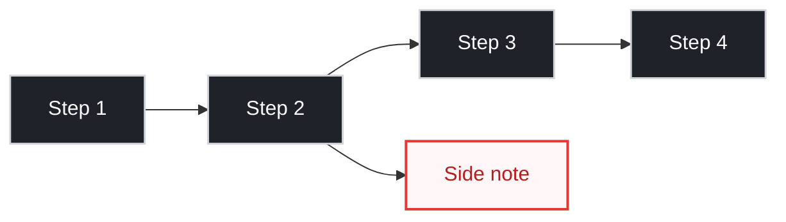
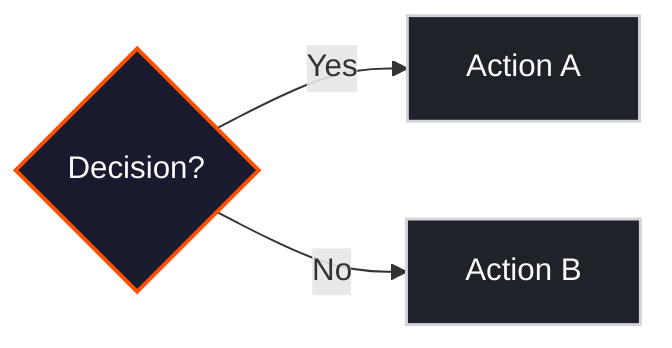

# Mermaid Diagram Standards

Reusable prompt fragment for Mermaid diagram rules and templates.

## When to Use Mermaid

Use diagrams **only** when they improve comprehension over plain text:
- Branching logic or decision trees
- Async flows with parallel paths
- State transitions
- Multi-service architectures

If the flow is linear and obvious, use a bullet list instead.

## Orientation Policy (Strict)

- **MUST** use `direction LR` (Left-to-Right) for flowcharts and state diagrams.
- **NEVER** use `TD` (Top-Down) — it wastes vertical space.
- Exception: Only if the user explicitly requests top-down.

## Node Rules

- Keep 4–6 core nodes on the primary path.
- One main path: `A --> B --> C --> D`.
- Side branches only when they directly aid understanding.
- Node labels: 1–2 short lines, action verbs preferred.

## Readability Rules

- High-contrast colors for dark themes (bg `#050505`).
- No tiny HTML text (`<small>`, ``).
- No crossing lines or dense branching.
- If still hard to read: remove nodes before adding style.

## Base Template

## Decision Diagram Template

