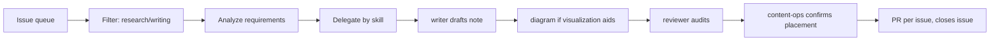

## Context

Audit of the open issue queue in `wahengchang/ai-study-note`, filtered to research and writing tasks, analyzed for operational requirements, and delegated to the agents registered in `claude/config.yaml`. This brief initiates the execution workflow — each row below is a ready-to-dispatch task card.

## Scope

| Filter | Rule |
|---|---|
| **Included** | Issues asking for research, study notes, learn notes, or publishable writing under `content/` |
| **Excluded** | Bug fixes, layout/template changes, infra maintenance |

### Triage summary

| # | Title (short) | Labels | Verdict |
|---|---|---|---|
| 77 | cmux terminal multiplexing + Claude Code productivity | documentation, enhancement | INCLUDE — research |
| 76 | n8n AI YouTube automation workflow | documentation, enhancement | INCLUDE — research |
| 75 | LLM-based raw/wiki knowledge management | documentation, enhancement | INCLUDE — research + writing |
| 74 | Astron Agent / Serper / Jina / Python node / LLM | documentation, enhancement | INCLUDE — writing |
| 67 | Duplicate article titles on Quartz pages | — | EXCLUDE — layout bug, not research/writing |
| 63 | Adopt Mintlify as new docs framework | enhancement | INCLUDE — framework evaluation (research) |
| 61 | 小紅書 prompt-optimization open-source project | — | INCLUDE — research |

## Delegation table

| Issue | Primary agent | Support agent | Target path | Note intent |
|---|---|---|---|---|
| #77 | `@writer` | `@reviewer` | `content/claude-code/cmux-claude-code-workflow.md` | Architect |
| #76 | `@writer` | `@diagram`, `@reviewer` | `content/claude-code/n8n-youtube-automation-workflow.md` | Architect |
| #75 | `@writer` | `@diagram`, `@reviewer` | `content/claude-code/llm-raw-wiki-knowledge-management.md` | Architect |
| #74 | `@writer` | `@reviewer` | `content/claude-code/astron-serper-jina-workflow-roles.md` | Architect |
| #63 | `@writer` | `@content-ops` | `content/setup-env/mintlify-framework-evaluation.md` | Architect |
| #61 | `@writer` | `@reviewer` | `content/prompt-notes/xhs-prompt-optimizer-research.md` | Architect |

> `@content-ops` is only engaged when the note ships and taxonomy placement needs confirmation. Folders above are proposals — content-ops may reassign per `docs/content-taxonomy.md`.

---

## Task cards

### #77 — cmux × Claude Code terminal workflow

**Agent**: `@writer` → `@reviewer`

**Operational requirements**
- **Source verification first**: the Xiaohongshu post names `cmux` ambiguously — must confirm whether it refers to the `cmux` project on GitHub, a tmux wrapper, or a rebrand before drafting. Resolve identity before any comparison.
- **Comparative research** across at least 3 tools: `cmux`, `tmux`, `zellij` (optional: `WezTerm mux`, `screen`).
- **Workflow documentation** centered on Claude Code's multi-pane, multi-session, long-running task monitoring patterns (agent pane, logs pane, edit/git/test pane, watcher pane).
- **Deliverables** (per issue acceptance criteria):
  1. Study note on terminal multiplexing for Claude Code productivity
  2. Tool comparison table (cmux vs. tmux vs. zellij ± others)
  3. Minimum viable workflow recipe applicable to a real Claude Code session
- **Risks**: if `cmux` identity cannot be verified, writer must flag with `> [!warning]` and fall back to a tmux/zellij-centric note.

**Done when**: writer's draft passes reviewer audit for structure, accuracy, and style compliance, and `npm run quartz -- build` exits 0.

---

### #76 — n8n AI YouTube automation pipeline

**Agent**: `@writer` → `@diagram` → `@reviewer`

**Operational requirements**
- **Workflow decomposition** into 7 stages: topic ideation → script → visuals → audio → assembly → publish → status/notify.
- **Tool taxonomy** across 6 categories (orchestration, LLM, visual, audio, rendering, publishing, storage) — at least the 20+ tools named in the issue must be placed in the table with one-line purpose, strength, and limit.
- **PoC architecture**: smallest viable version (e.g., n8n + one LLM + one TTS + one video renderer + Google Drive).
- **Policy & cost analysis**: YouTube content policy, copyright, duplicate-content detection, API cost scaling, whether the pipeline can support Traditional Chinese content.
- **Diagram delegation** (`@diagram`): one `flowchart LR` showing the end-to-end pipeline with the 7 stages and tool placeholders. Must render in Quartz with LR orientation.
- **Deliverables**:
  1. Research note
  2. Categorized tool inventory (table)
  3. Minimal PoC architecture with diagram
  4. Risk section (policy, copyright, quality, cost)

**Done when**: writer + diagram output pass reviewer audit; no `direction TD` diagrams; all claims link to evidence or flag as unverified.

---

### #75 — LLM raw/wiki knowledge management

**Agent**: `@writer` → `@diagram` → `@reviewer`

**Operational requirements**
- **Conceptual framing**: separation of `raw` (never mutated) and `wiki` (continuously evolved by LLM).
- **Query → writeback loop**: how querying the wiki produces new insights that mutate the wiki without touching raw.
- **Implementation stack**: IDE + Obsidian + Markdown + Git — explain why low-barrier tools are the point.
- **Attribution**: Andrej Karpathy and 林穎俊's approaches are references, not the subject — must credit without plagiarizing.
- **Diagram delegation** (`@diagram`): `stateDiagram-v2` with `direction LR` showing raw → LLM → wiki → query → writeback loop.
- **Deliverables**:
  1. Learn note outline or draft
  2. Clear articulation of why raw/wiki separation matters
  3. Follow-on usage: how the system supports querying, content output, brainstorming

**Done when**: draft has a clear thesis, a raw/wiki flow diagram, and a public-ready content frame.

---

### #74 — Astron Agent / Serper / Jina / Python node / LLM workflow roles

**Agent**: `@writer` → `@reviewer`

**Operational requirements**
- **Audience**: non-technical reader; keep a plain-language layer alongside the technical one.
- **Component coverage** (one per row):
  - Astron Agent
  - Serper.dev
  - Jina AI
  - Python node
  - LLM
- **For each**: one-sentence positioning, category (model / tool / platform / code node), pricing model (free / free tier / usage-based / subscription), official link.
- **Concluding synthesis**: frame the diagram as workflow components with division of labor — explicitly NOT "one AI tool."
- **Pricing accuracy**: writer must fetch current pricing pages before asserting free/paid status; flag anything stale with `> [!warning]`.
- **Deliverables**:
  1. Article title
  2. Publishable draft
  3. "Typically free-start vs. paid-at-scale" side note

**Done when**: reviewer confirms no component is misclassified and all pricing claims link to an official source.

---

### #63 — Mintlify framework evaluation

**Agent**: `@writer` → `@content-ops` (placement only)

**Operational requirements**
- **Scope boundary**: this is an *evaluation and decision brief*, not a migration. Writer must not draft migration steps.
- **Technical analysis**:
  - Mintlify as a developer-docs platform (GitHub repo → rendered docs)
  - Next.js / React SSR base
  - MDX for embedded React components
  - Tailwind CSS for styling and responsive layout
- **Reference benchmark**: https://agentskills.io/home — capture what makes it feel good (search, layout, navigation).
- **Comparison dimension**: what Quartz does well vs. what Mintlify would unlock, without turning into a migration plan.
- **Deliverables**:
  1. A clear "framework direction = Mintlify" task statement for future reference
  2. The technical analysis as a standalone note so a later migration can pick it up
- **Placement decision**: `@content-ops` picks the final folder per `docs/content-taxonomy.md` — proposal is `content/setup-env/` but this is a tooling/meta note and may belong elsewhere.

**Done when**: writer's brief is conclusive on direction, content-ops confirms placement, note ships without triggering a migration.

---

### #61 — Xiaohongshu prompt-optimization open-source project research

**Agent**: `@writer` → `@reviewer`

**Operational requirements**
- **Source identification first**: resolve the Xiaohongshu link to the actual open-source project (repo name, official site). Everything downstream depends on this.
- **Research output** per issue acceptance:
  - Project name, repo URL, official site (if any)
  - TL;DR in 3–5 lines
  - Core feature list
  - Practical application scenarios
  - Verdict: worth adopting in `ai-study-note` or not
- **Reusable takeaways**: at least 3 points a reader can lift into their own workflow.
- **Risks**: if the Xiaohongshu post is inaccessible or ambiguous, writer flags the blocker and proposes an alternative prompt-optimizer project to cover.

**Done when**: source is identified and documented, ≥3 reusable points captured, adoption verdict written.

---

## Execution workflow

## Dispatch order

Priority reflects source-verification risk (identity/link resolution blocks everything downstream):

1. **#61** — resolve Xiaohongshu source first; smallest scope
2. **#77** — resolve `cmux` identity; depends on one source check
3. **#74** — self-contained, pricing verification only
4. **#75** — conceptual, no source-verification blocker
5. **#63** — framework research, external reference stable
6. **#76** — largest surface (20+ tools, policy analysis); schedule last

## Acceptance for this delegation brief

- [x] Every open issue triaged (include/exclude with reason)
- [x] Every included issue assigned a primary agent
- [x] Every included issue has operational requirements documented
- [x] Target path proposed for every note
- [x] Dispatch order reflects blocking-risk ordering
- [ ] PR opened to initiate execution (tracked by this file)
