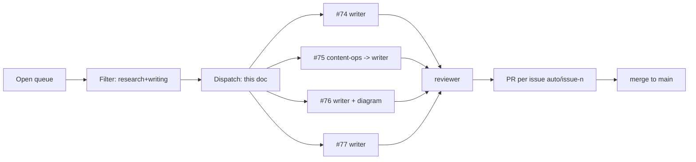

## Scope

Audit the open issue queue, filter for research and writing tasks, map each to the best-fit agent registered in `claude/config.yaml`, and initiate the execution workflow defined in `cron/git-auto.md`. Downstream work is expected to branch one-issue-per-branch off fresh `origin/main` as `auto/issue-<n>`.

Snapshot date: 2026-04-11. Open-issue count at audit time: 7.

## 1. Audit — full open queue

| # | Title (truncated) | Labels | Type | In-flight PR |
|---|---|---|---|---|
| #77 | Research terminal multiplexing / `cmux` × Claude Code | documentation, enhancement | Research → Writing | — |
| #76 | Research n8n AI YouTube automation workflow | documentation, enhancement | Research → Writing | — |
| #75 | LLM raw/wiki knowledge management (Karpathy / 林穎俊) | documentation, enhancement | Research → Writing | — |
| #74 | Study note: Astron Agent / Serper / Jina / Python node / LLM | documentation, enhancement | Writing | — |
| #67 | Fix duplicate article titles | — | Layout bug | #68 (open) |
| #63 | Adopt Mintlify as new framework | enhancement | Framework spike | — |
| #61 | 小紅書 prompt auto-optimizer research | — | Research | #73 (open) |

## 2. Filter — research and writing only

| # | Verdict | Reason |
|---|---|---|
| #77 | **Include** | Pure research → publishable note |
| #76 | **Include** | Pure research → publishable note |
| #75 | **Include** | Research → extend existing `content/prompt-notes/karpathy-llm-wiki-pattern.md` (merged in `bc7dd17`) |
| #74 | **Include** | Writing — raw material already collated by issue author |
| #67 | Exclude | Layout/template bug, not a note. Already has PR #68 |
| #63 | Exclude | Engineering framework evaluation, not a content note |
| #61 | **Skip** | Research task, but PR #73 is already open against it — would violate `cron/git-auto.md` "one issue per branch" invariant |

Filtered set for dispatch: **#74, #75, #76, #77**.

## 3. Operational requirements per issue

### #74 — Astron Agent / Serper / Jina / Python / LLM (Writing)

- **Deliverable**: `content/claude-code/astron-serper-jina-workflow-roles.md` (or taxonomy-adjacent folder — `@content-ops` confirms at placement time).
- **Gate**: Pricing claims per tool must be verified against official pages before draft lands; free-tier vs paid breakdown is the core value of the note.
- **Critical framing**: These are *different parts of one workflow*, not competing AI tools. Writer must preserve that framing.
- **Risk**: Low. Source material pre-collated in the issue body.

### #75 — LLM raw/wiki knowledge management (Research → Writing)

- **Deliverable**: Extension (not sibling) of `content/prompt-notes/karpathy-llm-wiki-pattern.md`. `@content-ops` decides whether to extend inline or add a cross-linked companion note; default is extend.
- **Gate**: No duplication of content already in `karpathy-llm-wiki-pattern.md` (shipped in `bc7dd17`, closes #65).
- **Core concept to preserve**: `raw` layer is immutable, `wiki` layer is derived and keeps evolving; query answers can feed back into `wiki`.
- **Risk**: Medium — easy to accidentally restate the existing note.

### #76 — n8n AI YouTube automation (Research → Writing)

- **Deliverable**: `content/claude-code/n8n-youtube-automation-workflow.md` or setup-env alternative; `@content-ops` confirms.
- **Gates**:
  - Pipeline must be stage-decomposed (ideation → script → visuals → audio → render → publish → monitor).
  - For each stage, writer must call out "truly no-code" vs "needs integration glue".
  - Policy, copyright, and YouTube-spam-policy risks must be explicit — this is a compliance-heavy topic.
- **Support**: `@diagram` produces the pipeline flow (direction LR only — project rule).
- **Risk**: Medium-high. Largest surface area (20+ tools); schedule last.

### #77 — `cmux` / terminal multiplexing × Claude Code (Research → Writing)

- **Deliverable**: `content/claude-code/cmux-claude-code-workflow.md` (or similar under `claude-code/`).
- **Gate — fail fast**: Identify what `cmux` actually refers to in the source Xiaohongshu post. If unverifiable, the note opens with `> [!warning]` calling out the ambiguity and compares the major alternatives (`tmux`, `zellij`, `screen`, WezTerm mux) against a Claude Code workflow rubric. **Do not fabricate a tool identity.**
- **Minimum comparison set**: 3 tools, each with a concrete Claude Code pane layout.
- **Risk**: Medium. Source verification is the blocker.

## 4. Delegation — matched to `claude/config.yaml`

| # | Primary | Support | Skill-set rationale |
|---|---|---|---|
| #74 | `@writer` | `@reviewer`, `@content-ops` | Pre-collated source → drafting + style audit. `@content-ops` validates placement. |
| #75 | `@writer` | `@content-ops`, `@reviewer` | Extends existing note → `@content-ops` arbitrates extend-vs-sibling before the writer run. |
| #76 | `@writer` | `@diagram`, `@reviewer` | Pipeline visualization required — `@diagram` is the only agent that owns Mermaid LR templates per project rule. |
| #77 | `@writer` | `@reviewer` | Source-verification + comparison table; `@reviewer` enforces the `> [!warning]` callout if identity is unverified. |

All primary authoring routes through `@writer` — it is the only agent that composes `formatting.md + mermaid.md + quartz.md` for publishable notes. Support agents are engaged only where their specific skill is required.

## 5. Execution order

Shortest-path-to-shipped, blocking-risk second. Each downstream cycle follows `cron/git-auto.md` invariants (fresh branch off `origin/main` as `auto/issue-<n>`, one issue per PR, explicit-path staging only, `.automation/` never staged).

1. **#74** — no blockers, material pre-collated.
2. **#75** — requires `@content-ops` extend-vs-sibling call, then low risk.
3. **#77** — fail-fast on `cmux` source verification.
4. **#76** — largest surface area, schedule last.

## 6. Overlap with existing dispatch PRs

Open PRs #78, #79, #80, #81 contain earlier dispatch attempts against the same queue. They have not been merged. This dispatch supersedes them on the `claude/gracious-hawking-N9UAo` execution branch and is the canonical reference for the next `cron/git-auto.md` cycle. On merge, the stale dispatch PRs should be closed to avoid duplicate routing instructions for the writer agent.

## 7. Handover checklist

- [ ] Reviewer confirms filter and exclusions
- [ ] `@content-ops` rules on the #75 extend-vs-sibling call before writer starts
- [ ] First downstream cycle picks up #74, opens `auto/issue-74`
- [ ] `npm run quartz -- build` exits 0 after each landed note (this dispatch lives under `claude/`, no site impact)
