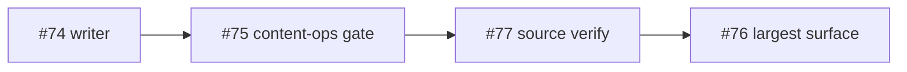

## Context

Audit of the open issue queue for research and writing tasks, per-issue
operational analysis, and per-agent delegation. Merging this brief
initiates the next downstream execution cycle under
[`cron/git-auto.md`](../../cron/git-auto.md).

Dispatch branch: `claude/gracious-hawking-HrSB1`.

## Filter — open issue queue (7 → 4 in scope)

| # | Type | Verdict | Reason |
|---|---|---|---|
| wahengchang/ai-study-note#77 | Research → Writing | **Include** | cmux × Claude Code terminal workflow — no existing note |
| wahengchang/ai-study-note#76 | Research → Writing | **Include** | n8n AI YouTube automation pipeline — no existing note |
| wahengchang/ai-study-note#75 | Research → Writing | **Include** | LLM raw/wiki knowledge mgmt — must extend existing `content/prompt-notes/karpathy-llm-wiki-pattern.md` (merged `bc7dd17`) |
| wahengchang/ai-study-note#74 | Writing | **Include** | Astron / Serper / Jina / Python node / LLM — source paste pre-collated |
| wahengchang/ai-study-note#61 | Research | **Skip** | PR wahengchang/ai-study-note#73 already open — bundling would violate `cron/git-auto.md` one-issue-per-branch invariant |
| wahengchang/ai-study-note#67 | Layout bug | **Exclude** | Duplicate-H1 template fix (PR wahengchang/ai-study-note#68 open) — not research/writing |
| wahengchang/ai-study-note#63 | Framework migration | **Exclude** | Mintlify engineering spike — not a content note |

## Per-issue operational analysis & delegation

All primary drafting routes to `@writer` (the only agent in `claude/config.yaml`
registered for note composition). Support agents engage only where their
registered skill set is actually required.

### wahengchang/ai-study-note#74 — Astron Agent / Serper / Jina / Python / LLM roles

- **Operational requirements**
  - Source material is a pre-collated Telegram paste — no upstream hunting needed
  - Must classify each component as model / tool / platform / code node (not a single "AI tool")
  - Pricing claims (free tier, paid model) must be verified against official pages, not the paste
  - Needs a plain-language layer so non-technical readers can follow the workflow split
- **Primary**: `@writer` (classify roles, draft bilingual-friendly positioning note)
- **Support**: `@reviewer` (pricing / positioning audit), `@content-ops` (placement under the correct `content/` taxonomy)
- **Critical gate**: Every pricing claim cited with its official source; no paraphrased pricing from the Telegram paste

### wahengchang/ai-study-note#75 — LLM raw/wiki knowledge management

- **Operational requirements**
  - **Do not duplicate** `content/prompt-notes/karpathy-llm-wiki-pattern.md` (merged in `bc7dd17`, closed #65)
  - Issue explicitly asks for the raw/wiki two-layer split, feedback loop, and IDE + Obsidian + Markdown + Git implementation angle — the existing note already covers part of this
  - The extend-vs-new-sibling decision must be made **before** the writer starts — otherwise the writer drafts in the wrong shape and the work is thrown away
- **Primary**: `@writer` (once placement is decided)
- **Support**: `@content-ops` (blocking gate: extend vs sibling call), `@reviewer`
- **Critical gate**: `@content-ops` rules on extend vs sibling placement before `@writer` is engaged

### wahengchang/ai-study-note#76 — n8n AI YouTube automation pipeline

- **Operational requirements**
  - Largest surface in this batch — ~20 tools across orchestration, LLM, visuals, audio, rendering, publishing, storage
  - Per pipeline stage, must distinguish "truly no-code" from "needs integration glue" (the issue explicitly asks for this)
  - Must explicitly surface risk: content quality, copyright, duplicate content, YouTube platform policy
  - Needs a minimal PoC architecture sketch — diagram helps here
- **Primary**: `@writer`
- **Support**: `@diagram` (pipeline flow — `direction LR` only per project rules), `@reviewer` (risk section completeness)
- **Critical gate**: Policy/copyright risks are explicit; no hand-waving of YouTube policy

### wahengchang/ai-study-note#77 — cmux × Claude Code terminal workflow

- **Operational requirements**
  - Source is an `xhslink` short URL — likely ephemeral; `cmux` tool identity is unclear and must be resolved before drafting
  - If the project referenced in the post cannot be confidently identified, the note must open with `> [!warning]` rather than fabricate a tool identity
  - Needs comparison across at least 3 tools (tmux / zellij / WezTerm mux / etc.) and at least one actionable Claude Code workflow pattern
- **Primary**: `@writer`
- **Support**: `@reviewer` (identity claims, comparison accuracy)
- **Critical gate**: `cmux` identity verified against a canonical source, **or** note opens with `> [!warning]` calling out the unresolved identity — never fabricated

## Delegation summary

| Issue | Primary | Support | Blocking gate |
|---|---|---|---|
| wahengchang/ai-study-note#74 | `@writer` | `@reviewer`, `@content-ops` | Pricing claims verified against official pages |
| wahengchang/ai-study-note#75 | `@writer` | `@content-ops`, `@reviewer` | `@content-ops` rules extend vs sibling before drafting |
| wahengchang/ai-study-note#76 | `@writer` | `@diagram` (LR), `@reviewer` | Stage-level no-code vs glue split; policy/copyright explicit |
| wahengchang/ai-study-note#77 | `@writer` | `@reviewer` | `cmux` identity verified or `> [!warning]` callout |

## Execution order

Shortest-path-to-shipped first, blocking-risk fail-fast second:

1. **wahengchang/ai-study-note#74** — source pre-collated, no upstream blockers
2. **wahengchang/ai-study-note#75** — `@content-ops` gate, then straightforward
3. **wahengchang/ai-study-note#77** — fail-fast on `cmux` source verification
4. **wahengchang/ai-study-note#76** — largest surface area, schedule last

## Downstream execution invariants

Each downstream cycle runs under [`cron/git-auto.md`](../../cron/git-auto.md):

- Branch fresh from `origin/main` as `auto/issue-<number>` — never reuse a stale branch
- One issue per branch, one branch per PR — never bundle
- Stage files by explicit path only — `.automation/` never staged
- `git diff --cached --stat` verified before every commit
- Working tree clean before start; abort and report if not

## Overlap note

Dispatch PRs wahengchang/ai-study-note#78, wahengchang/ai-study-note#79,
wahengchang/ai-study-note#80, wahengchang/ai-study-note#81, and
wahengchang/ai-study-note#82 targeted the same queue on the same day but remain
open and unmerged. This brief is the canonical dispatch for the
`claude/gracious-hawking-HrSB1` execution branch. On merge, the stale dispatch
PRs should be closed to avoid conflicting routing instructions.

## Done when

- [ ] Reviewer confirms the filter and exclusions
- [ ] `@content-ops` rules the wahengchang/ai-study-note#75 extend-vs-sibling call before writer starts
- [ ] First downstream `cron/git-auto.md` cycle picks up wahengchang/ai-study-note#74 and opens `auto/issue-74`
- [ ] `npm run quartz -- build` exits 0 (this doc lives under `claude/`, no site impact)
