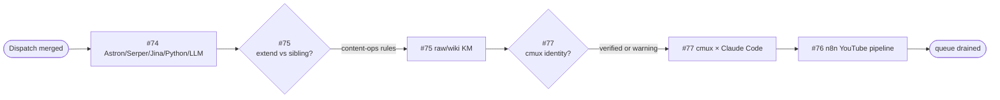

# Research and Writing Queue Dispatch — 2026-04-11

Operational briefing that audits the open issue queue on
[`wahengchang/ai-study-note`](https://github.com/wahengchang/ai-study-note),
filters research and writing tasks, analyzes per-issue operational
requirements, and delegates each eligible item to the appropriate agent
registered in [`claude/config.yaml`](../config.yaml).

Merging this document initiates the next downstream execution cycle under
[`cron/git-auto.md`](../../cron/git-auto.md) on the
`claude/gracious-hawking-sPtgV` branch.

## 1. Audit — open queue (7 issues)

| # | Kind | Verdict | Reason |
|---|---|---|---|
| [#77](https://github.com/wahengchang/ai-study-note/issues/77) | Research → Writing | **Include** | `cmux` × Claude Code terminal multiplexing workflow |
| [#76](https://github.com/wahengchang/ai-study-note/issues/76) | Research → Writing | **Include** | n8n AI YouTube automation pipeline — tool inventory + PoC |
| [#75](https://github.com/wahengchang/ai-study-note/issues/75) | Research → Writing | **Include** | LLM raw/wiki knowledge management — overlaps shipped `content/prompt-notes/karpathy-llm-wiki-pattern.md` (merged in `bc7dd17`); needs an extend-vs-sibling decision |
| [#74](https://github.com/wahengchang/ai-study-note/issues/74) | Writing | **Include** | Astron / Serper / Jina / Python node / LLM positioning — source material pre-collated |
| [#61](https://github.com/wahengchang/ai-study-note/issues/61) | Research | **Skip** | PR [#73](https://github.com/wahengchang/ai-study-note/pull/73) already open on `auto/issue-61`; respects the `cron/git-auto.md` "one issue per branch" invariant |
| [#67](https://github.com/wahengchang/ai-study-note/issues/67) | Layout bug | **Exclude** | Duplicate-H1 fix — layout/template concern, not research/writing. PR [#68](https://github.com/wahengchang/ai-study-note/pull/68) already open |
| [#63](https://github.com/wahengchang/ai-study-note/issues/63) | Framework migration | **Exclude** | Mintlify engineering spike, not a content note |

**In scope:** #74, #75, #76, #77.

## 2. Per-issue operational requirements

### #74 — Astron Agent / Serper / Jina / Python node / LLM

- **Type:** Writing (source material pre-collated by the reporter).
- **Goal:** A non-technical-friendly note that positions each component as a
  workflow part (model vs. tool vs. platform vs. programming node), with
  pricing notes and official links.
- **Operational gate:** Every pricing claim must be verified against the
  vendor's live pricing page at draft time. Stale pricing is the primary
  failure mode here.
- **Deliverable path:** `content/` — exact placement decided by
  `@content-ops` at merge time.
- **Blockers:** None.

### #75 — LLM raw/wiki knowledge management

- **Type:** Research → Writing.
- **Goal:** A learn note describing the raw-layer / wiki-layer separation
  pattern, the AI-assisted condensation loop, and its fit for personal
  knowledge management.
- **Operational gate:** The recently merged
  `content/prompt-notes/karpathy-llm-wiki-pattern.md` (shipped in `bc7dd17`,
  closes #65) already covers part of this territory. `@content-ops` **must**
  rule on extend-in-place vs. sibling-note **before** `@writer` starts —
  this is a hard precondition to avoid duplicating shipped content.
- **Deliverable path:** `content/prompt-notes/` (either extend the existing
  file or add a clearly-scoped sibling).
- **Blockers:** `@content-ops` extend-vs-sibling decision.

### #76 — n8n AI YouTube automation workflow

- **Type:** Research → Writing.
- **Goal:** End-to-end pipeline breakdown (ideation → script → visual →
  audio → render → publish → logging), a categorized tool inventory,
  and a minimum-viable PoC outline.
- **Operational gate:**
  1. Stage-by-stage "truly no-code" vs. "needs integration glue" split —
     not all stages are equal.
  2. Policy, copyright, and content-farm risks must appear as an explicit
     `> [!warning]` callout — not buried in the body.
  3. Mermaid pipeline diagram, `direction LR` only (per project rules).
- **Deliverable path:** `content/` — placement at `@content-ops` discretion.
- **Blockers:** None — largest surface area, scheduled last.

### #77 — `cmux` × Claude Code terminal workflow

- **Type:** Research → Writing.
- **Goal:** Clarify the `cmux` tool identity from the source Xiaohongshu
  post, compare with `tmux` / `zellij` / WezTerm mux, and derive a minimum
  Claude Code multi-pane workflow.
- **Operational gate:** `cmux` tool identity must be verified from a primary
  source. If identity cannot be confirmed, the note must open with a
  `> [!warning]` callout stating which `cmux` it refers to and what is
  unverified — **never fabricate a tool identity**.
- **Deliverable path:** `content/claude-code/` — placement at
  `@content-ops` discretion.
- **Blockers:** Fail-fast on `cmux` source verification.

## 3. Delegation

All primary drafting routes through `@writer` — the only authoring agent
registered in [`claude/config.yaml`](../config.yaml). Support agents engage
only where the operational gate genuinely requires their skill set.

| Issue | Primary | Support | Blocking gate |
|---|---|---|---|
| [#74](https://github.com/wahengchang/ai-study-note/issues/74) | `@writer` | `@reviewer`, `@content-ops` | Every pricing claim verified against the vendor's live pricing page at draft time |
| [#75](https://github.com/wahengchang/ai-study-note/issues/75) | `@writer` | `@content-ops`, `@reviewer` | `@content-ops` rules extend-vs-sibling on `content/prompt-notes/karpathy-llm-wiki-pattern.md` **before** writer starts |
| [#76](https://github.com/wahengchang/ai-study-note/issues/76) | `@writer` | `@diagram` (`direction LR` only), `@reviewer` | Stage-by-stage no-code-vs-glue split; policy/copyright `> [!warning]` callout explicit |
| [#77](https://github.com/wahengchang/ai-study-note/issues/77) | `@writer` | `@reviewer` | `cmux` tool identity verified from a primary source, or note opens with `> [!warning]` — never fabricated |

### Rationale for agent selection

- **`@writer`** — the only registered authoring agent; every issue's
  primary deliverable is a Quartz note, so it owns every primary slot.
- **`@reviewer`** — engaged on all four for technical accuracy and style
  compliance before merge (per `claude/agents/reviewer.md`).
- **`@content-ops`** — engaged on #74 (placement), #75 (extend-vs-sibling
  ruling is blocking), and #76 (placement).
- **`@diagram`** — engaged on #76 only; its pipeline is genuinely
  visualization-worthy. #75 intentionally does **not** engage `@diagram`
  since the raw/wiki loop is better explained in prose than in a diagram.

## 4. Execution order

Shortest-path-to-shipped first, blocking-risk fail-fast second:

1. **#74** — source pre-collated, no upstream blockers.
2. **#75** — `@content-ops` extend-vs-sibling gate, then straightforward.
3. **#77** — fail-fast on `cmux` source verification.
4. **#76** — largest surface area, schedule last.

Each downstream cycle runs under [`cron/git-auto.md`](../../cron/git-auto.md)
invariants:

- Fresh branch off `origin/main` as `auto/issue-<n>`.
- One issue per branch, one branch per PR.
- Explicit-path staging only — never `git add .` / `git add -A`.
- `.automation/` is never staged.
- Working tree must be clean before starting.

## 5. Overlap with prior dispatch PRs

Dispatch PRs [#78](https://github.com/wahengchang/ai-study-note/pull/78),
[#79](https://github.com/wahengchang/ai-study-note/pull/79),
[#80](https://github.com/wahengchang/ai-study-note/pull/80),
[#81](https://github.com/wahengchang/ai-study-note/pull/81),
[#82](https://github.com/wahengchang/ai-study-note/pull/82),
[#83](https://github.com/wahengchang/ai-study-note/pull/83),
[#84](https://github.com/wahengchang/ai-study-note/pull/84),
[#85](https://github.com/wahengchang/ai-study-note/pull/85), and
[#86](https://github.com/wahengchang/ai-study-note/pull/86) targeted the
same open queue earlier today but remain unmerged. This brief is the
canonical dispatch for the `claude/gracious-hawking-sPtgV` execution
branch. On merge, the stale dispatch PRs above should be closed to stop
conflicting routing instructions from reaching the downstream
`cron/git-auto.md` runner.

## 6. Kickoff checklist

- [ ] Reviewer confirms the filter verdicts and exclusions above.
- [ ] `@content-ops` rules on the #75 extend-vs-sibling call **before** the
      writer run starts.
- [ ] First downstream `cron/git-auto.md` cycle opens `auto/issue-74`.
- [ ] `npm run quartz -- build` exits 0 (dispatch doc lives under
      `claude/`, no site impact).
