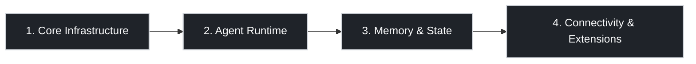

This note summarizes OpenClaw as four layers: **Core Infrastructure, Agent Runtime, Memory & State, Connectivity & Extensions**.

![[openclaw-4-pillar.png]]

## At a Glance

| Pillar | Core Components | Main Question During Debugging |
| --- | --- | --- |
| 1. Core Infrastructure | Gateway, Canvas Host | Are the core daemons healthy and reachable? |
| 2. Agent Runtime | System Prompt Builder, Agent Loop, Skills | Did the execution loop run correctly end-to-end? |
| 3. Memory & State | Workspace, Memory Search, Session Store | Was context loaded/searched/persisted correctly? |
| 4. Connectivity & Extensions | Clients, Nodes, Event Stream | Are external control and integrations connected? |

## Why This Model Works

| Bucket | What to Check |
| --- | --- |
| Core Infrastructure | Gateway/Canvas Host process and port health |
| Agent Runtime | Prompt assembly, think/act cycle, tool execution |
| Memory & State | Bootstrap files, memory retrieval, transcript writes |
| Connectivity & Extensions | Client access, node integration, event flow |

## 1. Core Infrastructure

:::col
### Components

- **Gateway (Daemon)**
  - "Brain" and router
  - Single source of truth
  - WebSocket on `:18789`
- **Canvas Host (UI Renderer)**
  - A2UI rendering host
  - UI service on `:18793`
:::

:::col
### Failure Signals

- No response at all: Gateway down or unreachable
- Text works but UI is missing: Canvas Host unavailable
- Random channel drop: adapter/session issue at gateway layer
:::

## 2. Agent Runtime

:::col
### Runtime Chain

1. Receive
2. Prompt
3. Think
4. Act
5. Stream
6. Persist

- **System Prompt Builder (Context Assembly)**
- **Agent Loop (Serial Process)**
- **Skills (Pluggable Capability Packs)**
:::

:::col
### Practical Checks

- Prompt builder includes rules + tool schemas + runtime context
- Skills are loaded as expected for this run
- Tool calls complete before persist step
- Serialized writes prevent conflicting session updates
:::

## 3. Memory & State

:::col
### Workspace (`~/.openclaw/workspace/`)

- **Bootstrap Files**
  - `AGENTS.md`
  - `SOUL.md`
  - `USER.md`
- **Memory Files**
  - `MEMORY.md`
  - `memory/YYYY-MM-DD.md`
- **Memory Search**
  - Retrieval layer (vector + BM25)
:::

:::col
### Session Store (`~/.openclaw/agents/.../sessions/`)

- JSONL transcripts (event history)
- Compaction & pruning (auto-summary)
- Separated from long-term Workspace memory
:::

| Storage Area | Purpose |
| --- | --- |
| Workspace | Durable identity + long-term memory |
| Session Store | Session transcript and event history |

## 4. Connectivity & Extensions

:::col
### External Control Plane

- **Clients**: CLI, App, Web Admin
- **Nodes**: capability providers (for example mobile/hardware access)
- **Event Stream**: lifecycle, assistant, tool events
:::

:::col
### Troubleshooting Order

1. Verify Gateway process and listening ports
2. Verify client/node auth and session health
3. Verify Event Stream flow
4. Verify tool endpoint/network reachability
:::

## Failure Mode Cheatsheet

| Symptom | Most Likely Layer |
| --- | --- |
| No response | Core Infrastructure / Connectivity |
| Text response but no UI | Core Infrastructure (Canvas Host) |
| Wrong persona or context | Agent Runtime / Memory & State |
| Memory not retained | Memory & State |
| Intermittent tool failures | Connectivity & Extensions |

## Mapping to This Repo

- `content/OpenClaw/index.md`: topic index
- `content/OpenClaw/utm-set-ubuntu.md`: deployment and troubleshooting guide
- `content/OpenClaw/openclaw-architecture-four-pillars.md`: this architecture overview
