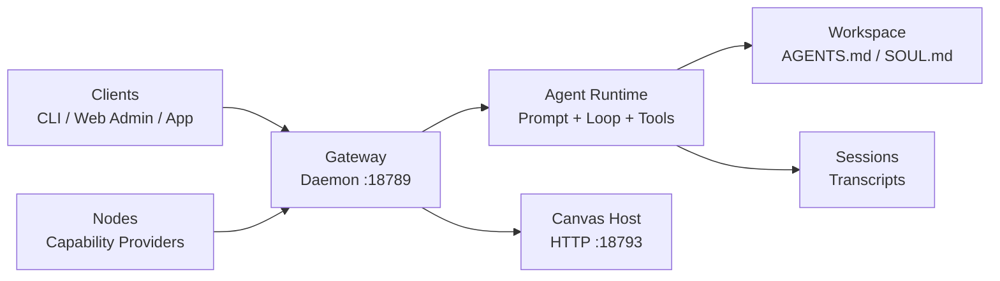

## System Map

This diagram shows the control flow: Clients/Nodes connect to Gateway, Gateway runs Runtime, Runtime reads/writes Workspace and Sessions, and Gateway also serves Canvas Host.

`Gateway` is the central host/router, `Agent Runtime` is the execution brain, `Memory & State` is the persistence layer (workspace + sessions), and `Clients/Nodes` are the external control and capability entry points connected through Gateway.
![[openclaw-architect.png]]

## 1. Core: Gateway (Daemon)

Use this table as a quick identity card for the Gateway process.

| Item | Details |
| --- | --- |
| Process | `openclaw gateway` |
| Topology | Singleton per host |
| Default bind | `127.0.0.1:18789` (WebSocket) |
| Main role | Host + Router |

Gateway responsibilities:

- Owns active external provider sessions (for example WhatsApp/Telegram adapters)
- Runs one embedded Agent Runtime for reasoning and tool execution
- Accepts WebSocket connections from Clients and Nodes

Practical note:

- If Gateway is down, all control and capability paths are unavailable

## 2. Brain: Agent Runtime and Routing

This table clarifies what the runtime is allowed to read, write, and route.

| Concern | Implementation Direction |
| --- | --- |
| Execution boundary | Runtime operates strictly inside the configured workspace |
| Memory input | Markdown context such as `AGENTS.md`, `SOUL.md` |
| File operations | Scoped to workspace rules |
| Routing model | One gateway process, multiple logical flows/agents |

Even with one gateway process, routing can dispatch tasks to different logical agent behaviors based on context.

## 3. Connectivity: Clients vs Nodes

If you are unsure where a feature belongs, use this table to decide whether it is a Client-side control feature or a Node-side capability feature.

| Component | `role` | Purpose | Typical Examples |
| --- | --- | --- | --- |
| Client | `operator` (implied) | Control plane: send prompts, view history, manage system | CLI, Web Admin, macOS App |
| Node | `node` | Capability provider: expose OS/hardware features | Camera, screen recording, location |

Rule of thumb:

- Client controls the system
- Node extends what the system can do

## 4. Specialized Service: Canvas Host

This table explains why Canvas Host is a separate service even when Gateway is healthy.

| Item | Details |
| --- | --- |
| Port | `18793` (default) |
| Protocol | HTTP |
| Owner | Managed by Gateway |
| Function | Serves A2UI (agent-generated dynamic web interfaces) |

Practical note:

- Chat may still work when Canvas Host is down, but A2UI pages fail to render

## 5. Wire Protocol and Security

This section explains connection safety rules at the protocol level (what must happen first, who is trusted, and how duplicates are prevented).

### Transport and handshake

- Transport uses WebSocket text frames carrying JSON payloads
- First frame after connection must be a `connect` payload
- Any non-`connect` first frame should trigger immediate disconnect

### Trust and authentication

- New devices require pairing before being trusted
- Paired devices receive a device token
- Localhost or trusted local network endpoints can be auto-approved (deployment dependent)

### Idempotency

- Side-effect commands should carry an idempotency key
- Prevents duplicated actions when retries happen

## 6. File System Structure

Use this table to quickly map each OpenClaw path to its operational purpose.

| Path | Purpose |
| --- | --- |
| `~/.openclaw/openclaw.json` | Gateway config (single primary config file) |
| `~/.openclaw/workspace` | Long-term memory and workspace files |
| `~/.openclaw/agents/.../sessions/` | Session transcript storage |

Recommended split:

- Version control workspace memory files
- Treat session transcripts as operational runtime data

## Quick Debug Order

Follow this order top-down to reduce false leads and shorten troubleshooting time.

1. Verify Gateway process and `:18789`
2. Verify client/node handshake and auth token state
3. Verify runtime routing and workspace context injection
4. Verify Canvas Host `:18793` if UI output is expected
5. Verify transcript write path and idempotency behavior

## References

- [OpenClaw Docs: Architecture](https://docs.openclaw.ai/concepts/architecture)
- [OpenClaw Docs: Agent](https://docs.openclaw.ai/concepts/agent)
