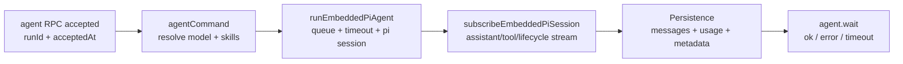

This chapter explains the real end-to-end agent run path in OpenClaw: from intake to persistence, including queueing, hooks, streaming, and timeout behavior.
![[agent-loop.png]]

Overview: this diagram shows the **OpenClaw Agent Loop Lifecycle** as 8 connected stages. It starts with **Entry & Initialization** (Gateway RPC/CLI validation, session parsing, metadata persistence, immediate `{ runId, acceptedAt }`), then **Queueing & Serialization** by session key. Next it prepares **Session & Workspace**, builds the **System Prompt** (base prompt, skill prompts, bootstrap context, overrides, token reserve), runs the **Execution Loop & Streaming** (assistant deltas + tool events with tool sanitization), applies **Reply Shaping** (`NO_REPLY` filtering and dedup), may enter **Compaction & Retries** on context overflow, and ends at **Completion & Persistence** (lifecycle end/error, transcript persistence, timeout/abort handling, final client status).

## What "Agent Loop" Means

Use this definition to separate one full run from smaller internal steps.

| Term | Meaning |
| --- | --- |
| Agent loop | One full serialized run: intake -> context assembly -> inference -> tool execution -> streaming -> persistence |
| Run unit | A single `runId` scoped to one session lane |
| Goal | Produce actions and a final reply while keeping session state consistent |

## Entry Points

These are the two main ways a loop starts.

| Entry | API/Command | Purpose |
| --- | --- | --- |
| Gateway RPC | `agent`, `agent.wait` | Programmatic trigger and wait |
| CLI | `agent` command | Operator-triggered run |

## End-to-End Flow

This is the authoritative run sequence from acceptance to completion state.

## High-Level Steps

Use this table as a quick checkpoint map for debugging.

| Step | Main Action | Output/Signal |
| --- | --- | --- |
| 1. Accept | Validate params, resolve session, persist session metadata | Immediate `{ runId, acceptedAt }` |
| 2. Execute | Resolve model defaults, load skills snapshot, start embedded runtime | Active run in queue lane |
| 3. Stream | Bridge pi events to OpenClaw streams | `assistant`, `tool`, `lifecycle` events |
| 4. Complete | Ensure lifecycle `end/error` is emitted | Stable run terminal state |
| 5. Wait | `agent.wait` blocks on lifecycle terminal event | `{ status, startedAt, endedAt, error? }` |

## Queueing and Concurrency

This section explains why OpenClaw serializes runs and where race prevention happens.

| Mechanism | Behavior | Why It Matters |
| --- | --- | --- |
| Session lane | Serializes runs per session key | Prevents session write races |
| Global lane (optional) | Adds cross-session throttling/serialization | Controls host-level pressure |
| Queue modes | `collect` / `steer` / `followup` feed lane logic | Keeps messaging channel behavior predictable |

## Session and Workspace Preparation

Before inference and tools run, OpenClaw prepares execution context and write safety.

| Preparation Item | What Happens |
| --- | --- |
| Workspace resolution | Workspace is resolved/created; sandbox may redirect workspace root |
| Skills snapshot | Skills loaded or reused, injected into env/prompt |
| Bootstrap context | Bootstrap files resolved and included in system prompt report |
| Session lock | Session write lock acquired before streaming/persist |

## Prompt Assembly and Limits

Prompt construction is controlled and budgeted before model execution.

| Concern | Behavior |
| --- | --- |
| Prompt inputs | Base prompt + skills prompt + bootstrap context + per-run overrides |
| Token safety | Model-specific limits and compaction reserve enforced |
| Reference | See system prompt docs for exact visible prompt shape |

## Hook Points

Use hooks when you need to intercept behavior without rewriting the core loop.

### Internal Hooks (Gateway Hooks)

| Hook/Event | Timing | Typical Use |
| --- | --- | --- |
| `agent:bootstrap` | During bootstrap build, before final system prompt | Add/remove bootstrap context files |
| Command hooks (`/new`, `/reset`, `/stop`, ...) | Command lifecycle | Command-specific automation |

### Plugin Hooks (Agent + Gateway Lifecycle)

| Hook | Timing |
| --- | --- |
| `before_agent_start` | Before run start; inject context or override prompt |
| `agent_end` | After completion; inspect final messages + metadata |
| `before_compaction` / `after_compaction` | Around compaction cycle |
| `before_tool_call` / `after_tool_call` | Around tool execution |
| `tool_result_persist` | Synchronous transform before transcript write |
| `message_received` / `message_sending` / `message_sent` | Inbound/outbound message pipeline |
| `session_start` / `session_end` | Session boundary lifecycle |
| `gateway_start` / `gateway_stop` | Gateway process lifecycle |

## Streaming and Partial Replies

Streaming behavior controls what users see during generation.

| Stream | Source | Notes |
| --- | --- | --- |
| `assistant` | pi-agent-core deltas | Supports partial/block streaming |
| `tool` | Tool start/update/end events | Includes sanitized tool outputs |
| `lifecycle` | start/end/error events | Terminal signal for run state |

Additional behavior:

- Block streaming can emit partial replies at `text_end` or `message_end`
- Reasoning can be emitted separately or embedded in block replies

## Tool Execution and Reply Shaping

Final user-visible output is post-processed to remove noise and duplicates.

| Rule | Effect |
| --- | --- |
| Tool result sanitization | Limits payload size/image logging before emit/persist |
| Messaging duplicate suppression | Avoids duplicate assistant confirmations |
| `NO_REPLY` filtering | Silent token removed from outgoing payloads |
| Fallback tool-error reply | Emitted when no renderable payload remains and tool failed (unless already user-visible) |

## Compaction and Retries

Compaction can reset the run path and trigger retries safely.

| Behavior | Impact |
| --- | --- |
| Auto-compaction events emitted | Visible compaction lifecycle |
| Retry after compaction | In-memory buffers/tool summaries reset to avoid duplicate output |

## Timeouts and Early Exit Conditions

Different timeout types end different parts of the lifecycle.

| Condition | Scope | Default |
| --- | --- | --- |
| `agent.wait` timeout | Wait-only (does not stop running agent) | `30s` |
| Runtime timeout | Active run abort timer | `agents.defaults.timeoutSeconds` (commonly `600s`) |
| Abort signal | Active run cancellation | Caller-controlled |
| Disconnect / RPC timeout | Transport-layer interruption | Environment-dependent |

## Event Streams and Chat Finalization

This section clarifies which stream exists today and how chat channels close runs.

| Event stream | Role today |
| --- | --- |
| `lifecycle` | Emitted by embedded subscription (or fallback by `agentCommand`) |
| `assistant` | Delta stream from pi-agent-core |
| `tool` | Tool event stream from pi-agent-core |

Chat channel handling:

- Assistant deltas are buffered into chat delta messages
- Chat final is emitted on lifecycle `end` or `error`

## Practical Debug Checklist

1. Confirm `agent` returned `runId` and `acceptedAt`
2. Confirm run entered session lane (not blocked/starved)
3. Confirm lifecycle `start` then `end/error` event sequence
4. Confirm assistant/tool deltas arrived during run
5. Confirm session transcript persisted and timestamps are set
6. Confirm `agent.wait` timeout is not confused with runtime timeout
