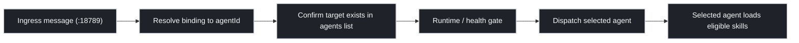

## Key Point (Read First)

- Routing target is an `agentId` from agent config/bindings.
- Skills are not routing keys by themselves; skills are loaded after the agent is selected.
- Execution still depends on runtime/health gates.

## Overview



## 1) Routing Priority

| Priority | Rule | Result |
| --- | --- | --- |
| 1 (highest) | Peer-specific binding | Route to bound `agentId` |
| 2 | Parent/thread inheritance binding | Route to inherited `agentId` |
| 3 | Account/channel/default bindings | Route by configured fallback ladder |

Hard rule:

- Binding resolution selects the agent before model/tool execution.

## 2) Trigger and Execution Gate

After route selection, agent execution can still fail.

| Stage | What happens |
| --- | --- |
| Ingress trigger | Gateway receives event/message from a channel/integration |
| Health check | Gateway verifies runtime/heartbeat availability |
| Dispatch | Gateway sends run to selected `agentId` |
| Runtime stage | Selected agent run loads its eligible skills/tooling |

## 3) CLI Commands (Routing / Trigger Ops)

```bash
openclaw --help
openclaw agents --help
openclaw gateway --help
```

Common checks:

```bash
openclaw agents list --bindings
openclaw agents inspect <agentId>
openclaw health
```

Config and runtime checks:

```bash
cat ~/.openclaw/openclaw.json
openclaw gateway --port 18789
```

## Verification Checklist

1. Confirm expected explicit bindings in `~/.openclaw/openclaw.json`.
2. Confirm target `agentId` exists in discovery output (`openclaw agents list`, if supported).
3. If wrong agent is selected, inspect higher-priority peer/thread binding first.
4. If routed but not executing, verify runtime/heartbeat health and gateway process state.

## Quick Troubleshooting

| Symptom | Likely Cause | First Check |
| --- | --- | --- |
| Wrong agent receives message | Higher-priority explicit binding exists | Inspect `openclaw.json` bindings |
| Expected skill behavior not seen | Correct agent selected but skill not loaded/eligible | Run `openclaw skills check --eligible -v` |
| Correct agent chosen but no reply | Runtime/heartbeat unhealthy | Restart gateway and verify runtime health |
| Behavior changed after edits | Binding or profile/workspace mismatch | Confirm active profile + bound `agentId` workspace |

## Notes

- This note is about selection and execution gates after discovery.
- Discovery mechanics are documented in `how-oc-discovers-agents-via-skill-definitions.md`.
