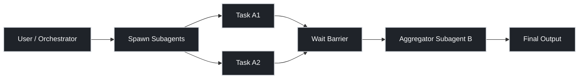

## Objective

- **Objective**: Architect
- 提供可直接落地的 CLI 手冊，覆蓋：
  - 單步子代理 (`/subagents spawn`)
  - 順序串聯（A → B）
  - 平行分派 + 聚合（Fan-out / Fan-in）
  - 常見限制、錯誤、診斷指令

## 1) Core Mental Model



- `spawn` 是 **非阻塞背景任務**：主流程先拿 task/session 參考，再決定是否等待。
- 串聯流程本質是：**上游結果變下游 context**。
- 平行流程本質是：**先 fan-out，再 wait-all，再 fan-in**。

## 2) Most Useful CLI Surface

### Subagent 操作

```bash
/subagents spawn <task description>
/subagents list
/subagents logs <subagent-id>
/subagents cancel <subagent-id>
```

### Session / Runtime 觀察

```bash
/sessions
/sessions spawn <task>
/tools
/model
/config
```

### Workflow（若專案已定義）

```bash
/workflow list
/workflow run <workflow-name>
```

## 3) Sequential Pattern（A → B）

### Pattern A: 直接順序呼叫

```bash
/subagents spawn 做任務 A
# 等 A 完成後，取結果摘要
/subagents spawn 用結果 A 做任務 B
```

### Pattern B: CLI Pipeline（工具鏈）

```bash
oc run --agent "subagent-a" --task "Work on A" | \
oc run --agent "subagent-b" --task "Process previous result to get B"
```

### Pattern C: Session 串接（可追蹤）

```bash
SESSION_ID=$(oc run --agent "subagent-a" --task "Work on A" --format json | jq -r '.session_id')
oc run --agent "subagent-b" --from-session "$SESSION_ID" --task "Based on resultA, perform task B"
```

## 4) Parallel + Aggregation Pattern（Fan-out / Fan-in）

### Step 1: 平行分派

```bash
TASK_ID_1=$(oc run --agent "subagent-a" --task "Work on a1" --async --format json | jq -r '.task_id')
TASK_ID_2=$(oc run --agent "subagent-a" --task "Work on a2" --async --format json | jq -r '.task_id')
```

### Step 2: Wait-All Barrier

```bash
oc task wait "$TASK_ID_1" "$TASK_ID_2"
```

### Step 3: 結果聚合（Fan-in）

```bash
RESULT_1=$(oc task result "$TASK_ID_1")
RESULT_2=$(oc task result "$TASK_ID_2")
oc run --agent "subagent-b" --task "Here are two results: $RESULT_1 and $RESULT_2. Combine them into B."
```

## 5) Operational Diagnostics（任務斷鏈先看這裡）

```bash
oc doctor --check-connectivity
oc tasks list --tree
oc gateway logs -n 50
```

- `doctor`: Runtime/Gateway 連通性
- `tasks --tree`: Parent/Child 派生關係
- `gateway logs`: 轉發與排程線索

## 6) Default Limits You Must Know

常見預設限制（實際值以 `openclaw.json` 為準）：

| Key | Meaning |
| --- | --- |
| `maxConcurrent` | 全域同時執行子代理上限 |
| `maxChildrenPerAgent` | 單一代理可建立 child 數量上限 |
| `maxSpawnDepth` | 巢狀 spawn 深度上限 |

設計建議：

- CPU/記憶體緊張時，先調低 `maxConcurrent`。
- 若需要多層 orchestration，先確認 `maxSpawnDepth` 是否允許。
- 若單代理常觸發過多 worker，檢查 `maxChildrenPerAgent`。

## 7) Common Mistakes

| Mistake | Correct Usage |
| --- | --- |
| 使用 `/spawn` | 改用 `/subagents spawn` |
| 平行後直接聚合 | 先 `wait-all`，再讀結果 |
| 子代理沒回應就重跑 | 先查 `logs` + `doctor` |
| 不設併發上限就壓測 | 先確認 `maxConcurrent` |

## 8) Quick Copy-Paste Playbooks

### 最小串聯 Playbook

```bash
/subagents spawn 先分析 repo 架構
/subagents spawn 根據上一步結果輸出重構建議
```

### 最小平行聚合 Playbook

```bash
/subagents spawn 掃描所有 TODO
/subagents spawn 掃描所有 FIXME
# 兩者完成後
/subagents spawn 合併 TODO/FIXME 並按風險排序
```

### Debug Playbook

```bash
/subagents list
/subagents logs <id>
oc doctor --check-connectivity
oc tasks list --tree
```
