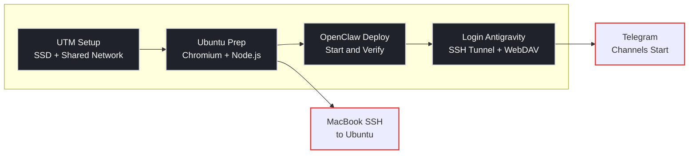

This guide documents a practical setup on an Apple Silicon Mac: running Ubuntu in UTM and deploying the OpenClaw AI Agent. It focuses on three high-impact areas:

- Choosing the right UTM network mode for stable connectivity
- Diagnosing OpenClaw service crashes quickly
- Enabling reliable Mac <-> Ubuntu access

## What You Will Be Able to Do

- Run Ubuntu stably on Apple Silicon Mac with UTM
- Find root causes when service status is `activating (auto-restart)`
- Use OpenClaw from Mac browser and access Mac files from Ubuntu



## 1. UTM Basics: Storage and Network

### 1.1 Save Local Space with External SSD

A UTM virtual machine is essentially a single `.utm` bundle, so you can move it directly.

```bash
# Workflow (conceptual)
# 1) Move <vm-name>.utm to external SSD
# 2) Re-open that .utm in UTM
```

- Use SSD, not HDD
- HDD latency is high and causes noticeable lag in Ubuntu and dev tools

### 1.2 Use Shared Network Mode (Critical)

Avoid choosing Bridged as default. In cafes, campus networks, and managed office networks, Bridged mode is often unstable or restricted.

:::col
### Shared Network (Recommended)
- Higher stability across varied network environments
- Port forwarding solves most access needs
- Mac may not `ping` VM directly
:::

:::col
### Bridged (Common Pitfalls)
- Looks direct, but depends on external network policy
- Frequently fails on restricted networks
- Troubleshooting cost is higher
:::

Setting path:

`UTM Settings -> Network -> Mode -> Shared Network (Emulated VLAN)`

> [!tip] Screenshot Suggestion
> Screenshot suggestion: capture the UTM Network settings page and highlight `Shared Network`.

## 2. Ubuntu Environment Setup

### 2.1 No Official Chrome for Linux ARM64

Symptoms:

- No official Chrome package is available
- Chromium works, but Google sync support is limited

Practical options:

- Use Chromium and import bookmarks manually
- Or switch to Firefox

### 2.2 Terminal Shortcuts to Avoid Killing Services

Common mistake: using `Ctrl + C` for copy and accidentally terminating the running server.

```text
Copy: Ctrl + Shift + C
Paste: Ctrl + Shift + V
Terminate process: Ctrl + C
```

### 2.3 Install Node.js 22 with nvm

```bash
nvm install 22
```

If you see `command not found`, reload your shell config:

```bash
source ~/.bashrc
```

## 3. OpenClaw Deployment and Troubleshooting

### 3.1 Service Restart Loop: `activating (auto-restart)`

Symptoms:

- Web UI is unreachable
- `systemctl status` shows `activating (auto-restart)`

Common causes:

- Missing or invalid configuration
- Port conflicts
- Token/mode mismatch

Stop the background service first, then run in foreground to see the real error:

```bash
systemctl --user stop openclaw-gateway
openclaw gateway --port 18789
```

Verification points:

- Check foreground logs for messages like `Missing config` or `Address already in use`
- Confirm the error maps directly to config or port issues

> [!tip] Screenshot Suggestion
> Screenshot suggestion: capture the red error output from foreground launch (for example, missing config or port conflict).

### 3.2 Config Corruption: Full Reset Is Faster

If token/model/mode state is uncertain, a full reset is usually faster than guessing.

```bash
# Remove old config
rm -rf ~/.openclaw

# Re-initialize
openclaw setup
```

After setup, optionally set values explicitly:

```bash
# Use Google Gemini Flash (fast and cost-effective)
openclaw config set agent.model google/gemini-1.5-flash

# Set fixed token
openclaw config set gateway.auth.token 123456

# Set local mode
openclaw config set gateway.mode local
```

Prevention:

- Record `model / token / mode / port` after each change
- Validate after each single change instead of changing everything at once

## 4. Mac <-> Ubuntu Connectivity

Under Shared Network mode, use two separate paths:

- `Mac -> Ubuntu OpenClaw`: SSH tunnel
- `Ubuntu -> Mac files`: WebDAV

### 4.1 Access OpenClaw from Mac via SSH Tunnel

Run this in Mac terminal (not in Ubuntu):

```bash
# Format:
# ssh -p [UTM_port] -L [Mac_port]:127.0.0.1:[Ubuntu_port] user@localhost
ssh -p 2222 -L 18789:127.0.0.1:18789 youname@localhost
```

Verify:

- Open `http://localhost:18789` in Mac browser
- Confirm OpenClaw UI loads and works

### 4.2 Access Mac Files from Ubuntu via WebDAV

Install and restart service inside Ubuntu:

```bash
sudo apt update && sudo apt install spice-webdavd -y
sudo systemctl restart spice-webdavd
```

Mount steps:

- Open Ubuntu `Files`
- Go to `+ Other Locations`
- In `Connect to Server`, enter `dav://127.0.0.1:9843`
- Click `Connect`

> [!tip] Screenshot Suggestion
> Screenshot suggestion: capture the `Connect to Server` field in Ubuntu Files with `dav://127.0.0.1:9843`.

## 5. Quick Checklist

- [ ] UTM network mode is `Shared Network (Emulated VLAN)`
- [ ] OpenClaw starts successfully in foreground
- [ ] Token / model / mode / port are consistent
- [ ] SSH tunnel allows Mac access to `http://localhost:18789`
- [ ] Ubuntu can access shared files via WebDAV

## 6. Conclusion

The key to this stack is not installation commands, but architecture and troubleshooting order:

- Stabilize networking first (Shared Network + port forwarding/tunnel)
- Debug in foreground first (do not rely only on systemd auto-restart logs)
- Reset when config state is unclear (faster than blind patching)

Following this flow gives a stable day-to-day setup for UTM + Ubuntu + OpenClaw on Apple Silicon Mac.
