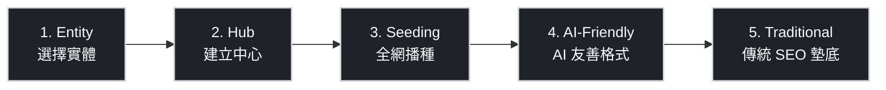

在「零點擊搜尋 (Zero-click search)」成為常態的時代，SEO 的重點已從「優化關鍵字」轉移到「建立實體關聯 (Entity Association)」。

## At a Glance

| 步驟 | 行動 | 核心目標 |
| --- | --- | --- |
| 1. Entity | 鎖定極度具體的「實體」 | 成為某領域的「預設唯一解」 |
| 2. Hub | 建立「實體中心」 | 讓 LLM 認定你為最佳訓練資料來源 |
| 3. Seeding | 在第三方平台「播種」 | 製造品牌與概念的「共現性」 |
| 4. AI-Friendly | 撰寫 AI 友善內容 | 讓 AI 能精準抓取並引用你的內容 |
| 5. Traditional | 鞏固傳統 SEO 地基 | 維持 Google 索引基礎，讓 AI 找得到你 |

## 核心思維轉移：從「關鍵字」到「實體」

| 維度 | 傳統 SEO | AI SEO (GEO) |
| --- | --- | --- |
| 優化對象 | 網頁內容匹配度 | 品牌實體關聯度 |
| 核心問題 | What you publish | Who you are |
| 成功指標 | 關鍵字排名 | AI 引用率、品牌共現次數 |

> **關鍵洞察：** 現在的 AI SEO 不是讓搜尋引擎看到你的內容，而是讓全網都在談論你，使 LLM 將「你的品牌」與「某個特定概念」畫上等號。

## The 5-Step Playbook

### Step 1 — Entity：鎖定極度具體的「實體」

**不要** 選擇寬泛標籤（行銷公司、SEO 工具）。

**要** 選擇極度具體且利基的概念，例如：
- 早期趨勢偵測工具
- B2B SaaS 留存率優化顧問

目標：讓 AI 容易將你的品牌視為該領域的唯一解，而非眾多選項之一。

```
填空練習：我們是 ________ 的代名詞。
```

---

### Step 2 — Hub：建立「實體中心」

在官方網站建立一篇（或一系列）**終極指南 / 深度文章**：

- 用最獨特、最權威的方式解釋你選定的實體概念
- 目標讀者是 LLM，讓它認為這是最棒的訓練資料
- 格式清晰、結構化，便於機器解析

---

### Step 3 — Seeding：在第三方平台「播種」

LLM 依賴**共現性 (Co-occurrence)**：品牌與概念必須在全網被反覆並列提及。

| 管道 | 行動 |
| --- | --- |
| 權威部落格 | 爭取進入「最佳工具比較清單」 |
| Podcast / YouTube | 參與利基市場訪談，讓主持人介紹你的品牌定位 |
| Reddit / Quora | 提供高價值的真實解答，自然帶出品牌 |

---

### Step 4 — AI-Friendly：撰寫 AI 友善內容

廢話是 AI 抓取內容的毒藥。遵循以下三原則：

1. **開門見山**：在頁面最頂端，用 1-2 句話直接回答核心問題
2. **宣告性語氣**：直接陳述事實，不使用模稜兩可的行銷詞彙
3. **加入限定條件**：說明此答案「適用於誰、不適用於誰」，增加可信度

---

### Step 5 — Traditional：鞏固傳統 SEO 地基

AI 依然依賴傳統 Google 索引獲取最新資訊。若網站基礎不穩，AI 也不會推薦你。

- 網站載入速度（Core Web Vitals）
- 清晰的網站架構與內部連結
- 高品質反向連結 (Backlinks)
- Google Search Console 索引健康狀態

## 策略優劣勢分析

:::col
### ✅ 優勢 (Pros)

- 完美契合 **RAG (檢索增強生成)** 的運作邏輯
- 不只提升 AI 引用率，本質上也是極佳的**數位品牌公關**
- 真實建立品牌信任，對人類讀者同樣有效
:::

:::col
### ❌ 劣勢 (Cons)

- 「第三方播種」門檻極高，需要大量外展時間、人脈或創新產品
- AI 總覽帶來的曝光較難精準追蹤 ROI 與轉換率
:::

> **實用主義觀點：**「內容數量」已大幅貶值。現在的硬通貨是**「獨特觀點」加上「第三方權威背書」**。

## 快速行動清單

- [ ] **定義實體**：寫下「我們是 ________ 的代名詞」
- [ ] **建立 Hub**：盤點官網，找出或新寫一篇針對該概念的權威指南
- [ ] **外展計畫**：列出 10 個可尋求提及的外部平台，並發送提供價值的開發信
- [ ] **內容瘦身**：將流量前 10 名文章的第一段，改寫為「1-2 句話的直接解答」
- [ ] **基礎健檢**：檢查 Google Search Console 索引狀態與網站載入速度

## 記憶輔助口訣：E.H.S.A.T.

> 發音類似 "A Hat"——想像你戴著一頂讓 AI 緊盯著你發光的帽子。

```
E — Entity      選擇極度具體的實體
H — Hub         在官網建立權威中心
S — Seeding     全網第三方平台播種
A — AI-Friendly 撰寫 AI 可精準抓取的內容
T — Traditional 傳統 SEO 打好地基
```


