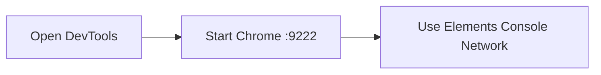

## Goal

Prepare Chrome DevTools so MCP can attach to Chrome for DOM, console, network, and interaction debugging, simple.



## 1. Open DevTools

- macOS shortcut: `Command + Option + I`
- Right click on page -> `Inspect`
- Chrome menu -> `View -> Developer -> Developer Tools`
![[Chrome with DevTools opened.png]]


## 2. Start Chrome with Remote Debugging (for MCP)

Close all Chrome windows, then run:

```bash
open -na "Google Chrome" --args --remote-debugging-port=9222
```

Verify endpoint:

```bash
curl http://127.0.0.1:9222/json/version
```

If JSON is returned, MCP can discover the browser target.

![[CodexApp with DevTools opened.png]]
## 3. Configure useful defaults

Open DevTools settings (`F1` inside DevTools) and set:

- `Appearance -> Theme`: choose your readable theme
- `Preferences -> Enable Ctrl+1-9 switch panels` (optional)
- `Sources -> Enable JavaScript source maps`
- `Network -> Preserve log`
- `Network -> Disable cache (while DevTools is open)`

## 4. Core panels MCP workflows use most

- `Elements`: inspect DOM/CSS and test style edits
- `Console`: runtime errors and quick JS checks
- `Network`: request timing/status and API payloads
- `Application`: storage, cookies, local/session storage

## 5. Fast MCP verification workflow

1. Open DevTools and reload page.
2. Confirm no red errors in `Console`.
3. Check failed requests in `Network` (4xx/5xx).
4. Inspect target element in `Elements`.

## Common Issues

- DevTools not opening:
  - Check keyboard shortcut conflicts.
  - Open via menu path instead.
- MCP cannot connect to Chrome:
  - Make sure Chrome was started with `--remote-debugging-port=9222`.
  - Confirm `http://127.0.0.1:9222/json/version` returns JSON.
- Network list is empty:
  - Enable `Preserve log`, then reload page.
- Changes disappear on refresh:
  - Edits in `Elements` are temporary unless saved in source files.


Official references:

- Chrome DevTools docs: <https://developer.chrome.com/docs/devtools>
- Chrome remote debugging port: <https://developer.chrome.com/docs/devtools/remote-debugging/local-server/>
