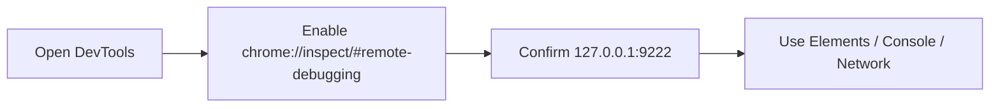

## 目標

設定好 Chrome DevTools，讓 MCP 可以連接 Chrome，進行 DOM、console、網路請求與互動除錯。


```mermaid
flowchart LR
  A["Open DevTools"] --> B["Enable chrome://inspect/#remote-debugging"]
  B --> C["Confirm 127.0.0.1:9222"]
  C --> D["Use Elements / Console / Network"]
```

## 1. 開啟 DevTools

- macOS 快捷鍵：`Command + Option + I`
- 在頁面上按右鍵 -> `Inspect`
- Chrome 選單 -> `View -> Developer -> Developer Tools`
  ![[Chrome with DevTools opened.png]]

## 2. 啟動 Chrome Remote Debugging（給 MCP 用）

### 方法 A（建議）：從 Chrome inspect 頁面啟用

1. 開啟 `chrome://inspect/#remote-debugging`。
2. 勾選 `Allow remote debugging for this browser instance`。
3. 確認 Chrome 顯示：`Server running at: 127.0.0.1:9222`。

快速驗證：

```bash
curl http://127.0.0.1:9222/json/version
```

如果有回傳 JSON，表示 MCP 可以偵測到瀏覽器目標。

### 方法 B（CLI 備案）：用指令啟動 Chrome 並開啟 remote debugging port

先關閉所有 Chrome 視窗，然後執行：

```bash
open -na "Google Chrome" --args --remote-debugging-port=9222
```

驗證端點：

```bash
curl http://127.0.0.1:9222/json/version
```

如果有回傳 JSON，表示 MCP 可以偵測到瀏覽器目標。

![[CodexApp with DevTools opened.png]]

## 3. 設定實用的預設值

開啟 DevTools 設定（在 DevTools 中按 `F1`），調整以下項目：

- `Appearance -> Theme`：選擇你看得順眼的主題
- `Preferences -> Enable Ctrl+1-9 switch panels`（選用）
- `Sources -> Enable JavaScript source maps`
- `Network -> Preserve log`
- `Network -> Disable cache (while DevTools is open)`

## 4. MCP 工作流程最常用的面板

- `Elements`：檢視 DOM/CSS，測試樣式修改
- `Console`：查看執行時錯誤與快速執行 JS
- `Network`：請求時間/狀態與 API payload
- `Application`：儲存空間、cookies、local/session storage

## 5. 快速驗證 MCP 的流程

1. 開啟 DevTools 並重新載入頁面。
2. 確認 `Console` 中沒有紅色錯誤。
3. 在 `Network` 中檢查失敗的請求（4xx/5xx）。
4. 用 `Elements` 檢視目標元素。

## 常見問題

- DevTools 打不開：
  - 檢查鍵盤快捷鍵是否有衝突。
  - 改用選單路徑開啟。
- MCP 無法連接 Chrome：
  - 開啟 `chrome://inspect/#remote-debugging`，確認 `Allow remote debugging for this browser instance` 已啟用。
  - 確認 Chrome 顯示 `Server running at: 127.0.0.1:9222`。
  - 確認 Chrome 啟動時有加上 `--remote-debugging-port=9222`。
  - 確認 `http://127.0.0.1:9222/json/version` 有回傳 JSON。
- Network 列表是空的：
  - 啟用 `Preserve log`，然後重新載入頁面。
- 修改在重新整理後消失：
  - 在 `Elements` 中的編輯是暫時的，除非存到原始檔案中。

官方參考資料：

- Chrome DevTools 文件：<https://developer.chrome.com/docs/devtools>
- Chrome remote debugging port：<https://developer.chrome.com/docs/devtools/remote-debugging/local-server/>
