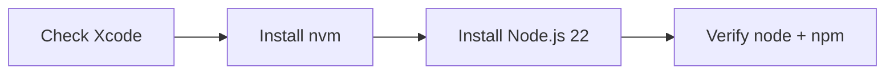

## Goal

Set up a stable Node.js environment on macOS in this order, simple.



`Xcode Command Line Tools -> nvm -> Node.js -> npm`

Official references:

- Apple Developer (Xcode): <https://developer.apple.com/xcode/>
- nvm (official repo): <https://github.com/nvm-sh/nvm>
- Node.js (official): <https://nodejs.org/>

## 1. Make Sure Xcode Is Installed

You only need to confirm Xcode Command Line Tools is available.
## 2. Install nvm

```bash
curl -o- https://raw.githubusercontent.com/nvm-sh/nvm/v0.40.3/install.sh | bash
```

Load shell config:

```bash
source ~/.zshrc
```

Verify:

```bash
nvm --version
```

## 3. Install Node.js (LTS or specific major)

Example (major 22):

```bash
nvm install 22
nvm use 22
nvm alias default 22
```

Verify:

```bash
node -v
npm -v
```

## Common Issues

- `nvm: command not found`
  - Run `source ~/.zshrc` or reopen terminal.
- `xcode-select` prompt keeps appearing
  - Install/repair Command Line Tools first, then retry `nvm` and `npm` commands.
