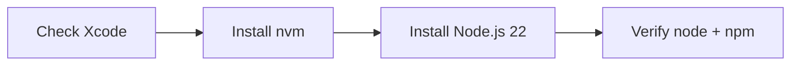

## 目標

在 macOS 上按照以下順序建立穩定的 Node.js 開發環境，簡單明瞭。


```mermaid
flowchart LR
  A["Check Xcode"] --> B["Install nvm"]
  B --> C["Install Node.js 22"]
  C --> D["Verify node + npm"]
```

`Xcode Command Line Tools -> nvm -> Node.js -> npm`

官方參考資料：

- Apple Developer (Xcode)：<https://developer.apple.com/xcode/>
- nvm（官方 repo）：<https://github.com/nvm-sh/nvm>
- Node.js（官方）：<https://nodejs.org/>

## 1. 確認 Xcode 已安裝

只需要確認 Xcode Command Line Tools 可以使用就好。

## 2. 安裝 nvm

```bash
curl -o- https://raw.githubusercontent.com/nvm-sh/nvm/v0.40.3/install.sh | bash
```

載入 shell 設定：

```bash
source ~/.zshrc
```

驗證：

```bash
nvm --version
```

## 3. 安裝 Node.js（LTS 或指定主要版本）

範例（主要版本 22）：

```bash
nvm install 22
nvm use 22
nvm alias default 22
```

驗證：

```bash
node -v
npm -v
```

## 常見問題

- `nvm: command not found`
  - 執行 `source ~/.zshrc` 或重新開啟終端機。
- `xcode-select` 提示一直出現
  - 先安裝或修復 Command Line Tools，再重新執行 `nvm` 和 `npm` 指令。
