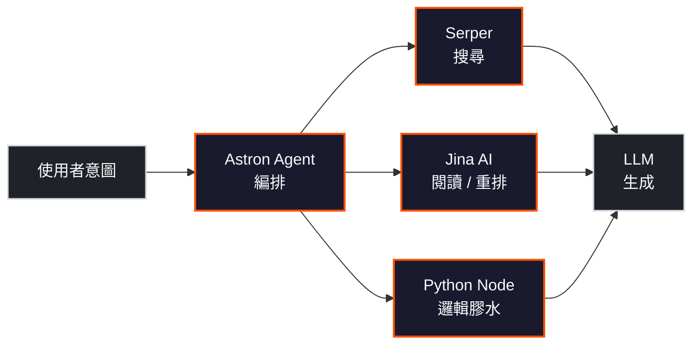

## TL;DR

這不是 5 個 AI 工具，而是 5 種 workflow 零件。它們在同一條 AI 自動化流水線裡各司其職：編排、搜尋、閱讀/排序、邏輯膠水、生成。搞清楚每個零件的分工，才能正確組裝自己的 workflow。

## 零件總覽

## 逐一拆解

### 1. Astron Agent — 編排平台

| 欄位 | 說明 |
|------|------|
| **這是什麼** | 科大訊飛（iFlyTek）開源的企業級 Agentic Workflow 開發平台 |
| **Workflow 角色** | 中央編排引擎——接收需求、分派子任務、串接工具、管控流程 |
| **分類** | 平台（Platform） |
| **付費方式** | 免費開源，Apache 2.0 授權，可商用 |
| **官方連結** | [github.com/iflytek/astron-agent](https://github.com/iflytek/astron-agent) |

核心能力：模型管理、MCP 工具整合、RPA 自動化、多 Agent 協作。它不是一個 AI 模型，而是讓多個模型和工具在同一條流水線裡跑起來的控制台。

### 2. Serper.dev — 搜尋工具

| 欄位 | 說明 |
|------|------|
| **這是什麼** | Google 搜尋結果 API，回傳結構化 SERP 資料 |
| **Workflow 角色** | 資料擷取——Agent 需要即時網路資訊時，透過 Serper 拿到搜尋結果 |
| **分類** | 工具（API Service） |
| **付費方式** | 免費 2,500 次查詢試用；付費方案 \$50 / 50K 查詢起（\$1/1K），量大可降至 \$0.30/1K |
| **官方連結** | [serper.dev](https://serper.dev) |

回應速度 1–2 秒，支援 300 QPS。在 AI workflow 裡，Serper 負責「幫 Agent 上網查資料」這一步。

### 3. Jina AI — 閱讀與重排工具

| 欄位 | 說明 |
|------|------|
| **這是什麼** | 搜尋基礎建設 API 套件：Reader（網頁轉文字）、Embeddings（向量化）、Reranker（結果重排） |
| **Workflow 角色** | 內容處理——把網頁轉成乾淨文字、把文字轉成向量、把搜尋結果依相關性重新排序 |
| **分類** | 工具（API Service） |
| **付費方式** | 免費 10M tokens（跨所有 API 共用）；Reader 基本用量免費；付費方案按 token 計價 |
| **官方連結** | [jina.ai](https://jina.ai) |

Jina 的 Reader API 特別適合 RAG 場景——搜完之後需要「讀懂」網頁內容再餵給 LLM。Reranker 則在候選結果太多時過濾雜訊。

### 4. Python Node — 邏輯膠水

| 欄位 | 說明 |
|------|------|
| **這是什麼** | 編排平台（如 n8n、Astron Agent）內建的程式碼執行節點 |
| **Workflow 角色** | 自訂邏輯——資料清洗、格式轉換、條件判斷、API 回傳值後處理 |
| **分類** | 邏輯節點（Code Execution Node） |
| **付費方式** | 免費，隨編排平台提供 |
| **官方連結** | 無獨立產品，內建於編排平台 |

Python node 不是 AI，是讓你在 workflow 中間插入任意程式碼的位置。當標準節點（搜尋、生成）之間需要格式轉換或分支判斷時，Python node 就是膠水。

### 5. LLM — 生成引擎

| 欄位 | 說明 |
|------|------|
| **這是什麼** | 大型語言模型，如 GPT-4.1、Claude、Gemini |
| **Workflow 角色** | 推理與生成——理解語意、產出文字、做出判斷 |
| **分類** | AI 模型（Model） |
| **付費方式** | 各家不同。多數有免費額度；正式使用按 token 計價（input/output 分開算） |
| **官方連結** | [OpenAI](https://openai.com) · [Anthropic](https://anthropic.com) · [Google AI](https://ai.google.dev) |

LLM 是整條 workflow 的大腦，但它只負責「想」——搜尋、閱讀、排序、程式邏輯都由上面的零件分擔。

## 付費摘要

| 零件 | 免費起步 | 正式使用費用 | 計價單位 |
|------|---------|-------------|---------|
| Astron Agent | 完全免費（Apache 2.0） | 免費 | — |
| Serper.dev | 2,500 次查詢 | \$1.00–\$0.30 / 1K 查詢 | 查詢次數 |
| Jina AI | 10M tokens | 按 token 計價 | Token 數 |
| Python Node | 免費（隨平台） | 免費 | — |
| LLM | 視提供商（多數有免費額度） | \$0.15–\$75 / 1M tokens | Token 數 |

## 一條完整 Workflow 範例

> 場景：使用者問「2026 年最值得關注的 AI Agent 框架有哪些？」

1. **Astron Agent** 接收問題，判斷需要搜尋 + 閱讀 + 生成
2. **Serper** 用 `"top AI agent frameworks 2026"` 查 Google，回傳 10 筆結果
3. **Jina Reader** 讀取前 5 筆網頁，轉成乾淨 Markdown
4. **Jina Reranker** 按相關性重排，取前 3 篇
5. **Python Node** 把 3 篇內容合併、截斷到 token 上限、加上 system prompt
6. **LLM** 讀入處理過的上下文，產出結構化回答

每個零件做一件事，串起來就是一條完整的 RAG pipeline。

## 結論：Workflow 零件，不是同一種工具

把這五個名字放在一起，容易誤以為它們是互相競爭的「AI 工具」。實際上它們是同一條流水線上的不同零件：

- **平台**（Astron Agent）負責指揮
- **搜尋**（Serper）負責找資料
- **閱讀 / 排序**（Jina AI）負責理解資料
- **膠水**（Python Node）負責銜接
- **模型**（LLM）負責產出

理解分工，才能正確選型、估算成本、替換零件。
