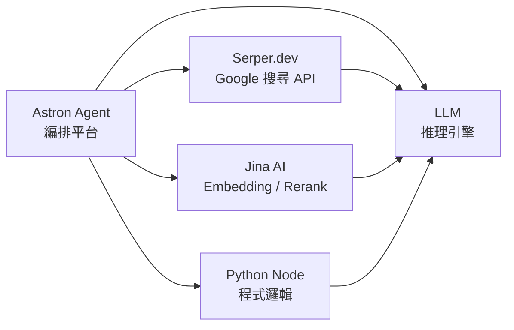

## TL;DR

- 這五個名詞放在同一張圖裡，常被誤以為是「五款同類 AI 工具在比拼」，實際上是 **一條 workflow 上五個不同角色**。
- 分層理解：`Astron Agent` = 編排平台，`LLM` = 推理引擎，`Serper.dev` = 外部搜尋資料源，`Jina AI` = 向量／語意檢索基礎設施，`Python node` = workflow 裡的程式碼執行格。
- 錢花在哪：LLM 與外部 API（Serper、Jina embeddings）是主要變動成本；Astron Agent 與 Python node 本身近乎零成本（只付你自己部署的算力）。

## 工作流中的角色分工

- **Astron Agent**：決定「誰在什麼時候被呼叫、用什麼參數、拿到結果之後往哪接」。
- **Python Node**：在 workflow 裡做 LLM 不擅長的事——精確字串處理、格式轉換、呼叫內部 API、數值運算。
- **LLM**：負責理解自然語言、決策、生成輸出。
- **Serper.dev**：當 workflow 需要「現在網路上在講什麼」時，替代自己爬蟲。
- **Jina AI**：把文字／文件轉成向量，做語意搜尋或 rerank，讓 LLM 拿到更相關的 context。

## 逐一拆解

### 1. Astron Agent

- **身分**：開源 AI Agent 編排平台（由科大訊飛開源，2025 年 9 月釋出）。
- **角色**：visual workflow builder + agent runtime，類似 Dify / n8n 定位，但偏向 agentic。
- **做什麼**：把 LLM、工具、API、資料源串成流程圖，可配置 prompt、工具呼叫、條件分支、迴圈。
- **付費模型**：開源本體免費，自託管只付伺服器成本。若使用官方雲端方案，需另計。
- **官方連結**：<https://github.com/iflytek/astron-agent>

> [!info]
> Astron Agent 本身不含 LLM，要自己接 OpenAI / Claude / Gemini / 本地模型等。

### 2. Serper.dev

- **身分**：Google Search API 包裝服務，返回 SERP 結構化 JSON。
- **角色**：workflow 中的「外部知識入口」，讓 agent 具備「現在就去搜」的能力。
- **做什麼**：一次呼叫回傳 organic results、knowledge graph、people also ask、news 等欄位。
- **付費模型**：
  - 免費：註冊送 2,500 次查詢（一次性，非每月）。
  - 付費：$50 / 50,000 queries 級距起跳（定價可能調整）。
- **官方連結**：<https://serper.dev>

### 3. Jina AI

- **身分**：neural search 與多模態 embedding 基礎設施供應商。
- **角色**：在 RAG / 語意檢索環節負責向量化、重排序、文件讀取。
- **常用 API**：
  - `Embeddings` — 文字／多語／多模態轉向量。
  - `Reranker` — 對候選文件重新打分，拉高相關性。
  - `Reader` — 把網頁轉成 LLM-ready Markdown（`https://r.jina.ai/<url>`）。
- **付費模型**：
  - 免費額度：API Key 註冊附帶 tokens 可用（實際額度以官方頁為準）。
  - 付費：依 token 或 call 計費，模型種類不同費率不同。
- **官方連結**：<https://jina.ai>

### 4. Python Node

- **身分**：workflow 平台裡的「執行任意 Python 程式碼」節點，**不是** AI 工具。
- **角色**：LLM 做不到或不該做的事情放這裡——
  - 正規表達式與嚴格格式驗證。
  - JSON / CSV / XML 轉換。
  - 呼叫內部私有 API、資料庫、檔案系統。
  - 簡單數學、統計、日期計算。
- **付費模型**：節點本身免費，成本來自執行環境（自託管 = 伺服器費；SaaS 平台 = 依 workflow 執行次數計價）。
- **常見出處**：n8n、Dify、Astron Agent、Zapier（以 `Code` 節點形式）、LangFlow。

> [!warning]
> 把所有邏輯都塞進 LLM prompt 是常見反模式。能用 5 行 Python 解決的，不要花 token 讓 LLM 推理。

### 5. LLM

- **身分**：大型語言模型——推理與生成引擎本體。
- **角色**：workflow 的「大腦」，負責理解輸入、決策、產生自然語言或結構化輸出。
- **常見選項**：OpenAI（GPT-4o / o-series）、Anthropic（Claude）、Google（Gemini）、開源（Qwen、DeepSeek、Llama）。
- **付費模型**：幾乎都是按 input / output token 計價，同家族不同模型單價差 10–100 倍。
- **關鍵事實**：LLM 本身**不會連網、不會讀檔、不會寫入資料庫**——這些都要靠 workflow 其他節點補。

## 分類對照表

| 元件 | 類型 | 是否 AI 模型 | 免費起步 | 正式使用多半要付費 |
|------|------|-------------|---------|------------------|
| Astron Agent | 編排平台 | 否 | ✅ 開源自託管 | 伺服器 / 雲端方案 |
| Serper.dev | 外部 API（搜尋） | 否 | ✅ 2,500 次額度 | ✅ 按查詢計費 |
| Jina AI | AI API（embedding / rerank） | ✅ 是 | ✅ 有免費額度 | ✅ 按 token 計費 |
| Python Node | 程式邏輯節點 | 否 | ✅ | 看平台方案 |
| LLM | AI 模型 | ✅ 是 | 部分模型免費（本地 / 免費級） | ✅ 按 token 計費 |

## 一段總結

這張圖不是「五款 AI 工具比拼」，而是 **一條 agentic workflow 的完整零件清單**：

- 需要一個 **編排層**（Astron Agent）把東西串起來。
- 需要一個 **推理層**（LLM）做決策與生成。
- 需要 **資料輸入層**（Serper.dev 取網路即時資料、Jina AI 做向量檢索）。
- 需要 **程式邏輯層**（Python Node）處理 LLM 做不到或不該做的精確操作。

看懂這個分工，才會知道「我要不要再買一個 X」這個問題，通常不是「買哪個 LLM」，而是「我在哪一層缺零件」。

## 延伸方向

- 這條 workflow 的完整替代方案比較（Dify / n8n / LangFlow / Flowise）。
- 同一條 agent workflow 換掉不同 LLM 的成本與品質 benchmark。
- RAG 中 Jina Reranker vs Cohere Rerank vs 自己用 cross-encoder 的實戰比較。
