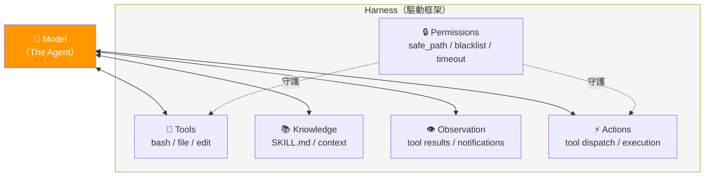
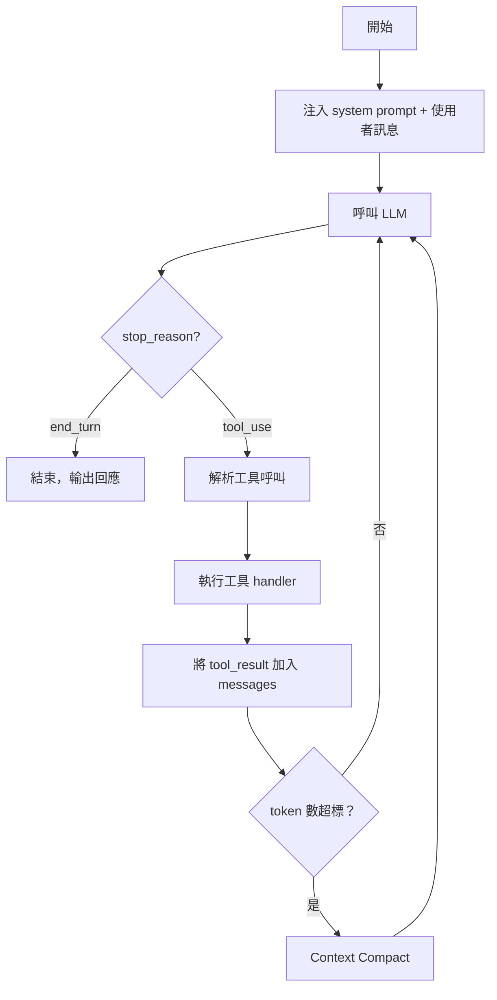

# AI Agent 駕駛框架全解析：從 30 行 Loop 到多 Agent 團隊

> 基於 [shareAI-lab/learn-claude-code](https://github.com/shareAI-lab/learn-claude-code) 的 Harness Framework 操作手冊
> License: MIT ｜ 語言：Python / TypeScript / Markdown

---

## 這篇文章是什麼

這不是一般的 repo 摘要。

這是一份 **AI Agent 駕駛框架 (Harness Framework) 的完整操作手冊**。它回答的核心問題是：**模型這麼強，你該怎麼「駕駛」它？**

learn-claude-code 提出了一個關鍵洞見：**Model IS the Agent**——模型本身就是 agent，你寫的程式碼不是 agent，而是「駕駛框架 (harness)」。你的工作不是打造 AI，而是打造讓 AI 發揮的載具。

這篇文章把這套框架從 12 個漸進式 session 中提煉出來，整理成可直接套用的架構模式、安全機制、團隊協作協議。無論你是在用 Claude Code、建自己的 agent、還是設計多 agent 工作流，這份手冊都是你的操作參考。

**適合誰：**
- 正在用 Claude Code 但想理解「它為什麼這樣設計」的開發者
- 想從零打造 agent 的工程師
- 需要設計多 agent 協作系統的架構師

**什麼時候該回來看：**
- 開始建新 agent 時（選對複雜度等級）
- Agent 的 context 爆了（三層壓縮策略）
- 需要多 agent 平行工作（JSONL mailbox + worktree 隔離）
- 想加新工具但不確定怎麼設計（tool dispatch map 模式）

---

## TL;DR

1. **核心公式**：`Harness = Tools + Knowledge + Observation + Actions + Permissions`——模型是駕駛，harness 是載具
2. **12 階段漸進式架構**：從最基本的 agent loop（30 行），一路到 worktree 隔離的多 agent 團隊
3. **每階段只加一個機制**：loop → tool dispatch → todo → subagent → skill loading → context compact → task system → background → teams → protocols → autonomous → worktree
4. **技能系統 (Skill)**：SKILL.md + YAML frontmatter 的兩層載入模式，省 token 又靈活
5. **安全防護完整**：path traversal 防護、危險指令黑名單、timeout、output 截斷、遞迴防護
6. **多模型支援**：Claude / MiniMax / GLM / Kimi / DeepSeek 皆可用
7. **附帶互動學習平台**：Next.js 建的視覺化教學網站
8. **不教你用工具，教你造工具**：揭示 Claude Code 背後的設計原理
9. **直接可用**：每個 session 的 Python 實作都可以獨立執行，也有 scaffold 腳本快速生成專案
10. **五級複雜度選擇**：從 Level 0（loop + bash）到 Level 4（teams + worktree），按需選用不過度工程

---

## Repo 在講什麼

### 專案定位

這是一份 **Harness Engineering 的實作教科書**。它不是教你怎麼用 Claude Code，而是教你 Claude Code 是怎麼被建出來的——從第一行 while loop 到完整的多 agent 作業系統。

### 主要內容範圍

| 面向 | 涵蓋內容 |
|------|---------|
| Agent 架構 | 從單一 loop 到多 agent 團隊的完整演進 |
| 工具系統 | Tool dispatch、安全防護、背景執行 |
| 知識管理 | Skill loading、context compression |
| 任務管理 | Todo → Task system → 依賴圖 |
| 團隊協作 | Mailbox protocol、shutdown/approval FSM |
| 隔離機制 | Git worktree 隔離平行工作 |

### 與 Claude Code 的關係

這個 repo 揭示了 Claude Code 背後的設計哲學與核心機制。理解這些後，你會更清楚：
- 為什麼 Claude Code 的 tool 是這樣設計的
- subagent 為什麼需要 context 隔離
- skill / SKILL.md 的設計邏輯
- context compact 在做什麼

---

## 分類整理

### 1. Prompt / Instruction Patterns

**Repo 中講了什麼：**
- System prompt 是 harness 的一部分，用來定義 agent 的行為邊界
- 兩層式知識注入：system prompt 只放 skill 名稱 + 描述（~100 tokens），完整內容透過 tool_result 按需載入
- Nag reminder 機制：每隔 N 輪自動注入 `<reminder>` 提醒模型更新 todo

**為什麼重要：**
- 前置載入所有知識會吃掉 context window，兩層式載入是唯一可擴展的做法
- 模型會「忘記」自己的計畫，reminder injection 是低成本的修正方式

**下次可以怎麼用：**
- 設計 SKILL.md 時採用 frontmatter + 按需載入
- 長時間執行的 agent 加入 reminder injection
- System prompt 只放「角色 + 工具清單 + 行為約束」，不放具體知識

### 2. Workflow / Operating Habits

**Repo 中講了什麼：**
- Agent 的工作流核心是一個 while loop：`LLM call → check stop_reason → execute tools → append results → loop`
- Todo/Task 系統強制一次只能有一個 `in_progress` 任務
- 背景任務模式：慢操作丟到 daemon thread，notification queue 在每次 LLM call 前 drain
- Idle cycle：autonomous agent 在沒任務時每 5 秒 poll inbox + task board

**為什麼重要：**
- 單一 in_progress 約束防止 agent 分心
- 背景任務讓 agent 不會卡在長時間指令上

**下次可以怎麼用：**
- 任何 agent 工作流都從 s01 的 while loop 開始
- 需要平行化時用背景任務模式，不是多線程 LLM call
- Task board polling 模式適合多 agent 場景

### 3. Tools / Integrations

**Repo 中講了什麼：**
- Tool dispatch map 模式：`TOOL_HANDLERS = {"bash": run_bash, "read_file": run_read, ...}`
- 加一個工具 = 加一個 handler function + 一個 JSON schema
- Loop 本身不需要改動
- 工具分類：filesystem（read/write/edit）、execution（bash）、planning（todo/task）、coordination（message/broadcast）

**為什麼重要：**
- Dispatch map 讓工具系統完全解耦，新增工具零成本
- JSON schema 讓模型自動理解工具參數

**下次可以怎麼用：**
- 用 `skills/agent-builder/references/tool-templates.py` 作為新工具的範本
- 維持 loop 不變、只動 handler map 的原則

### 4. Workspace / File Structure

**Repo 中講了什麼：**
- `.tasks/task_N.json`：檔案式任務持久化，包含 id、subject、status、blockedBy、owner
- `.team/config.json`：團隊配置
- `.transcripts/`：context compact 時的對話備份
- `.worktrees/index.json`：worktree 註冊表
- `events.jsonl`：生命週期事件日誌
- `skills/*/SKILL.md`：技能定義檔

**為什麼重要：**
- 檔案式狀態 > 記憶體狀態：context compact 後狀態不會遺失
- JSONL append-only 模式天然支援多 agent 並發寫入

**下次可以怎麼用：**
- 需要跨 session 持久化時，用 `.tasks/` 或類似的檔案結構
- Agent 間通訊用 JSONL mailbox，不用 shared memory

### 5. Safety / Guardrails

**Repo 中講了什麼：**

| 防護機制 | 實作方式 |
|---------|---------|
| Path traversal | `safe_path()` 檢查 `path.is_relative_to(WORKDIR)` |
| 危險指令 | 黑名單 `["rm -rf /", "sudo", "shutdown", ...]` |
| Timeout | `subprocess.run(timeout=120)` |
| Output 截斷 | 所有工具輸出上限 50,000 字元 |
| 遞迴防護 | Subagent 不能呼叫 `task` 工具 |
| 並行約束 | 一次只能有一個 `in_progress` todo/task |
| Todo 上限 | 最多 20 個 |
| 檔案隔離 | Git worktree 避免平行 agent 衝突 |

**為什麼重要：**
- Agent 有 bash 存取權就有系統存取權，安全邊界必須在 harness 層實作
- 遞迴防護是 subagent 設計的必要條件

**下次可以怎麼用：**
- 任何有 bash 工具的 agent 必須加 `safe_path()` 和危險指令黑名單
- Subagent 永遠不給 spawn 工具

### 6. Reusable Playbooks / Templates

**Repo 中講了什麼：**

| 資源 | 路徑 | 用途 |
|------|------|------|
| 最小 agent | `skills/agent-builder/references/minimal-agent.py` | ~80 行的完整可執行 agent |
| Tool 範本 | `skills/agent-builder/references/tool-templates.py` | 所有工具的 JSON schema + 實作 |
| Subagent 模式 | `skills/agent-builder/references/subagent-pattern.py` | Agent type registry (explore/code/plan) |
| Agent 哲學 | `skills/agent-builder/references/agent-philosophy.md` | Harness engineering 完整論述 |
| 專案腳手架 | `skills/agent-builder/scripts/init_agent.py` | CLI 生成不同複雜度的 agent 專案 |
| Code review 技能 | `skills/code-review/SKILL.md` | 結構化 review checklist |
| MCP builder 技能 | `skills/mcp-builder/SKILL.md` | MCP server 建置模板 |

**下次可以怎麼用：**
- 需要新 agent 時，用 `init_agent.py` 腳手架或 `minimal-agent.py` 起手
- 需要加工具時，參考 `tool-templates.py`

---

## 可直接複用的做法

### Checklist：建立新 Agent

- [ ] 從 s01 的 while loop 開始
- [ ] 定義 TOOL_HANDLERS dispatch map
- [ ] 每個工具加 JSON schema
- [ ] 加 `safe_path()` 防護
- [ ] 加危險指令黑名單
- [ ] 加 subprocess timeout
- [ ] 加 output 截斷
- [ ] 需要計畫時加 TodoManager
- [ ] 需要知識時加 SkillLoader（兩層式）
- [ ] 長時間執行加 context compact
- [ ] 多步驟加 TaskManager
- [ ] 多 agent 加 MessageBus

### Template：SKILL.md 格式

```markdown
---
name: my-skill
description: 一行描述，用於 system prompt 的技能清單
version: 1.0
---

# My Skill

## 使用時機
（什麼情況下載入這個技能）

## 操作步驟
1. ...
2. ...

## 注意事項
- ...
```

### SOP：漸進式複雜度選擇

| 等級 | 包含機制 | 適用場景 |
|------|---------|---------|
| Level 0 | Loop + Bash | 單一指令執行 |
| Level 1 | + File tools + Todo | 多步驟檔案操作 |
| Level 2 | + Subagents | 探索性任務、避免 context 污染 |
| Level 3 | + Skills + Compact | 需要領域知識、長時間執行 |
| Level 4 | + Tasks + Teams + Worktree | 多 agent 協作、平行開發 |

### Decision Rules

```
需要 agent 嗎？
├─ 單一 API call → 不需要，直接呼叫
├─ 多步驟但可預測 → 用 script/pipeline
└─ 多步驟且需要判斷 → 用 agent
    ├─ 單一任務 → Level 0-1
    ├─ 需要探索 → Level 2
    ├─ 需要領域知識 → Level 3
    └─ 需要平行/協作 → Level 4
```

### Do / Don't

| Do | Don't |
|----|-------|
| 從最簡單的 level 開始 | 一開始就上 Level 4 |
| 信任模型的判斷能力 | 用大量 if-else 腳本化行為 |
| 把知識放在 SKILL.md 按需載入 | 把所有知識塞進 system prompt |
| 用檔案系統做狀態持久化 | 把狀態只存在記憶體 |
| Subagent 用 fresh context | 把父 agent 的 context 傳給子 agent |
| 工具輸出加截斷和 timeout | 假設工具一定會正常返回 |

---

## 圖表 / 結構圖

### Agent 架構演進路線圖


> 藍色 = 基本迴圈 ｜ 橘色 = 規劃與知識 ｜ 綠色 = 持久化 ｜ 紫色 = 團隊協作

### Harness 核心公式與架構



### Agent Loop 流程圖



---

## 與我目前工作流的連結

### How I Can Use This Next Time

| 我的工作場景 | learn-claude-code 對應知識 | 具體做法 |
|-------------|--------------------------|---------|
| **研究型 task** | s04 Subagent + s05 Skill Loading | 用 subagent 做探索，把結論帶回主 agent；研究結果寫成 SKILL.md 供未來載入 |
| **Coding task** | s01-s02 Loop + Tools | 理解 Claude Code 的 tool 呼叫機制，更精準地引導它使用正確工具 |
| **Issue 撰寫** | s07 Task System | 把 issue 拆成有依賴關係的 task，讓 agent 自動按序處理 |
| **Repo 探索** | s04 Subagent (explore type) | 用 explore 型 subagent 掃描 repo，避免主 context 被大量檔案內容污染 |
| **Agent / Sub-agent 工作流** | s09-s12 Teams + Protocols | JSONL mailbox 通訊、shutdown/approval FSM、worktree 隔離 |
| **OpenClaw 場景** | s05 Skill + s08 Background | Skill 系統與 OpenClaw 的 skill-notes 設計相通；cron/background 模式對應 OpenClaw 的自動化 |
| **長時間執行** | s06 Context Compact | 三層壓縮策略：micro_compact → auto_compact → manual compact |
| **多人協作** | s09-s10 Teams + Protocols | 多 agent 間的 mailbox 通訊、plan approval 流程 |

### 實務建議

1. **設計新 Skill 時**：參考 `skills/agent-builder/SKILL.md` 的 frontmatter 結構
2. **debug agent 行為時**：回頭看 s01 的核心 loop，問題通常在 tool dispatch 或 stop_reason 判斷
3. **context 不夠用時**：套用 s06 的三層壓縮策略
4. **需要多 agent 時**：從 s09 的 JSONL mailbox 開始，不要直接跳 s12

---

## Quick Reference 速查區

### 核心公式

```
Harness = Tools + Knowledge + Observation + Actions + Permissions
Agent = Model + Harness
```

### 12 Sessions 速查

| # | 名稱 | 一句話 | 原始碼 |
|---|------|-------|--------|
| s01 | Agent Loop | 一個 while loop + bash 就夠了 | `agents/s01_agent_loop.py` |
| s02 | Tool Dispatch | 加工具 = 加一個 handler | `agents/s02_tool_use.py` |
| s03 | TodoWrite | 沒計畫的 agent 會迷路 | `agents/s03_todo_write.py` |
| s04 | Subagents | 大任務拆小，每個子 agent 乾淨 context | `agents/s04_subagent.py` |
| s05 | Skill Loading | 知識按需載入，不要預載 | `agents/s05_skill_loading.py` |
| s06 | Context Compact | Context 會滿，要有壓縮策略 | `agents/s06_context_compact.py` |
| s07 | Task System | 任務寫檔案，壓縮後不會丟 | `agents/s07_task_system.py` |
| s08 | Background Tasks | 慢操作丟背景，agent 繼續思考 | `agents/s08_background_tasks.py` |
| s09 | Agent Teams | 一個人做不完就找隊友 | `agents/s09_agent_teams.py` |
| s10 | Team Protocols | 隊友需要共同的溝通規則 | `agents/s10_team_protocols.py` |
| s11 | Autonomous Agents | 掃 task board、自己認領 | `agents/s11_autonomous_agents.py` |
| s12 | Worktree Isolation | 各做各的，互不干擾 | `agents/s12_worktree_task_isolation.py` |

### 關鍵檔案路徑

| 用途 | 路徑 |
|------|------|
| 最小可執行 agent | `skills/agent-builder/references/minimal-agent.py` |
| 工具 schema + 實作範本 | `skills/agent-builder/references/tool-templates.py` |
| Subagent 模式 | `skills/agent-builder/references/subagent-pattern.py` |
| Agent 設計哲學 | `skills/agent-builder/references/agent-philosophy.md` |
| 專案腳手架 | `skills/agent-builder/scripts/init_agent.py` |
| 完整版 agent | `agents/s_full.py`（740 行） |

### 安全防護 Checklist

- [ ] `safe_path()` 路徑檢查
- [ ] 危險指令黑名單
- [ ] subprocess timeout（120s）
- [ ] output 截斷（50K 字元）
- [ ] subagent 不給 spawn 權限
- [ ] 單一 in_progress 約束

## Related

- [[agent-teams-guide|Claude Code Agent Teams 協作]]
- [[hooks-guide|Claude Code Hooks 入門]]
- [[claude-folder-anatomy-guide|.claude/ 資料夾完全解析]]
