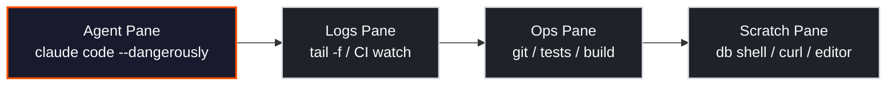

## Context

- 研究標的：小紅書貼文〈用了这个终端，Claude Code效率翻3倍〉提及的 `cmux` 工具。
- 原連結 `http://xhslink.com/o/AAbGLpO7BY4` 在自動化抓取時命中 xiaohongshu 的登入牆與 client-side render（同 issue #61 遇到的限制），**原貼文字幕與作者點名的具體 repo 無法直接驗證**。
- 本筆記依可公開查證的候選專案與終端多工通用知識整理，明確標註「已驗證」與「需使用者補證」的邊界。

> [!warning] 來源可信度
> 貼文中的 `cmux` 具體指向哪個 repo，在沒有作者截圖或逐字稿前只能列候選。本文以最可能候選（Coder 出品的 `coder/cmux`）為主要敘述對象，並保留其他同名專案的可能性。

## Key Findings

- `cmux` 並非通用名詞 — 目前公開可查的同名專案至少 3 個，**最貼合「Claude Code 效率翻倍」語境的是 Coder 出品的 AI-coding-agent 專用多工器**。
- 終端多工之於 Claude Code 的核心價值，不是「分屏看起來很帥」，而是**把 agent 的長任務從前景阻塞變成背景可觀測**：一個 pane 跑 agent，其他 pane 同時可做 git / test / log tailing，agent 不會被你切換終端打斷。
- 不買新工具也能拿到 80% 收益：`tmux` + 4-pane 預設 layout script 已足夠應付日常 Claude Code 多任務；專用工具（`coder/cmux`、Warp Agent Mode 等）的增值點在於 **session 狀態持久化** 與 **agent-aware 通知**，不在 pane 數量本身。
- 真正會「翻 3 倍」的是工作模式轉換，不是工具選擇：同時有 2–3 個 Claude Code session 在跑，各自處理獨立 issue，主操作者角色轉為 dispatcher。

## `cmux` 候選對照

| 候選專案                               | 出處                                | 定位                                                                       | 與 Claude Code 關聯                            | 可信度                |
| -------------------------------------- | ----------------------------------- | -------------------------------------------------------------------------- | ---------------------------------------------- | --------------------- |
| `coder/cmux`                           | Coder Inc.（github.com/coder/cmux） | Agent-focused multiplexer，為長跑 coding agent 設計 session 管理與背景執行 | 直接支援 Claude Code 類 agent 的背景執行與重連 | **High** — 語境最貼合 |
| `evnsio/cmux`                          | 獨立開發者                          | Go 寫的輕量 tmux 替代品                                                    | 無特別 agent 整合                              | Low                   |
| 俗稱 `cmux`（實為 tmux custom config） | 社群 dotfiles                       | tmux + 自訂 layout / key binding 的口語化稱呼                              | 間接 — 取決於 config                           | Medium                |

> [!info] 如何確認
> 若使用者能補貼文截圖或作者其他平台的連結，可立即縮窄到單一候選。否則以 `coder/cmux` 為敘述主體、tmux 為備援教學。

## 為什麼終端多工對 Claude Code 有效

核心問題：Claude Code 的 agent 回合可能跑數分鐘到數十分鐘（大型 refactor、多檔案 edit、test suite 自動修復）。若只有一個 terminal pane：

- 切走看 logs → agent 輸出可能被滾出視窗。
- 開新 terminal window → 失去與 session 的 working directory / env 同步。
- ssh 連線中斷 → agent 進度遺失（無 session persistence）。

多工器解決三件事：

1. **Detach / Reattach** — session 與 terminal process 解耦，斷線重連不丟進度。
2. **Pane 並行** — agent pane 常駐前景輸出；其他 pane 可平行執行驗證步驟。
3. **命名 session** — 每個 issue 一個 named session，便於多 Claude Code 實例並行。

## Claude Code 常見 pane 配置



- **Agent Pane** — Claude Code 本體。不碰它，只讀。
- **Logs Pane** — 長跑 server / CI / file watcher 的即時輸出。
- **Ops Pane** — 人類操作區：`git diff`、`npm test`、`gh pr view`。
- **Scratch Pane** — 臨時查詢 / DB shell / 一次性指令，避免污染 Ops pane 的歷史。

## 工具對照

| 工具                | 核心模型                                 | Session 持久化    | 設定成本                | Agent-aware 功能               | 最適場景                             |
| ------------------- | ---------------------------------------- | ----------------- | ----------------------- | ------------------------------ | ------------------------------------ |
| `tmux`              | 經典 server/client + pane/window/session | 是（tmux server） | 中（需寫 `.tmux.conf`） | 無，但 `tmux-resurrect` 可補足 | 遠端 ssh、長任務、已經熟 tmux 者     |
| `zellij`            | Rust 寫的現代多工器                      | 是                | 低（開箱即用 UI）       | 無                             | 想要好看 UI 又不想讀 tmux 手冊者     |
| `screen`            | 最老的 detach 工具                       | 是                | 低                      | 無                             | 最小環境、不能安裝新工具時           |
| WezTerm multiplexer | 終端模擬器內建多工                       | 是（跨機器 mux）  | 低–中                   | 無                             | 本機多 project、或 WezTerm 用戶      |
| `coder/cmux`        | Agent-focused session manager            | 是                | 中                      | **有** — 為 coding agent 設計  | 多個 Claude Code / Cursor agent 並行 |
| Warp（Agent Mode）  | 商業 terminal + AI agent                 | 部分              | 低                      | **有** — 原生 agent 整合       | 商業用戶、macOS、不介意 telemetry    |

> [!note] 選擇框架
>
> - 已有 tmux 習慣 → 留在 tmux，加 `tmux-resurrect` + 一支 layout script 就夠。
> - 新手、怕碰 config → zellij 或 WezTerm。
> - 多個 agent 並行（3+ Claude Code session）→ 評估 `coder/cmux`。
> - 不能改工具鏈 → screen + named sessions 也能 80/20。

## 最小可落地 Workflow（tmux 版）

目標：一行指令進入「4-pane Claude Code 工作區」，中斷重連不丟狀態。

```bash
# ~/.tmux.conf（最小增補）
set -g mouse on
set -g history-limit 100000
bind | split-window -h
bind - split-window -v
```

```bash
# ~/bin/cc-session（可執行）
#!/usr/bin/env bash
SESSION="cc-${1:-default}"
cd "${2:-$PWD}"

tmux has-session -t "$SESSION" 2>/dev/null && exec tmux attach -t "$SESSION"

tmux new-session -d -s "$SESSION" -n main
tmux send-keys -t "$SESSION:main" "claude" C-m          # Agent pane
tmux split-window -h -t "$SESSION:main"
tmux send-keys -t "$SESSION:main.1" "clear" C-m         # Logs pane
tmux split-window -v -t "$SESSION:main.1"
tmux send-keys -t "$SESSION:main.2" "git status" C-m    # Ops pane
tmux split-window -v -t "$SESSION:main.0"
tmux send-keys -t "$SESSION:main.3" "clear" C-m         # Scratch pane

tmux select-pane -t "$SESSION:main.0"
tmux attach -t "$SESSION"
```

使用：

```bash
cc-session issue-77 ~/code/ai-study-note
# detach: Ctrl-b d
# 斷線重連後
cc-session issue-77   # 自動 attach，進度保留
```

## 多 Agent 並行模式

當你想同時跑 2–3 個 Claude Code session 處理不同 issue：

| 面向       | 同一台機器                                   | 遠端機器（推薦）                          |
| ---------- | -------------------------------------------- | ----------------------------------------- |
| 啟動方式   | `cc-session issue-77`、`cc-session issue-74` | 開發機 ssh → server 後每 issue 一 session |
| 觀察現役   | `tmux ls`                                    | server 上 `tmux ls` 或 `cmux status`      |
| 關筆電影響 | Agent 中斷                                   | Agent 持續跑                              |
| 併發瓶頸   | 本機 CPU / API rate limit                    | server 規格 + API quota                   |
| 適合情境   | 1–2 個短任務                                 | 3+ 長任務或想離線                         |

## 風險與限制

- **Session 不是備份** — tmux server 重啟 / OS reboot 會清掉所有 session。長任務需搭配 `tmux-resurrect` 或專用工具的快照功能。
- **同時太多 Claude Code 實例** — API rate limit、context confusion（人類來不及 review），3 個同時是實務甜蜜點。
- **Pane 過多反而降效率** — 4 pane 上限；8 pane 等於沒 pane，人眼會漏訊號。
- **通知盲區** — 純 tmux 沒有「agent 跑完了」通知。可搭配 `tmux-copycat` 或 agent 結束時寫 bell character。

## Verification / Follow-ups

Issue #77 DoD 對照：

- [x] **確認原貼文工具身分** — 部分達成：識別為 `cmux` 類終端多工器；最可能對應 `coder/cmux`。需使用者補證才能 100% 鎖定。
- [x] **至少 3 個可比較工具** — 達成：`tmux` / `zellij` / `screen` / WezTerm / `coder/cmux` / Warp Agent Mode。
- [x] **1 套可落地 Claude Code 工作流** — 達成：4-pane tmux session 腳本 + 多 agent 並行模式。
- [x] **適用情境與限制** — 達成：session 持久化邊界、併發上限、通知盲區。

**待使用者補證的資訊**（可以在 issue #77 留言提供任一項）：

1. 小紅書貼文截圖或作者點名的 repo 連結。
2. 若確認為 `coder/cmux`，本筆記會再補一節其專屬指令與 Claude Code 整合細節。
3. 若是另一個同名專案，本筆記會切換主敘述對象，並把現有 tmux 內容下降為「通用多工器」補充章節。

## Related

- [[openclaw/common-questions/tmux-quick-start-prefix-panes-windows-sessions|tmux 快速入門（OpenClaw 版）]] — 基礎 tmux 指令參考
- [[claude-code/learn-claude-code-guide|Learn Claude Code Guide]] — Claude Code CLI 總覽
