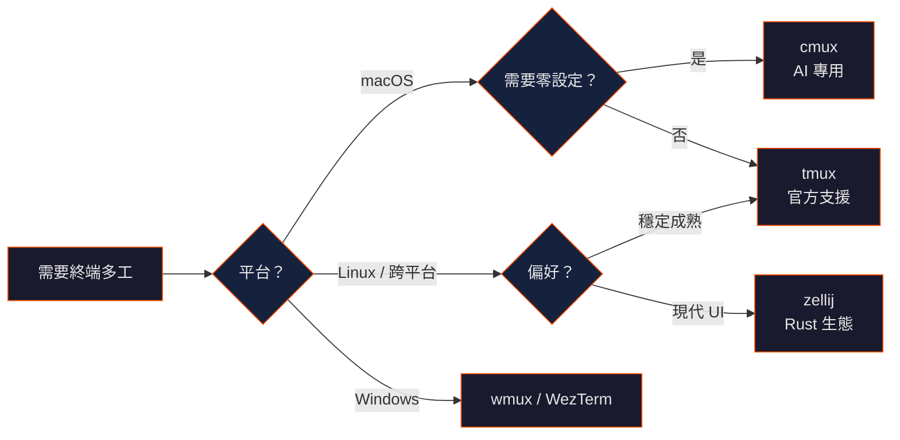

## TL;DR

- **cmux** 是真實存在的工具（不是 tmux 的拼寫錯誤），是專為 AI coding agent 設計的 macOS 原生終端
- **tmux** 是目前 Claude Code Agent Teams 唯一官方支援的 multiplexer
- 效率提升來自**消除上下文切換開銷** —— 讓 agent、logs、測試、瀏覽器同時可見
- 「效率翻 3 倍」的說法是體感數字，非基準測試結果

## 工具比較

| 工具 | 類型 | AI Agent 專用 | Session 持久化 | 分割面板 | 設定複雜度 | Claude Code 官方支援 |
|------|------|--------------|---------------|---------|-----------|---------------------|
| **cmux** | macOS 原生 app（Swift） | 專為 AI agent 設計 | 有 | 有 + 內嵌瀏覽器 | 零設定 | 社群 skill |
| **tmux** | CLI multiplexer | 通用 | 有 | 有 | 中等（prefix key + `.tmux.conf`） | 官方唯一支援 |
| **zellij** | CLI multiplexer（Rust） | 通用 | 有（內建） | 有 + floating panes | 低（可探索式 UI） | 未官方支援；有社群插件 |
| **WezTerm** | GPU 加速終端 + mux | 通用 | 有 | 有 | 中等（Lua 設定） | 有 MCP server；未官方支援 |

## cmux：專為 AI Coding 設計的終端

- **Repo：** [craigsc/cmux](https://github.com/craigsc/cmux)
- **官網：** [cmux.com](https://cmux.com/)
- **定位：** 「tmux for Claude Code」
- **技術：** 基於 Ghostty，Swift/AppKit 原生

### 核心特點

- 垂直分頁、分割面板、內嵌瀏覽器 —— 全在一個視窗內
- Socket API 可程式化控制
- 不需要 prefix key、不需要設定檔
- 支援 Claude Code、Codex CLI、Gemini CLI、Aider 等 AI agent

### 限制

- **僅 macOS** —— Windows 使用者可參考 [wmux](https://github.com/amirlehmam/wmux)
- 相對較新，社群生態尚在建立

## tmux：官方支援的標準方案

tmux 是 Claude Code Agent Teams 的**唯一官方支援後端**（`teammateMode: "split-pane"`）。

### 基本 Claude Code 配置

```bash
# 建立新 session
tmux new-session -s claude

# 水平分割（agent + logs）
tmux split-window -h

# 垂直分割（加入測試面板）
tmux split-window -v
```

### 進階：多 session 管理

- [claude-tmux](https://github.com/nielsgroen/claude-tmux) —— Claude Code 專用 tmux 整合
- [Codeman](https://github.com/andynu/codeman) —— 管理 20+ 平行 Claude Code session

## 標準多面板工作流

不論用哪個工具，推薦的面板配置：

| 面板 | 角色 | 說明 |
|------|------|------|
| **主面板** | Claude Code agent | 互動式 agent session |
| **側面板** | Logs 監控 | `tail -f` 追蹤日誌 |
| **底面板** | Git / 測試 | `git status`、test runner |
| **額外面板** | 長時間任務 | Build、第二個 agent session |

```
┌─────────────────┬──────────────┐
│                 │              │
│  Claude Code    │  Logs / 監控  │
│  (主 agent)      │              │
│                 │              │
├─────────────────┴──────────────┤
│  Git / Test / 第二個 agent       │
└────────────────────────────────┘
```

## 為什麼這能提升效率

1. **消除 alt-tab** —— 所有資訊同時可見，不需要切換視窗
2. **平行執行** —— 一個面板跑 agent，另一個面板跑測試，第三個面板看結果
3. **Session 持久化** —— SSH 斷線不會丟失 agent 狀態（tmux/zellij）
4. **監控長任務** —— 長時間 build 或 deploy 在獨立面板持續運行

## 選擇建議



## 目前狀態（2026 年 4 月）

- **tmux** 仍是 Claude Code Agent Teams 唯一官方支援的 multiplexer
- **zellij** 和 **WezTerm** 已有 feature request 在 anthropics/claude-code（#24122、#31901、#23574）
- **cmux** 社群成長中，有專屬的 `setup-cmux` skill

## 參考來源

- cmux — [cmux.com](https://cmux.com/) / [craigsc/cmux](https://github.com/craigsc/cmux)
- claude-tmux — [nielsgroen/claude-tmux](https://github.com/nielsgroen/claude-tmux)
- wmux — [amirlehmam/wmux](https://github.com/amirlehmam/wmux)
