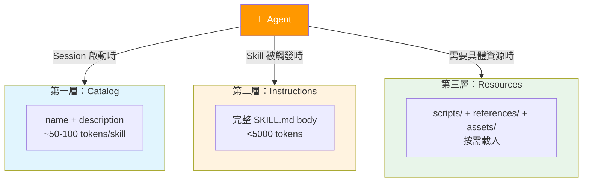
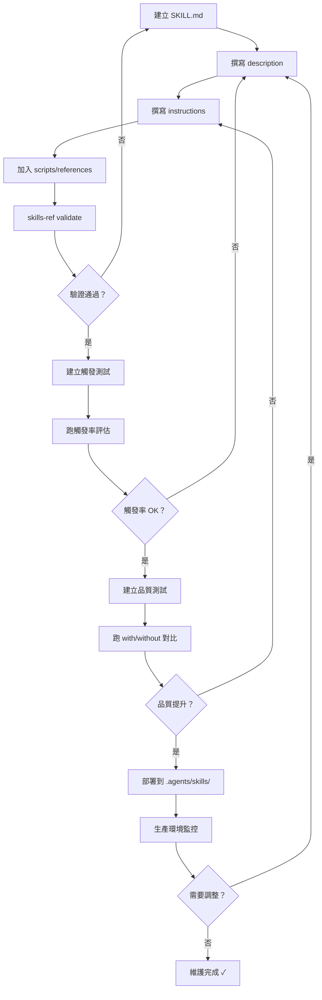
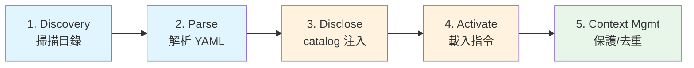

# Agent Skills 規格研究筆記

> 來源 Repo：[agentskills/agentskills](https://github.com/agentskills/agentskills)
> 文件站：[agentskills.io](https://agentskills.io)
> 範例技能：[anthropics/skills](https://github.com/anthropics/skills)（17 個官方範例）
> License: Apache 2.0（程式碼）/ CC-BY-4.0（文件）

---

## TL;DR

1. **Agent Skills 是一個開放規格**，由 Anthropic 維護，定義了 AI agent 技能的標準格式
2. **核心是 SKILL.md**：YAML frontmatter + Markdown 指令，放在固定目錄結構中
3. **三層漸進式揭露**：catalog（名稱+描述）→ instructions（完整指令）→ resources（腳本/參考資料），有效控制 context window
4. **跨客戶端互通**：Claude Code、VS Code Copilot、Cursor、Gemini CLI 等 30+ 工具已採用 `.agents/skills/` 目錄慣例
5. **觸發工程 (Trigger Engineering)**：系統化的描述優化方法論，含評估腳本與 train/validation 分割
6. **完整評估框架**：with-skill vs without-skill 對比、assertion 驗證、benchmark 聚合
7. **腳本設計原則**：為 agent 使用場景設計的 CLI 工具指南（無互動、結構化輸出、冪等性）
8. **適合對象**：正在建立或整理 agent 工作流的開發者，特別是想讓知識可攜帶、可複用的人
9. **最大價值**：不只是格式規格，更是「如何把知識打包成 agent 可用單元」的完整方法論
10. **直接可用**：附帶 Python 驗證工具、17 個官方範例、skill-creator 自動化技能建立

---

## Repo 在講什麼

### 專案定位

Agent Skills 是一個**開放格式規格 (open format specification)**，目標是讓 AI agent 的能力擴充變得標準化、可攜帶、可互通。它不是一個框架或 SDK，而是一份「合約」——定義了技能應該長什麼樣、怎麼被發現、怎麼被載入。

### 主要內容範圍

| 面向 | 涵蓋內容 |
|------|---------|
| 格式規格 | SKILL.md 結構、frontmatter 欄位、目錄慣例、命名規則 |
| 設計哲學 | 漸進式揭露、context 效率、控制校準 |
| 撰寫指南 | 最佳實踐、描述優化、腳本設計 |
| 評估方法 | 觸發率測試、品質評估、benchmark 聚合 |
| 客戶端實作 | 五步驟整合指南（發現→解析→揭露→啟動→管理） |
| 參考實作 | Python SDK（驗證、解析、prompt 生成） |

### 與 Claude Code 的關係

Agent Skills 就是 Claude Code 的 skill 系統的底層規格。理解這個規格後：
- 你會知道 SKILL.md 的每個欄位為什麼存在
- 你會理解為什麼 skill 描述這麼重要（觸發路由）
- 你會知道如何設計讓 agent 更容易使用的腳本
- 你能建立跨工具可攜帶的技能包

---

## 分類整理

### 1. Skill Spec / Skill Anatomy

**Repo 中講了什麼：**

一個 skill 是一個目錄，至少包含 `SKILL.md`：

```
skill-name/
├── SKILL.md          # 必要：metadata + 指令
├── scripts/          # 選用：可執行腳本
├── references/       # 選用：參考文件
├── assets/           # 選用：模板、資源
```

**SKILL.md frontmatter 欄位：**

| 欄位 | 必要 | 說明 |
|------|------|------|
| `name` | 是 | 最長 64 字元，小寫+連字號，必須與目錄同名 |
| `description` | 是 | 最長 1024 字元，描述用途與觸發時機 |
| `license` | 否 | 授權名稱或引用 |
| `compatibility` | 否 | 最長 500 字元，環境需求 |
| `metadata` | 否 | 任意 key-value |
| `allowed-tools` | 否 | 預核准的工具清單（實驗性） |

**命名規則**：只能用小寫英數字+連字號；不能以連字號開頭或結尾；不能連續連字號。

**為什麼重要：**
- 這是互通性的基礎——遵循規格的 skill 可以在任何支援的 agent 客戶端使用
- 目錄名 = skill 名的約束避免了命名衝突

**下次可以怎麼用：**
- 建立新 skill 時嚴格遵循此結構
- 用 `skills-ref validate` 驗證格式正確性

### 2. Prompt / Instruction Patterns

**Repo 中講了什麼：**

六大撰寫模式：

**A. Gotchas 區段** — 最高價值內容，糾正 agent 會犯的具體錯誤：
```markdown
## Gotchas
- `users` 表使用 soft delete，查詢必須加 `WHERE deleted_at IS NULL`
- user ID 在 DB 中是 `user_id`，auth 服務中是 `uid`，billing API 中是 `accountId`
```

**B. 輸出模板** — 用具體結構取代描述性文字

**C. 檢查清單** — 多步驟工作流的進度追蹤

**D. 驗證迴圈** — 做 → 驗證 → 修正 → 重複直到通過

**E. 規劃-驗證-執行** — 批次/破壞性操作：建立計畫 → 對照驗證 → 驗證通過才執行

**F. 控制校準** — 脆弱操作要精確指定，彈性操作給自由度；提供預設值，不提供選單

**核心原則**：「補充 agent 不知道的，省略 agent 已知的」。不要解釋 PDF 是什麼，直接講用哪個 library 和什麼 pattern。

**為什麼重要：**
- 這些模式適用於任何 agent 指令撰寫，不限於 skill
- Gotchas 區段是防止 agent 犯錯的最有效手段

**下次可以怎麼用：**
- 每個 SKILL.md 都加 Gotchas 區段
- 破壞性操作一律用 Plan-Validate-Execute
- 指令要寫「程序」不要寫「宣告」

### 3. Workflow / Usage Patterns

**Repo 中講了什麼：**

**觸發工程 (Trigger Engineering)**：
- 描述用祈使句：「Use this skill when...」
- 聚焦使用者意圖，不是實作細節
- 偏向積極觸發——明確列出適用情境
- 保持在 1024 字元內

**評估方法論**：
1. 建立 ~20 個測試查詢（8-10 應觸發 + 8-10 不應觸發）
2. 每個查詢跑 3+ 次，計算觸發率
3. 用 train/validation 分割（~60/40）避免過度擬合
4. 迭代 5 輪：評估 → 找失敗 → 修改描述 → 重跑

**品質評估**：
- 測試案例格式存在 `evals/evals.json`
- 工作區結構：`iteration-N/eval-name/{with_skill,without_skill}/`
- 對比 with-skill vs without-skill
- 記錄時間數據（token 數、執行時間）
- 聚合成 `benchmark.json` 含 delta 分析

**為什麼重要：**
- 觸發率直接影響使用體驗——好的 skill 在對的時候自動啟動
- 沒有系統化評估，skill 品質無法量化

**下次可以怎麼用：**
- 新 skill 上線前跑一輪觸發率測試
- 用 with/without 對比證明 skill 的實際效果

### 4. Tooling / Integrations

**Repo 中講了什麼：**

**腳本設計原則（為 agent 使用場景）**：

| 原則 | 做法 |
|------|------|
| 無互動 | 不用 interactive prompt，agent 在非互動 shell |
| 自文檔 | 支援 `--help`，這是 agent 學介面的方式 |
| 有用的錯誤訊息 | 「Error: --format must be one of: json, csv. Received: 'xml'」 |
| 結構化輸出 | JSON/CSV 優於自由文字 |
| stdout/stderr 分離 | 資料走 stdout，診斷走 stderr |
| 冪等性 | agent 可能重試 |
| --dry-run | 破壞性操作必備 |
| 有意義的 exit code | 不要全部回傳 0 |
| 可預測的輸出量 | 支援 `--offset` 分頁，別塞爆 context |

**一次性指令**：用 `uvx`、`npx`、`bunx`、`deno run`、`go run`，自動解決依賴。鎖定版本。

**自包含腳本**：用 PEP 723（Python）、npm: specifiers（Deno）等內嵌依賴宣告。

**參考 SDK**：`skills-ref` Python 套件提供 `validate`、`read-properties`、`to-prompt` CLI 指令。

**為什麼重要：**
- Agent 用 CLI 的方式和人不同——無法互動、需要結構化輸出、可能重試
- 腳本設計不當是 skill 失敗的常見原因

**下次可以怎麼用：**
- 寫給 agent 用的腳本一律遵循這些原則
- CI 中用 `skills-ref validate` 自動驗證

### 5. Workspace / File Structure

**Repo 中講了什麼：**

**Skill 搜尋路徑（優先順序）**：
1. 專案層級：`<project>/.agents/skills/` 和 `<project>/.<client>/skills/`
2. 使用者層級：`~/.agents/skills/` 和 `~/.<client>/skills/`
3. 專案層級覆蓋使用者層級（同名時）

**Context 管理**：
- Skill 內容在 context compact 時應受保護，不被修剪
- 同一 session 內避免重複載入
- 複雜 skill 可委派給 subagent

**為什麼重要：**
- `.agents/skills/` 是跨客戶端的互通標準
- 放對位置才能被自動發現

**下次可以怎麼用：**
- 個人通用 skill 放 `~/.agents/skills/`
- 專案特定 skill 放 `<project>/.agents/skills/`

### 6. Safety / Guardrails

**Repo 中講了什麼：**

| 機制 | 說明 |
|------|------|
| 信任閘門 | 專案層級 skill 可能來自不信任的 repo，需使用者確認 |
| 權限白名單 | 白名單 skill 目錄，避免每次觸發權限對話框 |
| allowed-tools | 預核准 skill 可用的工具（實驗性） |
| 過濾機制 | 停用的 skill 從 catalog 完全隱藏，不是在啟動時阻擋 |
| Plan-Validate-Execute | 破壞性操作必須先驗證再執行 |
| --dry-run | 腳本支援模擬執行 |

**為什麼重要：**
- Skill 來源不一定可信，安全機制必須在 harness 層
- 隱藏優於阻擋——被阻擋的 skill 還是會消耗 context

**下次可以怎麼用：**
- 團隊共享的 skill 需要 review 流程
- 有破壞性操作的 skill 加 --dry-run

### 7. Reusable Playbooks / Templates

**Repo 中講了什麼：**

**17 個官方範例 skill**（[anthropics/skills](https://github.com/anthropics/skills)）：

| 類別 | Skills |
|------|--------|
| 創意設計 | algorithmic-art, canvas-design, frontend-design, theme-factory, slack-gif-creator |
| 開發技術 | claude-api, mcp-builder, webapp-testing, web-artifacts-builder |
| 企業溝通 | brand-guidelines, doc-coauthoring, internal-comms |
| 文件處理 | docx, pdf, pptx, xlsx |
| Meta | **skill-creator**（自動化 skill 建立 + eval 迴圈） |

**skill-creator** 特別值得關注——它自動化了整個描述優化和評估工作流。

---

## 可直接複用的做法

### Checklist：建立新 Skill

- [ ] 建立目錄，名稱符合規則（小寫+連字號）
- [ ] 建立 `SKILL.md`，含 name + description frontmatter
- [ ] description 用祈使句，描述「何時使用」
- [ ] 指令保持 500 行以內
- [ ] 加 Gotchas 區段
- [ ] 腳本放 `scripts/`，支援 `--help` 和 `--dry-run`
- [ ] 參考資料放 `references/`
- [ ] 用 `skills-ref validate` 驗證
- [ ] 跑觸發率測試（20 個查詢，60/40 分割）
- [ ] 跑品質評估（with/without 對比）

### Template：最小 SKILL.md

```markdown
---
name: my-skill-name
description: >
  用一句話描述這個 skill 做什麼。Use this skill when the user wants to...
  列出具體適用情境。
---

# My Skill Name

## 使用時機
- 情境 A
- 情境 B

## 操作步驟
1. 第一步
2. 第二步

## Gotchas
- 容易犯的錯誤 A
- 容易犯的錯誤 B

## 驗證
完成後執行 `scripts/validate.sh` 確認結果正確。
```

### SOP：Skill 描述優化流程

1. 寫初版 description
2. 建立 20 個測試查詢（10 應觸發 + 10 不應觸發）
3. 分成 train（60%）和 validation（40%）
4. 對 train set 跑 3 次，計算觸發率
5. 找出失敗案例，修改 description
6. 對 validation set 驗證，確認沒有過度擬合
7. 重複 5 輪

### Decision Rules

```
要把知識打包嗎？
├─ 只用一次 → 不需要，直接寫在 prompt
├─ 個人反覆用 → 放 ~/.agents/skills/
├─ 專案團隊共用 → 放 <project>/.agents/skills/
└─ 跨專案通用 → 發布為獨立 skill 套件
    ├─ 需要腳本 → 加 scripts/ + --help + --dry-run
    ├─ 需要範本 → 加 assets/
    └─ 需要背景知識 → 加 references/
```

### Do / Don't

| Do | Don't |
|----|-------|
| 描述寫「何時使用」 | 描述寫「這個 skill 可以...」 |
| 指令寫程序（步驟） | 指令寫宣告（描述） |
| 補充 agent 不知道的 | 解釋 agent 已知的常識 |
| Gotchas 寫具體糾正 | Gotchas 寫泛泛的注意事項 |
| 腳本用結構化輸出 | 腳本用自由文字輸出 |
| 破壞性操作加 --dry-run | 假設 agent 一定不會誤操作 |
| 評估用 with/without 對比 | 只看 with-skill 的結果 |
| SKILL.md 控制在 500 行 | 把所有知識塞進 SKILL.md |

---

## 圖表 / 結構圖

### 三層漸進式揭露架構



### Skill 生命週期流程圖



### 客戶端整合五步驟



---

## 與我目前工作流的連結

### How I Can Use This Next Time

| 我的工作場景 | Agent Skills 對應知識 | 具體做法 |
|-------------|---------------------|---------|
| **建立新 skill** | Skill Spec + Best Practices | 遵循 SKILL.md 格式，加 Gotchas，用 `skills-ref validate` 驗證 |
| **整理既有 prompt 成 skill** | 漸進式揭露 + 描述優化 | 把長 prompt 拆成 description（觸發）+ body（指令）+ references（背景） |
| **Coding task 的 skill 化** | 腳本設計原則 | 把常用 coding workflow 包成 skill，腳本遵循 agent-friendly 原則 |
| **Research task 的 skill 化** | Template + Checklist 模式 | 用輸出模板定義研究報告結構，用 checklist 追蹤步驟 |
| **團隊知識打包** | 目錄慣例 + 信任閘門 | 放 `.agents/skills/`，設 review 流程 |
| **OpenClaw skill-notes** | Skill Spec 對齊 | 確保 OpenClaw 的 SKILL.md 遵循官方規格，享受跨工具互通 |
| **Claude Code 使用優化** | 觸發工程 | 優化 description 讓 skill 在正確時機自動啟動 |
| **評估 skill 效果** | 評估框架 | 用 with/without 對比 + benchmark.json 量化效果 |

### 實務建議

1. **立即可做**：檢查現有 `skill-notes/` 是否符合 Agent Skills 規格，不符合的補上 frontmatter
2. **短期目標**：把最常用的 3-5 個工作流包成標準 skill，放到 `~/.agents/skills/`
3. **中期目標**：建立觸發率測試 pipeline，確保 skill 在對的時候啟動
4. **長期目標**：用 skill-creator skill 自動化新 skill 的建立與優化流程

---

## Quick Reference 速查區

### SKILL.md 最小格式

```yaml
---
name: my-skill
description: >
  一句話。Use this skill when...
---
```

### 目錄慣例

| 位置 | 用途 |
|------|------|
| `~/.agents/skills/` | 個人通用 skill |
| `<project>/.agents/skills/` | 專案特定 skill |
| `<project>/.<client>/skills/` | 客戶端特定 skill |

### 三層揭露

| 層 | 內容 | 時機 | Token |
|----|------|------|-------|
| 1 | name + description | session 開始 | ~50-100/skill |
| 2 | SKILL.md body | skill 觸發 | <5000 |
| 3 | scripts/references | 按需 | 不定 |

### 撰寫原則速查

| 原則 | 一句話 |
|------|--------|
| 補充不知道的 | 不要解釋常識 |
| 程序 > 宣告 | 寫步驟不寫描述 |
| 預設值 > 選單 | 別讓 agent 選 |
| Gotchas 必備 | 寫具體會犯的錯 |
| 500 行上限 | 長內容放 references/ |

### CLI 指令

```bash
# 驗證 skill 格式
skills-ref validate ./my-skill

# 讀取 skill 屬性
skills-ref read-properties ./my-skill

# 生成 agent prompt XML
skills-ref to-prompt ./skill-a ./skill-b
```

### 相關資源

| 資源 | 連結 |
|------|------|
| 規格文件 | [agentskills.io](https://agentskills.io) |
| 官方範例 | [anthropics/skills](https://github.com/anthropics/skills) |
| 規格 repo | [agentskills/agentskills](https://github.com/agentskills/agentskills) |
| Discord | [discord.gg/MKPE9g8aUy](https://discord.gg/MKPE9g8aUy) |
