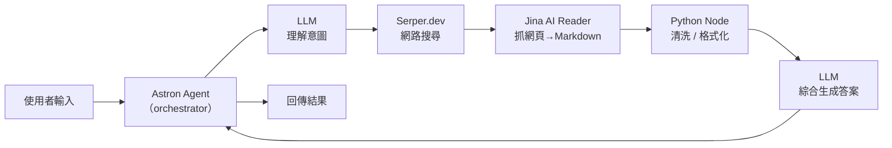

> [!note]
> 這篇筆記的重點是：**這五個名詞不是五個「同類的 AI 工具」**，而是同一條 AI workflow 裡負責不同階段的零件。先分清楚角色，再談要不要付費。

## TL;DR

- **Astron Agent** = 平台 / 畫布：把整條流程串起來
- **Serper.dev** = 搜尋工具：幫 LLM 找到即時網路資料
- **Jina AI** = 內容處理工具：抓網頁、做 embedding / reranker
- **Python node** = 程式邏輯節點：workflow 裡的自訂程式碼格子
- **LLM** = 推理核心：真正「思考」與生成文字的模型
- 每個零件都有免費起步的方式，但**正式量產通常要付費**（搜尋次數、token、抓取次數）

## 各元件角色

### Astron Agent

- **定位**：AI agent / workflow 建構平台（由 iFlytek / 科大訊飛開源）
- **性質**：平台（orchestration platform），不是 AI 模型本身
- **做什麼**：提供視覺化畫布，把 LLM 節點、工具節點、程式節點、知識庫節點串成一條可執行的 agent
- **類比**：跟 Dify、Coze、n8n(+AI)、LangFlow 同類
- **收費**：
  - 開源版本可自架（伺服器成本自負）
  - 官方雲端有免費額度，超量或企業功能需付費
- **官方連結**：https://github.com/iflytek/astron-agent

### Serper.dev

- **定位**：Google Search 的 API 封裝
- **性質**：工具（search tool），不是 AI 模型
- **做什麼**：給一個查詢字串，回傳 Google 搜尋結果 JSON（標題、連結、摘要、knowledge graph 等）
- **在 workflow 裡的位置**：LLM 想「查即時資訊」時呼叫的外部搜尋服務
- **收費**：
  - 免費額度：註冊送 2,500 次查詢（一次性，非每月）
  - 付費起跳：約 USD $50 / 50,000 queries（實際以官網為準）
- **官方連結**：https://serper.dev

### Jina AI

- **定位**：AI infrastructure 供應商，主力是 embeddings、reader、reranker、DeepSearch
- **性質**：工具 / 服務組合；部分產品本身是模型（如 `jina-embeddings`），但用途是**給別人的 workflow 當零件**
- **做什麼**（常見三種用途）：
  - **Reader API** (`https://r.jina.ai/<url>`)：把任意網頁轉成乾淨 Markdown，給 LLM 讀
  - **Embeddings API**：把文字轉向量，做語意搜尋 / RAG
  - **Reranker API**：重新排序 retrieval 結果，提升 RAG 精度
- **在 workflow 裡的位置**：抓網頁、向量化、檢索後重排——LLM 的「資料清洗與召回」助手
- **收費**：
  - 免費額度：每個 API 都有 token-based 免費額度（例如 Reader 每個月有一定量）
  - 付費起跳：依 token 計費，API key 儲值式
- **官方連結**：https://jina.ai

### Python Node

- **定位**：workflow 平台裡的「程式碼格子」
- **性質**：**不是 AI**，是一段可執行的 Python 程式邏輯節點
- **做什麼**：
  - 資料清洗、格式轉換（JSON → 字串、欄位過濾）
  - 呼叫外部 API（沒有現成節點時的萬用出口）
  - 條件判斷、迴圈、錯誤處理
  - 把上一個節點的輸出整理成下一個節點想要的格式
- **在 workflow 裡的位置**：所有「AI 做不到、但工程邏輯能解」的膠水
- **收費**：節點本身免費；運算成本算在平台伺服器上
- **注意**：不同平台（Dify / n8n / Astron / Coze）的 Python node 介面與權限不同，可寫的範圍也不同

### LLM

- **定位**：大型語言模型——整條 workflow 的推理核心
- **性質**：AI 模型本身
- **做什麼**：理解指令、整合輸入、生成文字 / 結構化輸出 / 工具呼叫參數
- **在 workflow 裡的位置**：每一次「需要思考 / 生成 / 判斷語意」的地方
- **收費**：
  - 幾乎全部依 token 計費（input + output 分開算）
  - 不同模型價差極大（如 `gpt-4.1-mini` vs `claude-opus-4-6`）
  - 部分開源模型可自架（成本改算 GPU）
- **常見選擇**：OpenAI、Anthropic Claude、Google Gemini、DeepSeek、Qwen、開源 Llama 系

## Workflow 分工視圖

- **Astron Agent** 是整張圖的畫布
- **LLM** 在不同階段重複出現：一次負責理解、一次負責生成
- **Serper / Jina / Python node** 都是被 LLM 或 workflow 呼叫的「手腳」

## 收費模式對照

| 元件         | 性質            | 免費起步                    | 正式使用主要成本                             |
| ------------ | --------------- | --------------------------- | -------------------------------------------- |
| Astron Agent | 平台            | 開源自架 / 官方雲端免費額度 | 自架伺服器成本、企業版授權                   |
| Serper.dev   | 搜尋工具        | 一次性 2,500 次試用         | 依查詢次數計費                               |
| Jina AI      | 工具 / 模型服務 | 每月 token 免費額度         | 依 token 計費（Reader / Embedding / Rerank） |
| Python Node  | 邏輯節點        | 免費                        | 平台伺服器運算成本                           |
| LLM          | AI 模型         | 多數廠商有 free tier        | 依 input + output token 計費                 |

## 關鍵觀念：不要把它們擺在同一個抽屜

很多剛接觸 AI workflow 的人會問「我到底要用 Jina AI 還是 LLM？」——這問法本身是錯的，因為：

- 你**不會用 Jina AI 回答問題**，Jina 是幫 LLM 把網頁轉乾淨的
- 你**不會用 Serper 寫文章**，Serper 只回傳搜尋結果連結
- 你**不會用 Python node 理解語意**，Python node 是拿來轉格式的
- 你**不會用 LLM 抓整個網站**，那會燒爆 context window 還很貴
- 你**不會用 Astron Agent 本身做決策**，它只是把上面這些串起來的畫布

一條合理的 AI workflow 是：**Astron 當畫布，LLM 當大腦，Serper / Jina 當手腳，Python node 當膠水**。

## 延伸方向

- 同類平台比較：Astron Agent vs Dify vs Coze vs n8n(+AI)
- 搜尋工具替代：Serper vs Tavily vs Brave Search API vs SearXNG 自架
- 內容抓取替代：Jina Reader vs Firecrawl vs ScrapingBee vs Playwright 自寫
- Embedding 替代：Jina Embeddings vs OpenAI text-embedding-3 vs Voyage vs BGE 開源
- 觀察每一條邊的成本：計算一次完整 run 大概花多少 token / queries
