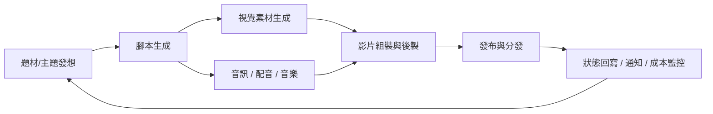
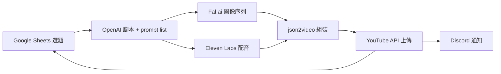

> 來源：【全自動】AIエージェントにYouTube動画を無限に作ってもらう方法（神ツールn8n×コード不要）— [YouTube](https://www.youtube.com/watch?v=5Htbfh_LYSE)

## TL;DR

- 整套影片產線把「題材 → 腳本 → 畫面 → 配音 → 組裝 → 發布 → 回寫」切成 7 階段，每階段由一個專責工具負責，n8n 串起資料流
- 看起來「無程式碼」，實際上 API 成本、工具串接、版權與 YouTube 重複內容政策才是落地門檻
- 可行的最小 PoC：Google Sheets 選題 → OpenAI 產腳本 → Fal.ai/Kling 出畫面 → Eleven Labs 配音 → json2video 組裝 → YouTube API 上傳；其餘（Discord 通知、Drive 備份）屬於營運增強

## Workflow 7 階段拆解

### 1. 題材／主題發想

- 輸入：Google Sheets / Airtable 的選題清單、或由 LLM 根據熱門關鍵字自動產生
- 產物：單筆題目 + 角度 + 目標受眾
- 關鍵：題目資料表同時扮演「工作佇列」與「去重清單」，避免重複產製

### 2. 腳本生成

- 工具：GPT-4.1 mini / ChatGPT / Gemini
- 產物：分段腳本（hook → body → CTA）、畫面提示詞（prompt list）、旁白腳本
- 關鍵：一次 LLM 呼叫要同時輸出「旁白文字」與「對應畫面 prompt」，下游才能平行處理視覺與音訊

### 3. 視覺素材生成

- 圖像：Fal.ai、Pollinations AI、Nano Banana 2
- 影片片段：Kling 3.0、Veo3、Compose
- 關鍵：多數視覺 API 是**非同步任務**，n8n 需要 webhook callback 或 polling 節點才能接住結果

### 4. 音訊／配音／音樂

- TTS：OpenAI TTS、Eleven Labs
- 配樂：Suno AI
- 關鍵：旁白與配樂需分軌輸出，組裝階段才能各自控制音量與時長

### 5. 影片組裝與後製

- 低門檻 API：json2video、Creatomate（吃 JSON 模板 → 回傳 mp4 URL）
- 高彈性：FFmpeg（需要自架 runner / cloud function）
- 關鍵：樣板化（JSON 模板）可讓 LLM 直接輸出組裝指令，跳過非線性剪輯軟體

### 6. 發布與分發

- YouTube API：直接上傳 + 設定 metadata（title、description、tags、thumbnail）
- Blotato：多平台同步分發（YouTube / TikTok / Shorts / Reels）
- 關鍵：OAuth token 刷新、配額管理、縮圖產出屬於易被忽略的工程成本

### 7. 狀態回寫 / 通知 / 成本監控

- 儲存：Google Drive（原始素材備份）
- 通知：Discord Webhook、Telegram Bot
- 日誌：回寫 Sheets / Airtable 的狀態欄位
- 關鍵：每個 API 呼叫記錄 token / credit 消耗，是避免失控成本的唯一方法

## 工具分類清單

| 類別          | 工具                          | 定位                      | 計費模式（常見）                |
| ------------- | ----------------------------- | ------------------------- | ------------------------------- |
| Orchestration | n8n                           | workflow 引擎，node-based | self-host 免費 / n8n Cloud 訂閱 |
| Orchestration | Google Sheets、Airtable       | 選題表、狀態表            | 免費起步                        |
| LLM / Script  | GPT-4.1 mini、ChatGPT         | 主要腳本生成              | token 計費                      |
| LLM / Script  | Google Gemini                 | 替代 LLM、長 context      | token 計費（免費額度大）        |
| 圖像生成      | Fal.ai                        | serverless 多模型入口     | per-call 計費                   |
| 圖像生成      | Pollinations AI               | 免費圖像 API              | 免費（有速率限制）              |
| 圖像生成      | Nano Banana 2                 | 風格化圖像                | per-call                        |
| 影片生成      | Kling 3.0、Veo3、Compose      | 短片片段生成              | per-second 計費，成本高         |
| 音訊 TTS      | OpenAI TTS                    | 多語系配音                | per-character                   |
| 音訊 TTS      | Eleven Labs                   | 高擬真語音、voice clone   | 字數訂閱制                      |
| 音樂          | Suno AI                       | 背景音樂生成              | 訂閱制                          |
| 組裝          | json2video、Creatomate        | JSON 模板 → mp4           | per-minute 輸出計費             |
| 組裝          | FFmpeg                        | 自架，全彈性              | 運算成本（self-host）           |
| 發布          | YouTube API                   | 官方上傳                  | 免費（有每日配額）              |
| 發布          | Blotato                       | 多平台一鍵分發            | 訂閱制                          |
| 儲存          | Google Drive                  | 原始檔備份                | 免費起步                        |
| 通知          | Discord Webhook、Telegram Bot | 狀態推播                  | 免費                            |

## 真正「無程式碼」vs「仍需工程」

| 環節            | 無程式碼可行          | 仍需工程整合                            |
| --------------- | --------------------- | --------------------------------------- |
| 選題 / 資料表   | Yes                   | —                                       |
| LLM 腳本        | Yes（HTTP node）      | 輸出結構驗證（JSON schema）             |
| 圖像 / 影片生成 | 部分 Yes              | 非同步 callback、錯誤重試、素材命名規則 |
| 組裝（模板化）  | Yes                   | 模板設計、時長對齊                      |
| 組裝（FFmpeg）  | No                    | 自架 runner、cloud function             |
| YouTube 上傳    | Yes（n8n OAuth node） | Token refresh、配額監控、縮圖產出       |
| 成本監控        | No                    | 自建回寫邏輯、儀表板                    |

## 成本結構（量級估算）

- **LLM**：每支影片腳本 + prompt list ≈ 5k–15k tokens → per-video 成本低
- **影片生成**：per-second 計費是主要成本中心，1 分鐘短片可達單支 USD $1–$5+
- **TTS + 音樂**：字數 / 秒數計費，中量級成本
- **組裝服務**：per-minute output，中量級成本
- **結論**：視覺生成占總成本 60–80%，控制影片時長與 reuse 素材是優化重點

## 風險與合規

> [!warning] YouTube 政策
> 大量自動產製、低人工投入的內容會觸發「**Spam, deceptive practices & scams**」與「**Reused content**」政策，可能被取消營利資格或下架。

- **版權**：LLM / 視覺 / 音樂模型的訓練資料與輸出授權條款各家不同，商用前要逐一確認
- **重複內容**：同模板 + 換關鍵字的量產模式最容易被判定為 reused content
- **事實正確性**：LLM 生成腳本若涉及人物、品牌、醫療、金融資訊，需人工校對
- **平台特性**：YouTube 2024 以後對「AI 生成內容」要求標註（altered/synthetic content disclosure）

## 中文／繁中工作流注意事項

- TTS：Eleven Labs 與 OpenAI TTS 的繁中發音品質差異明顯，PoC 前先做 A/B
- LLM 腳本：繁中長 context 優先考慮 Gemini；口語風格需在 prompt 內明示「台灣用語」避免混入中國用語
- 視覺素材中若有中文字幕需求，多數 diffusion 模型中文字形仍不穩定，建議字幕於組裝階段後製加上

## 最小可行 PoC（MVP）

目標：單支影片全自動產出，跳過多平台分發與進階後製。

- Sheets 作為「題目佇列 + 狀態表」（pending / generating / uploaded / failed）
- 單一 n8n workflow，失敗節點回寫 error 並推播 Discord
- **跳過**：Kling/Veo3（高成本）、Blotato、Drive 備份、成本儀表板

## 延伸方向：研究型內容自動化

純量產短影音是最脆弱的用法。把相同 pipeline 轉向「研究型內容」更耐久：

- **輸入**：論文 / 技術文章 / 會議筆記（而非熱門關鍵字）
- **腳本**：摘要 + 重點 + 視覺化提示詞（圖表、流程圖）
- **視覺**：以 Mermaid / 靜態圖表為主，降低視覺生成成本與版權風險
- **音訊**：結構化配音（章節切分）
- **發布**：YouTube + 同步產出 Markdown 研究筆記（雙產出）

優勢：內容有參考價值、可被 LLM 重新檢索、避開 reused content 判定。

## 結論

- n8n 的價值是**把非同步 API 串成工作流**，而不是取代工程；「無程式碼」只適用到中等複雜度
- 這套架構真正稀缺的是**資料設計**（選題表 schema、狀態機、成本回寫），不是工具組合
- 若目的是學習 AI 工作流設計，先做研究型 PoC（低成本、低版權風險）再考慮量產短影音
