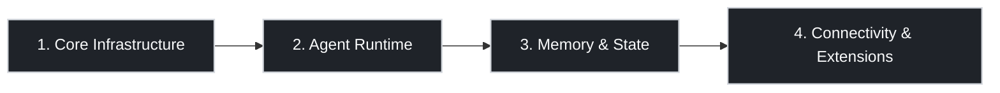

這篇筆記將 OpenClaw 架構整理成四個層級：**Core Infrastructure、Agent Runtime、Memory & State、Connectivity & Extensions**。

![[openclaw-4-pillar.png]]

## 總覽

| 支柱 | 核心元件 | Debug 時的核心問題 |
| --- | --- | --- |
| 1. Core Infrastructure | Gateway, Canvas Host | 核心 Daemon 是否正常運作且可連線？ |
| 2. Agent Runtime | System Prompt Builder, Agent Loop, Skills | 執行迴圈是否從頭到尾正確完成？ |
| 3. Memory & State | Workspace, Memory Search, Session Store | Context 是否正確載入／搜尋／持久化？ |
| 4. Connectivity & Extensions | Clients, Nodes, Event Stream | 外部控制與整合是否正常連線？ |

## 為什麼這個模型好用

| 分類 | 檢查重點 |
| --- | --- |
| Core Infrastructure | Gateway / Canvas Host Process 與 Port 狀態 |
| Agent Runtime | Prompt 組裝、Think/Act 循環、Tool 執行 |
| Memory & State | Bootstrap 檔案、Memory 檢索、Transcript 寫入 |
| Connectivity & Extensions | Client 存取、Node 整合、Event 流 |

## 1. Core Infrastructure

:::col
### 元件

- **Gateway (Daemon)**
  - 系統的「大腦」兼路由器
  - 單一真實來源 (Single Source of Truth)
  - WebSocket 監聽 `:18789`
- **Canvas Host (UI Renderer)**
  - A2UI 渲染主機
  - UI 服務位於 `:18793`
:::

:::col
### 故障訊號

- 完全沒回應：Gateway 掛了或無法連線
- 文字正常但 UI 不見：Canvas Host 無法使用
- 頻道隨機斷線：Gateway 層的 Adapter / Session 問題
:::

## 2. Agent Runtime

:::col
### Runtime 執行鏈

1. Receive
2. Prompt
3. Think
4. Act
5. Stream
6. Persist

- **System Prompt Builder（Context 組裝）**
- **Agent Loop（序列化處理流程）**
- **Skills（可插拔的能力模組）**
:::

:::col
### 實際檢查項目

- Prompt Builder 是否包含 Rules + Tool Schemas + Runtime Context
- Skills 是否如預期載入本次執行
- Tool Calls 是否在 Persist 步驟前完成
- 序列化寫入是否防止了 Session 更新衝突
:::

## 3. Memory & State

:::col
### Workspace (`~/.openclaw/workspace/`)

- **Bootstrap 檔案**
  - `AGENTS.md`
  - `SOUL.md`
  - `USER.md`
- **Memory 檔案**
  - `MEMORY.md`
  - `memory/YYYY-MM-DD.md`
- **Memory Search**
  - 檢索層（Vector + BM25）
:::

:::col
### Session Store (`~/.openclaw/agents/.../sessions/`)

- JSONL Transcript（事件歷史）
- Compaction & Pruning（自動摘要）
- 與長期 Workspace Memory 分離
:::

| 儲存區域 | 用途 |
| --- | --- |
| Workspace | 持久身份 + 長期 Memory |
| Session Store | Session Transcript 與事件歷史 |

## 4. Connectivity & Extensions

:::col
### 外部控制平面

- **Clients**：CLI、App、Web Admin
- **Nodes**：能力提供者（例如行動裝置 / 硬體存取）
- **Event Stream**：Lifecycle、Assistant、Tool 事件
:::

:::col
### 排障順序

1. 確認 Gateway Process 與監聽 Port
2. 確認 Client / Node 的驗證與 Session 狀態
3. 確認 Event Stream 流程
4. 確認 Tool Endpoint / 網路可達性
:::

## 故障模式速查表

| 症狀 | 最可能的層級 |
| --- | --- |
| 完全沒回應 | Core Infrastructure / Connectivity |
| 有文字回應但沒有 UI | Core Infrastructure (Canvas Host) |
| 人格或 Context 錯誤 | Agent Runtime / Memory & State |
| Memory 沒有保留 | Memory & State |
| Tool 間歇性失敗 | Connectivity & Extensions |

## 對應本 Repo 的檔案

- `content/openclaw/index.md`：主題索引
- `content/setup-env/utm-set-ubuntu.md`：部署與排障指南
- `content/openclaw/openclaw-architecture-four-pillars.md`：本架構總覽

## Related

- [[ch2-architecture-implementation-guide|Ch2: 架構與實作指南]]
- [[ch3-agent-loop-openclaw|Ch3: Agent Loop]]
- [[openclaw-five-component-lifecycle-analysis|Five-Component Lifecycle Analysis]]
