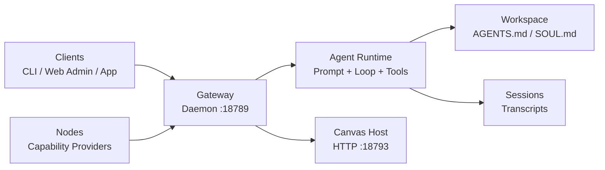

## 系統全貌

這張圖展示整體控制流程：Clients / Nodes 連線到 Gateway，Gateway 執行 Runtime，Runtime 讀寫 Workspace 和 Sessions，Gateway 同時也提供 Canvas Host 服務。

`Gateway` 是中央主機與路由器，`Agent Runtime` 是執行大腦，`Memory & State` 是持久化層（Workspace + Sessions），而 `Clients / Nodes` 則是透過 Gateway 連入的外部控制與能力端點。
![[openclaw-architect.png]]

## 1. 核心：Gateway (Daemon)

把這張表當作 Gateway Process 的快速識別卡。

| 項目 | 細節 |
| --- | --- |
| Process | `openclaw gateway` |
| 拓撲 | 每台主機一個 Singleton |
| 預設綁定 | `127.0.0.1:18789` (WebSocket) |
| 主要角色 | Host + Router |

Gateway 的職責：

- 擁有活躍的外部 Provider Session（例如 WhatsApp / Telegram Adapter）
- 執行一個內嵌的 Agent Runtime，負責推理與 Tool 執行
- 接受來自 Clients 與 Nodes 的 WebSocket 連線

實務提醒：

- Gateway 一旦掛掉，所有控制與能力路徑都會斷線

## 2. 大腦：Agent Runtime 與路由

這張表釐清 Runtime 能讀取、寫入和路由的範圍。

| 關注點 | 實作方向 |
| --- | --- |
| 執行邊界 | Runtime 嚴格在設定的 Workspace 範圍內運作 |
| Memory 輸入 | Markdown Context，例如 `AGENTS.md`、`SOUL.md` |
| 檔案操作 | 受 Workspace 規則限定 |
| 路由模型 | 一個 Gateway Process，多個邏輯流程 / Agent |

即使只有一個 Gateway Process，路由機制也能根據 Context 將任務分派給不同的邏輯 Agent 行為。

## 3. 連線：Clients vs Nodes

如果你不確定某個功能歸屬在哪，用這張表來判斷它屬於 Client 端的控制功能，還是 Node 端的能力功能。

| 元件 | `role` | 用途 | 典型範例 |
| --- | --- | --- | --- |
| Client | `operator`（隱含） | 控制平面：送出 Prompt、檢視歷史、管理系統 | CLI, Web Admin, macOS App |
| Node | `node` | 能力提供者：暴露 OS / 硬體功能 | Camera、螢幕錄影、Location |

簡單判斷：

- Client 控制系統
- Node 擴展系統能做的事

## 4. 專用服務：Canvas Host

這張表解釋為什麼即使 Gateway 正常，Canvas Host 仍需要是獨立的服務。

| 項目 | 細節 |
| --- | --- |
| Port | `18793`（預設） |
| Protocol | HTTP |
| 擁有者 | 由 Gateway 管理 |
| 功能 | 提供 A2UI（Agent 產生的動態網頁介面） |

實務提醒：

- Canvas Host 掛掉時，Chat 可能仍能正常運作，但 A2UI 頁面會無法渲染

## 5. 通訊協定與安全性

這個段落說明協定層級的連線安全規則（什麼必須先發生、誰被信任、如何防止重複操作）。

### Transport 與 Handshake

- Transport 使用 WebSocket Text Frame 承載 JSON Payload
- 連線後的第一個 Frame 必須是 `connect` Payload
- 任何非 `connect` 的第一個 Frame 都應該觸發立即斷線

### 信任與認證

- 新裝置需要先 Pairing 才能被信任
- 已配對的裝置會取得 Device Token
- Localhost 或受信任的區網端點可以自動核准（依部署方式而定）

### Idempotency

- 有副作用的指令應攜帶 Idempotency Key
- 避免重試時產生重複操作

## 6. 檔案系統結構

用這張表快速對應每個 OpenClaw 路徑的用途。

| 路徑 | 用途 |
| --- | --- |
| `~/.openclaw/openclaw.json` | Gateway 設定檔（唯一的主要設定檔） |
| `~/.openclaw/workspace` | 長期 Memory 與 Workspace 檔案 |
| `~/.openclaw/agents/.../sessions/` | Session Transcript 儲存 |

建議的拆分方式：

- Workspace Memory 檔案納入版本控制
- Session Transcript 視為營運面的 Runtime 資料

## 快速 Debug 順序

由上而下依照這個順序檢查，可以減少誤判並加速排障。

1. 確認 Gateway Process 與 `:18789`
2. 確認 Client / Node 的 Handshake 與 Auth Token 狀態
3. 確認 Runtime 路由與 Workspace Context Injection
4. 如果預期有 UI 輸出，確認 Canvas Host `:18793`
5. 確認 Transcript 寫入路徑與 Idempotency 行為

## 參考資料

- [OpenClaw Docs: Architecture](https://docs.openclaw.ai/concepts/architecture)
- [OpenClaw Docs: Agent](https://docs.openclaw.ai/concepts/agent)

## Related

- [[ch1-architecture-four-pillars|Ch1: 架構四大支柱]]
- [[ch3-agent-loop-openclaw|Ch3: Agent Loop]]
- [[ch4-context-window-and-prompt-budget|Ch4: Context Window]]
