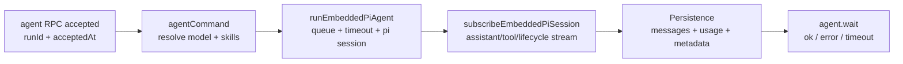

這篇筆記說明 OpenClaw 中完整的 Agent 執行路徑：從接收請求到持久化，涵蓋 Queueing、Hooks、Streaming 與 Timeout 行為。
![[agent-loop.png]]

總覽：這張圖展示 **OpenClaw Agent Loop Lifecycle** 的 8 個連續階段。從 **Entry & Initialization**（Gateway RPC/CLI 驗證、Session 解析、Metadata 持久化、立即回傳 `{ runId, acceptedAt }`）開始，接著是依 Session Key 進行的 **Queueing & Serialization**。然後準備 **Session & Workspace**，組裝 **System Prompt**（Base Prompt、Skill Prompts、Bootstrap Context、Overrides、Token Reserve），執行 **Execution Loop & Streaming**（Assistant Deltas + Tool Events，搭配 Tool Sanitization），套用 **Reply Shaping**（`NO_REPLY` 過濾與去重），遇到 Context 溢位時可能進入 **Compaction & Retries**，最後到達 **Completion & Persistence**（Lifecycle End/Error、Transcript 持久化、Timeout/Abort 處理、最終 Client 狀態）。

## 什麼是 "Agent Loop"

用這個定義來區分「一次完整執行」和「內部子步驟」。

| 術語 | 意義 |
| --- | --- |
| Agent Loop | 一次完整的序列化執行：Intake -> Context 組裝 -> Inference -> Tool 執行 -> Streaming -> Persistence |
| Run Unit | 一個 `runId`，對應一條 Session Lane |
| 目標 | 產生動作與最終回覆，同時維持 Session State 一致性 |

## Entry Points

Loop 啟動的兩種主要方式。

| 進入方式 | API/Command | 用途 |
| --- | --- | --- |
| Gateway RPC | `agent`, `agent.wait` | 程式化觸發與等待 |
| CLI | `agent` 指令 | 操作者手動觸發 |

## 端對端流程

從接受請求到完成狀態的權威執行順序。

## 高階步驟

把這張表當成 Debug 時的快速檢查點。

| 步驟 | 主要動作 | 輸出/訊號 |
| --- | --- | --- |
| 1. Accept | 驗證參數、解析 Session、持久化 Session Metadata | 立即回傳 `{ runId, acceptedAt }` |
| 2. Execute | 解析 Model 預設值、載入 Skills Snapshot、啟動 Embedded Runtime | 在 Queue Lane 中的活躍 Run |
| 3. Stream | 將 Pi Events 橋接到 OpenClaw Streams | `assistant`、`tool`、`lifecycle` 事件 |
| 4. Complete | 確保發出 Lifecycle `end/error` | 穩定的 Run 終止狀態 |
| 5. Wait | `agent.wait` 阻塞等待 Lifecycle 終止事件 | `{ status, startedAt, endedAt, error? }` |

## Queueing 與 Concurrency

這個段落說明 OpenClaw 為什麼要序列化執行，以及 Race Condition 防範機制在哪裡。

| 機制 | 行為 | 為什麼重要 |
| --- | --- | --- |
| Session Lane | 按 Session Key 序列化執行 | 防止 Session 寫入競爭 |
| Global Lane（選用） | 加入跨 Session 的節流/序列化 | 控制主機層級的負載壓力 |
| Queue Modes | `collect` / `steer` / `followup` 驅動 Lane 邏輯 | 讓訊息頻道行為保持可預測 |

## Session 與 Workspace 準備

在 Inference 和 Tool 執行前，OpenClaw 會準備執行 Context 與寫入安全機制。

| 準備項目 | 實際動作 |
| --- | --- |
| Workspace Resolution | 解析/建立 Workspace；Sandbox 可能會重導 Workspace Root |
| Skills Snapshot | 載入或重用 Skills，注入到 Env/Prompt |
| Bootstrap Context | 解析 Bootstrap 檔案並納入 System Prompt Report |
| Session Lock | 在 Streaming/Persist 前取得 Session Write Lock |

## Prompt 組裝與限制

Prompt 的建構在 Model 執行前就受到控制與預算管理。

| 關注點 | 行為 |
| --- | --- |
| Prompt 輸入 | Base Prompt + Skills Prompt + Bootstrap Context + 每次 Run 的 Overrides |
| Token 安全機制 | 強制執行 Model 特定的限制與 Compaction Reserve |
| 參考 | 詳見 System Prompt 文件了解實際的可見 Prompt 結構 |

## Hook Points

當你需要攔截行為但不想改寫核心 Loop 時，使用 Hooks。

### Internal Hooks (Gateway Hooks)

| Hook/Event | 時機 | 典型用途 |
| --- | --- | --- |
| `agent:bootstrap` | Bootstrap 建構期間，在最終 System Prompt 之前 | 新增/移除 Bootstrap Context 檔案 |
| Command Hooks (`/new`, `/reset`, `/stop`, ...) | Command Lifecycle | 指令專屬的自動化 |

### Plugin Hooks (Agent + Gateway Lifecycle)

| Hook | 時機 |
| --- | --- |
| `before_agent_start` | Run 開始前；注入 Context 或覆寫 Prompt |
| `agent_end` | 完成後；檢視最終 Messages + Metadata |
| `before_compaction` / `after_compaction` | Compaction 前後 |
| `before_tool_call` / `after_tool_call` | Tool 執行前後 |
| `tool_result_persist` | Transcript 寫入前的同步轉換 |
| `message_received` / `message_sending` / `message_sent` | 收發訊息的管線 |
| `session_start` / `session_end` | Session 邊界的 Lifecycle |
| `gateway_start` / `gateway_stop` | Gateway Process 的 Lifecycle |

## Streaming 與 Partial Replies

Streaming 行為決定使用者在生成過程中看到什麼。

| Stream | 來源 | 備註 |
| --- | --- | --- |
| `assistant` | pi-agent-core Deltas | 支援 Partial/Block Streaming |
| `tool` | Tool Start/Update/End 事件 | 包含經過 Sanitize 的 Tool 輸出 |
| `lifecycle` | Start/End/Error 事件 | Run 狀態的終止訊號 |

額外行為：

- Block Streaming 可在 `text_end` 或 `message_end` 時發出 Partial Replies
- Reasoning 可以獨立發出，也可以嵌入 Block Replies 中

## Tool 執行與 Reply Shaping

最終的使用者可見輸出會經過後處理，移除雜訊與重複內容。

| 規則 | 效果 |
| --- | --- |
| Tool Result Sanitization | 在 Emit/Persist 前限制 Payload 大小與 Image Logging |
| Messaging Duplicate Suppression | 避免重複的 Assistant 確認訊息 |
| `NO_REPLY` 過濾 | 從送出的 Payload 中移除 Silent Token |
| Fallback Tool-Error Reply | 當沒有可渲染的 Payload 且 Tool 失敗時發出（除非已經對使用者可見） |

## Compaction 與 Retries

Compaction 可以重設執行路徑並安全地觸發 Retry。

| 行為 | 影響 |
| --- | --- |
| 自動發出 Compaction 事件 | 可見的 Compaction Lifecycle |
| Compaction 後 Retry | 重設記憶體中的 Buffer/Tool Summary，避免重複輸出 |

## Timeouts 與提前退出條件

不同的 Timeout 類型會結束 Lifecycle 的不同部分。

| 條件 | 作用範圍 | 預設值 |
| --- | --- | --- |
| `agent.wait` Timeout | 僅等待（不會停止執行中的 Agent） | `30s` |
| Runtime Timeout | 活躍 Run 的 Abort 計時器 | `agents.defaults.timeoutSeconds`（通常 `600s`） |
| Abort Signal | 活躍 Run 的取消 | 由呼叫端控制 |
| Disconnect / RPC Timeout | Transport 層的中斷 | 依環境而定 |

## Event Streams 與 Chat 結束處理

這個段落釐清目前存在哪些 Stream，以及 Chat Channel 如何結束 Run。

| Event Stream | 目前的角色 |
| --- | --- |
| `lifecycle` | 由 Embedded Subscription 發出（或由 `agentCommand` Fallback） |
| `assistant` | 來自 pi-agent-core 的 Delta Stream |
| `tool` | 來自 pi-agent-core 的 Tool Event Stream |

Chat Channel 處理：

- Assistant Deltas 會被 Buffer 成 Chat Delta Messages
- Chat Final 在 Lifecycle `end` 或 `error` 時發出

## 實務 Debug 檢查清單

1. 確認 `agent` 回傳了 `runId` 與 `acceptedAt`
2. 確認 Run 進入了 Session Lane（沒有被阻塞/餓死）
3. 確認 Lifecycle 事件順序為 `start` -> `end/error`
4. 確認 Run 期間收到了 Assistant/Tool Deltas
5. 確認 Session Transcript 已持久化且 Timestamp 已設定
6. 確認 `agent.wait` Timeout 沒有和 Runtime Timeout 搞混

## Related

- [[ch2-architecture-implementation-guide|Ch2: 架構與實作指南]]
- [[ch4-context-window-and-prompt-budget|Ch4: Context Window]]
- [[how-oc-routes-and-triggers-agents|How OC Routes and Triggers Agents]]
