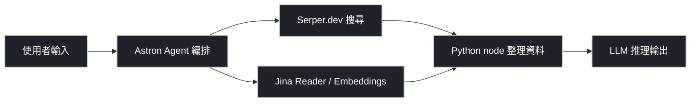

## 元件角色一覽

| Component    | 類型                 | 一句話定位                                                        | 官方連結                                                                                                           |
| ------------ | -------------------- | ----------------------------------------------------------------- | ------------------------------------------------------------------------------------------------------------------ |
| Astron Agent | 平台 / Agent 編排    | 訊飛 iFlytek 開源的 AI agent 平台，用來把節點串成 workflow        | [github.com/iflytek/astron-agent](https://github.com/iflytek/astron-agent)                                         |
| Serper.dev   | SaaS 工具            | 以 API 包裝 Google Search，讓 agent 拿到即時搜尋結果              | [serper.dev](https://serper.dev)                                                                                   |
| Jina AI      | SaaS 工具 / 模型服務 | Reader API、Embeddings、Reranker、DeepSearch 等文件與向量處理服務 | [jina.ai](https://jina.ai)                                                                                         |
| Python node  | 程式邏輯節點         | workflow 工具內的 Code step，做資料清洗、格式轉換、自訂 API 呼叫  | 依 host 平台而定（Astron、n8n、Dify 等）                                                                           |
| LLM          | AI 模型              | 生成式語言模型本體，負責推理與自然語言輸出                        | [openai.com](https://openai.com) / [anthropic.com](https://anthropic.com) / [ai.google.dev](https://ai.google.dev) |

## 計費模式

| Component    | 免費額度                               | 常見付費方式                                                 | 規模化後通常付費？ |
| ------------ | -------------------------------------- | ------------------------------------------------------------ | ------------------ |
| Astron Agent | 開源自架免授權費                       | 自架運算資源成本；若用官方雲端平台依方案而異                 | Y（算力）          |
| Serper.dev   | 註冊時給試用查詢額度（依官方為準）     | 按查詢次數計費，階梯式方案                                   | Y                  |
| Jina AI      | 免費 tier 含速率限制                   | 依 token / 請求量計費，Reader、Embeddings、Reranker 分別定價 | Y                  |
| Python node  | 無本身費用                             | 成本歸屬於執行平台（Astron / n8n / serverless）              | 間接 Y             |
| LLM          | 部分模型免費試用額度（以官方定價為準） | 按 input/output token 計費；自架則算 GPU 成本                | Y                  |

實際數字以各官方 pricing page 為準，方案與額度會隨時調整。

## Workflow 中的分工

Astron Agent 是指揮中心，決定什麼時候呼叫哪個節點。Serper.dev 負責即時網路檢索、Jina AI 把 URL 或文件轉成 LLM 可讀的 Markdown 或向量，Python node 把兩邊的輸出合併、清洗、格式化，最後交給 LLM 做語意整合與回覆生成。每個節點都可以單獨抽換，例如把 Serper 換成 Tavily、把 Jina 換成 Firecrawl，不影響整體架構。

## 白話版說明

這不是同一種 AI 工具，而是 workflow 中不同零件各司其職。Astron Agent 像是廚房的主廚，決定流程；Serper.dev 像是外送員，從 Google 把最新食材（搜尋結果）拿回來；Jina AI 像是切菜備料的助手，把網頁或 PDF 切成 LLM 吃得下的格式；Python node 是料理台上的刀具與容器，做瑣碎的搬移、組裝、格式轉換；LLM 才是那個真的在「思考」並寫出回答的大腦。把它們放在一起才構成一個完整的 AI 應用，少任何一個零件，整條流水線就斷了。

## 免費起步 vs 規模化付費

:::col

### 免費起步

- Astron Agent 可自架，原始碼免費
- Serper.dev 註冊送試用查詢額度
- Jina AI 免費 tier 足以做 POC
- LLM 可先用官方免費模型或低價 tier（如 Gemini Flash、GPT-4o-mini）
- Python node 本身零成本
  :::

:::col

### 規模化後通常付費

- Serper.dev 按查詢次數累積，流量一上去就得升級
- Jina AI Reader / Embeddings 依 token 計費，長文件成本顯著
- LLM 是主要開銷，input+output token 會隨使用者數線性成長
- Astron Agent 自架需要付主機、GPU、監控成本
- Python node 的執行時間由 host 平台計費（serverless 冷啟動、運算時間）
  :::

## 延伸方向

- 搜尋替代品：Tavily、Brave Search API、Exa、Bing Web Search API
- 文件擷取替代品：Firecrawl、ScrapingBee、Apify、Mercury Parser
- 向量 / Rerank 替代品：Cohere Embed / Rerank、OpenAI text-embedding-3、Voyage AI
- Agent 編排替代品：n8n、Dify、LangGraph、Flowise、Coze
- LLM 供應選項：OpenAI、Anthropic Claude、Google Gemini、開源權重（Qwen、DeepSeek、Llama）自架
- 相關筆記：[[prompt-notes/system-prompt-patterns-research|System Prompt Patterns Research]]
