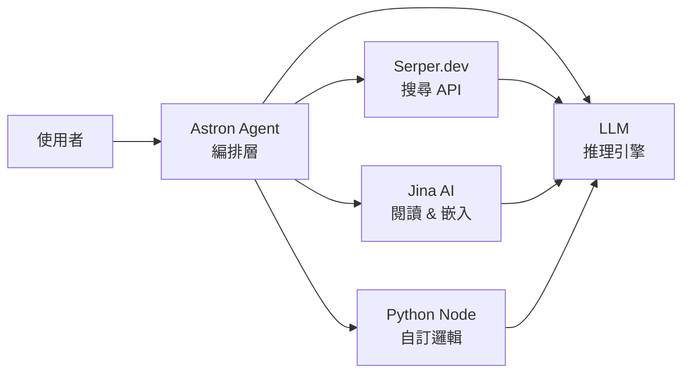

## TL;DR

- 一條 AI agent workflow 不是「一個 AI 工具」，而是 **多個零件各司其職**
- Astron Agent 負責排程與編排；Serper 負責搜尋；Jina AI 負責閱讀與嵌入；Python node 跑自訂邏輯；LLM 負責推理
- 理解這些零件的分工，才能正確評估成本、瓶頸與可替換性

## 零件總覽

## 各零件定位

### 1. Astron Agent — 編排層（Orchestrator）

| 項目 | 說明 |
|------|------|
| **類別** | AI Agent 平台 / 編排工具 |
| **做什麼** | 管理多步驟任務流程，協調 LLM 與外部工具之間的呼叫順序、上下文傳遞與錯誤處理 |
| **類比** | 類似 n8n / LangGraph 中的 agent executor，但封裝成更高階的服務 |
| **定價** | 免費額度起步；正式用量依 agent 執行次數或 API 呼叫計費 |
| **官方** | [astron.sh](https://astron.sh) |

> 重點：Astron Agent 本身 **不是 AI 模型**，而是負責「指揮」模型和工具的控制層。

### 2. Serper.dev — 即時搜尋 API

| 項目 | 說明 |
|------|------|
| **類別** | Search API 服務 |
| **做什麼** | 提供 Google Search 結果的 JSON API，讓 agent 能即時取得網路資訊 |
| **用途** | 在 agent workflow 中做 real-time retrieval —— 查最新新聞、確認事實、取得 URL |
| **定價** | 免費額度 2,500 次/月；超出後 pay-per-search（$0.001–$0.004/次） |
| **官方** | [serper.dev](https://serper.dev) |

> 重點：是「搜尋工具」而非「AI」。Agent 呼叫 Serper 拿到搜尋結果，再交給 LLM 解讀。

### 3. Jina AI — 閱讀 & 嵌入服務

| 項目 | 說明 |
|------|------|
| **類別** | AI 平台（Document AI / Embedding） |
| **做什麼** | 兩個核心能力：(1) Reader API — 將網頁/PDF 轉成乾淨文字；(2) Embedding API — 將文字轉成向量供語意搜尋使用 |
| **用途** | RAG pipeline 中的前處理層：先用 Reader 讀取原始文件，再用 Embedding 建索引 |
| **定價** | Reader API 免費額度 1M tokens/月；Embedding API 有免費 tier，超出按 token 計費 |
| **官方** | [jina.ai](https://jina.ai) |

> 重點：Jina 填補了 LLM 的盲區 —— LLM 不能直接「閱讀」一個 URL 或 PDF，需要 Jina 先轉譯。

### 4. Python Node — 自訂邏輯執行

| 項目 | 說明 |
|------|------|
| **類別** | 程式邏輯節點（Code Execution） |
| **做什麼** | 在 workflow 平台（如 n8n、LangFlow）中執行自訂 Python 腳本 —— 資料清洗、格式轉換、條件判斷、API 串接 |
| **用途** | 處理 LLM 和工具 API 無法直接完成的邏輯操作 |
| **定價** | 免費（包含在 workflow 平台中） |

> 重點：Python node **不是 AI**，是「膠水程式碼」。當 LLM 輸出需要 post-processing，或資料需要轉換格式時使用。

### 5. LLM — 推理引擎

| 項目 | 說明 |
|------|------|
| **類別** | AI 模型（Foundation Model） |
| **做什麼** | 語言理解、推理、生成。整個 workflow 的「大腦」，負責理解指令、分析資料、產出回覆 |
| **常見選項** | GPT-4.1（OpenAI）、Claude Opus 4.6（Anthropic）、Gemini 3 Pro（Google）、Llama 4（Meta, 開源） |
| **定價** | 依 token 計費（input + output），各家費率不同；開源模型可自架但需 GPU |

> 重點：LLM 是 workflow 中 **成本最高** 的零件，也是能力瓶頸所在。選錯模型 = 整條 workflow 的品質上限被壓低。

## 分工比較表

| 零件 | 類別 | 是否 AI | 免費起步 | 主要成本驅動 |
|------|------|---------|----------|-------------|
| Astron Agent | 編排平台 | 否 | 是 | Agent 執行次數 |
| Serper.dev | 搜尋 API | 否 | 是（2,500/月） | 搜尋次數 |
| Jina AI | 閱讀 & 嵌入 | 部分 | 是 | Token / 文件量 |
| Python Node | 程式邏輯 | 否 | 是 | N/A（平台內建） |
| LLM | AI 模型 | 是 | 部分 | Token 用量 |

## 關鍵觀念

### 這不是「一個 AI 工具」

初學者常把 agent workflow 視為單一工具，但實際上每個環節都是獨立零件：

- **搜尋** ≠ AI（Serper 只是 API wrapper）
- **閱讀** ≠ LLM（Jina Reader 用的是 specialized parser，不一定是 LLM）
- **編排** ≠ 智慧（Astron Agent 執行的是預定義流程，不是自主推理）
- **程式碼** ≠ AI（Python node 跑的是確定性邏輯）

只有 LLM 是真正做「推理」的零件。其他都是工具層。

### 成本結構

一條 workflow 的成本 = Σ(每個零件的 API 呼叫費用)

- 最貴：LLM（特別是長 context 或 reasoning model）
- 中等：Jina AI embedding（大量文件時）
- 便宜：Serper（單次查詢極便宜）
- 免費：Python node、Astron Agent 免費額度

### 可替換性

每個零件都有替代方案：

| 零件 | 可替換為 |
|------|----------|
| Astron Agent | n8n、LangGraph、CrewAI、AutoGen |
| Serper.dev | Tavily、SearXNG（自架）、Bing API |
| Jina AI | Firecrawl、Unstructured、LangChain loaders |
| Python Node | JavaScript node、HTTP request node |
| LLM | 任何 OpenAI-compatible API endpoint |

## 延伸方向

- 實際搭一條 Astron Agent + Serper + Jina + LLM 的 research workflow
- 比較 Astron Agent vs n8n agent node 的設計差異
- 測試不同 LLM 在同一 workflow 中的品質與成本差異
