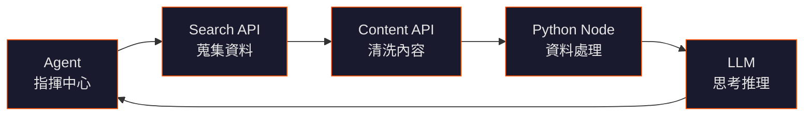

## TL;DR

- 一條 AI workflow 裡有 **5 種不同角色** 的元件，它們不是同一種東西
- 理解它們的分工，就能看懂任何 AI 自動化流程的架構
- 有些免費起步、有些正式用一定要付費 —— 成本結構差異很大

## 核心觀念：這不是一個 AI 工具，是一條流水線

把 AI workflow 想成工廠的生產線：

每個節點做一件事，串起來才是完整的智慧。

## 五大元件角色

### 1. Agent（指揮中心）— Astron Agent

| 項目 | 說明 |
|------|------|
| 是什麼 | AI agent 平台，負責協調整條 workflow 的執行 |
| 角色 | **orchestration** —— 決定先做什麼、後做什麼、該呼叫哪個工具 |
| 類比 | 像工廠的生產線經理 |
| 免費？ | 視平台方案；多數有免費試用額度 |

Agent 是流水線上的「大腦中樞」，它不直接搜尋、不直接產內容，而是協調其他工具的執行順序。

### 2. Search API（蒐集資料）— Serper.dev

| 項目 | 說明 |
|------|------|
| 是什麼 | Google Search Results API，透過 API 取得 Google 搜尋結果 |
| 角色 | **retrieval** —— 讓 AI 能即時查詢網路上的最新資訊 |
| 官網 | [serper.dev](https://serper.dev) |
| 免費？ | 註冊送 2,500 次查詢；之後 50 美元/月起（50K 查詢） |
| 類比 | 像工廠裡負責採購原料的部門 |

### 3. Content API（清洗內容）— Jina AI

| 項目 | 說明 |
|------|------|
| 是什麼 | AI 基礎設施公司，提供 Reader API、Embeddings API、Search API |
| 核心功能 | `r.jina.ai/{url}` 把任何網頁轉成 LLM 可讀的乾淨文字 |
| 角色 | **content extraction** —— 把原始網頁「清洗」成 AI 能理解的格式 |
| 官網 | [jina.ai](https://jina.ai) |
| 免費？ | 免費額度慷慨（Reader API 免費、Embeddings 1M tokens 免費） |
| 類比 | 像工廠裡的原料處理車間 |

### 4. Python Node（資料處理）

| 項目 | 說明 |
|------|------|
| 是什麼 | workflow 自動化工具（n8n、Zapier 等）中的程式碼執行節點 |
| 角色 | **transformation** —— 處理 API 回傳的資料格式、做計算、執行自定邏輯 |
| 免費？ | 隨 workflow 工具附帶；n8n 自建免費 |
| 類比 | 像工廠裡的加工站 |

Python node 不是 AI，是傳統的程式碼執行。它處理 AI 不擅長的精確計算、格式轉換和資料清理。

### 5. LLM（思考推理）

| 項目 | 說明 |
|------|------|
| 是什麼 | 大型語言模型（GPT-4、Claude、Gemini 等） |
| 角色 | **intelligence** —— 理解意圖、綜合資訊、生成內容、做決策 |
| 免費？ | 幾乎都是按 token 付費；是整條流水線中最貴的部分 |
| 類比 | 像工廠裡的高級技師 |

LLM 是整條 workflow 的「智慧核心」，但沒有其他工具提供資料和執行能力，它也只是空有一身本事。

## 成本速查

| 元件 | 免費起步 | 正式用要付費 | 成本量級 |
|------|----------|-------------|---------|
| Agent 平台 | 多數有試用 | 是 | 月費制 |
| Serper.dev | 2,500 次免費 | 是 | 約 0.001 美元/次查詢 |
| Jina AI | Reader API 免費 | 大量使用要付 | 低 |
| Python node | 自建免費 | n8n cloud 要付 | 低 |
| LLM | 有限免費額度 | 是 | 最貴（按 token） |

## 重點整理

- **不要把這些工具混為一談** —— 它們在 workflow 中扮演完全不同的角色
- **Agent 不等於 LLM** —— Agent 是指揮，LLM 是思考
- **Search API 不等於 Content API** —— 一個找到頁面，一個把頁面變成可用內容
- **Python node 是唯一不是 AI 的元件** —— 但它不可或缺
- **成本主要來自 LLM 和視覺生成** —— 其他元件通常免費或很便宜
