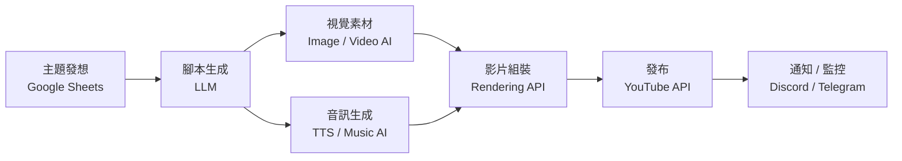
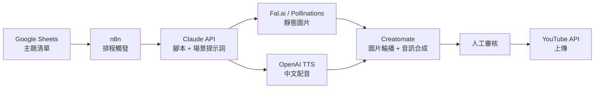

## TL;DR

- 用 n8n 串接 LLM 腳本生成 → AI 視覺素材 → AI 配音/音樂 → 影片組裝 → 自動發布，可實現近全自動 YouTube 影片產線
- 真正「零程式碼」的只有 n8n 編排和部分 SaaS 呼叫；影片組裝與異常處理仍需工程整合
- API 成本結構差異大：文字生成便宜、影片生成昂貴，每支影片估計 $0.5–$5 USD（依品質與長度）
- 最大風險不是技術而是政策：YouTube 對大量 AI 生成內容有明確的 spam 和揭露規範

## 端到端工作流

## 工作流各階段拆解

### 1. 主題發想與排程

| 層面 | 說明 |
|------|------|
| **目標** | 批次管理主題清單、追蹤每支影片狀態 |
| **影片中工具** | Google Sheets / Airtable 作為主題資料庫 |
| **替代方案** | Notion API、自建 DB |
| **自動化程度** | 無程式碼 |

### 2. 腳本生成

| 層面 | 說明 |
|------|------|
| **目標** | 將主題轉換為分場腳本（場景描述 + 旁白文字 + 視覺提示詞） |
| **影片中工具** | GPT-4.1 mini / OpenAI API |
| **替代方案** | Claude API、Gemini API、本地模型（Llama） |
| **自動化程度** | 無程式碼（n8n HTTP Request node） |
| **估計成本** | ~$0.01–$0.05 / 篇（GPT-4.1 mini） |

### 3. 視覺素材生成

| 層面 | 說明 |
|------|------|
| **目標** | 依照場景描述生成圖片或短影片片段 |
| **影片中工具** | Fal.ai、Kling 3.0、Pollinations AI |
| **替代方案** | Midjourney API、DALL-E 3、Veo 3、Runway |
| **自動化程度** | 低程式碼（需處理非同步回呼與重試邏輯） |
| **估計成本** | 圖片 ~$0.02–$0.10/張；影片 ~$0.10–$1.00/片段 |

### 4. 音訊生成

#### 4a. 配音（TTS）

| 層面 | 說明 |
|------|------|
| **目標** | 將旁白文字轉為自然語音 |
| **影片中工具** | OpenAI TTS、ElevenLabs |
| **替代方案** | Google Cloud TTS、Azure TTS、Fish Audio |
| **自動化程度** | 無程式碼（n8n HTTP Request） |
| **估計成本** | OpenAI: $15/1M 字元；ElevenLabs: 免費額度 10k 字元/月，付費 $5/月起 |

#### 4b. 背景音樂

| 層面 | 說明 |
|------|------|
| **目標** | 生成搭配影片氛圍的背景音樂 |
| **影片中工具** | Suno AI |
| **替代方案** | Udio、免費音樂庫（Pixabay Audio） |
| **自動化程度** | 低程式碼（API 尚不完全公開，部分需繞道） |
| **估計成本** | 免費額度有限，Pro $10/月 |

### 5. 影片組裝與後製

| 層面 | 說明 |
|------|------|
| **目標** | 將圖片/影片片段 + 音訊 + 字幕組裝成完整影片 |
| **影片中工具** | json2video、Creatomate |
| **替代方案** | FFmpeg（自架）、Shotstack、Remotion |
| **自動化程度** | 需工程整合（模板定義、時間軸同步、字幕嵌入） |
| **估計成本** | json2video: $49/月起；Creatomate: $39/月起；FFmpeg: 免費但需自建 |

### 6. 發布與追蹤

| 層面 | 說明 |
|------|------|
| **目標** | 上傳至 YouTube 並填入 metadata（標題、描述、標籤、縮圖） |
| **影片中工具** | YouTube Data API v3、Blotato |
| **替代方案** | 直接用 YouTube API + OAuth、Hootsuite |
| **自動化程度** | 低程式碼（OAuth 認證設定較繁瑣） |

### 7. 通知與成本監控

| 層面 | 說明 |
|------|------|
| **目標** | 每支影片完成後通知、追蹤累計 API 花費 |
| **影片中工具** | Discord Webhook、Telegram Bot |
| **替代方案** | Slack Webhook、Email |
| **自動化程度** | 無程式碼 |

## 工具分類總覽

| 類別 | 工具 | 免費額度 | 付費起點 |
|------|------|----------|----------|
| **編排** | n8n | 自架免費 | Cloud $24/月 |
| **資料庫** | Google Sheets | 免費 | — |
| **LLM** | GPT-4.1 mini | 有限免費 | Pay-per-use |
| **圖片生成** | Fal.ai、Pollinations | 有 | Pay-per-use |
| **影片生成** | Kling 3.0 | 每日額度 | Pro plan |
| **TTS** | OpenAI TTS、ElevenLabs | ElevenLabs 10k 字元/月 | $5/月起 |
| **音樂** | Suno AI | 每日額度 | $10/月 |
| **影片組裝** | json2video、Creatomate | 有限 | $39–$49/月 |
| **發布** | YouTube API、Blotato | API 免費 | Blotato ~$30 一次買斷 |
| **通知** | Discord / Telegram | 免費 | — |

## 風險分析

### YouTube 政策風險

- **AI 內容揭露**：YouTube 要求標註「改造或合成」內容，未揭露可能導致下架
- **重複/垃圾內容**：大量產出低原創性影片會觸發 spam 政策，頻道可能被終止
- **Deepfake 規範**：描繪真實人物或事件的合成內容需揭露，違反可收到 strike

### 版權風險

- AI 生成的音樂若模仿特定藝人風格，可能觸發 Content ID
- 圖片素材的訓練資料來源不透明，商用授權模糊
- 建議：使用明確標示可商用的生成工具，避免模仿特定風格

### 成本風險

- 影片生成（Kling、Fal.ai）是最大成本項目
- 規模化後 API 費用可能快速增長：100 支影片/月估計 $50–$500
- 建議：先以靜態圖片 + 配音模式控制成本，再逐步升級為 AI 影片

### 品質風險

- AI 配音仍可辨識為合成語音，中文品質落後英文
- AI 生成影片片段一致性不佳（同一角色跨場景外觀會變）
- 建議：人工審核環節不可省略，至少在發布前檢查一次

## 最小可行 PoC 架構

適合繁體中文內容工作流的最小版本：

### PoC 設計決策

| 決策 | 選擇 | 理由 |
|------|------|------|
| 影片形式 | 靜態圖片輪播 + 配音 | 成本最低，品質可控 |
| LLM | Claude API | 中文品質穩定，支援長文腳本 |
| 圖片 | Fal.ai | Pay-per-use，無月費門檻 |
| TTS | OpenAI TTS | API 穩定，中文品質可接受 |
| 組裝 | Creatomate | 模板化程度高，比 json2video 易上手 |
| 審核 | 人工 | PoC 階段保留品質把關 |

### 預估每支影片成本（PoC）

| 項目 | 估計費用 |
|------|----------|
| LLM 腳本 | $0.02 |
| 圖片 ×8 場景 | $0.40 |
| TTS 配音 ~2000 字 | $0.03 |
| 影片組裝 | ~$0.50（依方案） |
| **合計** | **~$0.95 / 支** |

## 延伸方向

- 升級為 AI 影片片段（Kling 3.0）取代靜態圖片，成本升至 ~$5/支
- 加入 Suno AI 自動生成片頭/片尾音樂
- 接入 YouTube Analytics API 做成效回饋迴圈
- 探索「研究型內容自動化」而非短影音農場——用同一套流程產出技術解說影片
