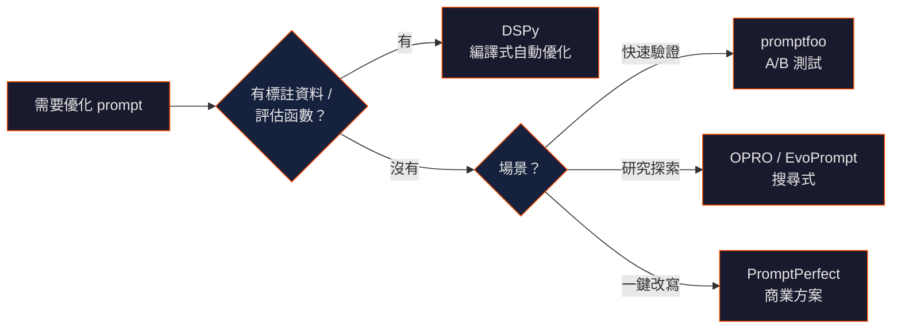

## TL;DR

- 手工寫 prompt 的時代正在轉變 —— 開源工具已能自動把粗略提示詞優化成結構化、高品質版本
- 核心方法分兩派：**編譯式**（DSPy）和**搜尋式**（OPRO、EvoPrompt）
- 實務上最先落地的是 **prompt 測試框架**（promptfoo），讓你用 CI/CD 方式驗證 prompt 品質
- 商業方案（PromptPerfect）提供一鍵優化 UX，但開源方案在靈活度與可控性上更強

## 工具概覽

| 工具 | 類型 | 做什麼 | 授權 |
|------|------|--------|------|
| DSPy | 編譯式框架 | 用 Python 定義任務，自動搜尋最佳 prompt + few-shot 組合 | MIT |
| OPRO | LLM 自我優化 | 用 LLM 本身迭代生成、評分、篩選最佳 prompt | Apache 2.0 |
| promptfoo | 測試框架 | Prompt A/B 測試、自動評分、CI/CD 整合 | MIT |
| EvoPrompt | 演化演算法 | 用遺傳演算法 / 差分演化自動演化更好的 prompt | Research |
| PromptPerfect | 商業 SaaS | 一鍵將粗略 prompt 改寫成專業級版本 | 商業（免費額度） |

## 方法分類

### 編譯式：DSPy（Stanford NLP）

**核心思路：** 把 prompt 工程變成程式工程。你不寫 prompt，你寫 Python 模組定義「輸入 → 輸出」的 signature，DSPy 的 compiler 自動搜尋最佳的 prompt 模板和 few-shot 範例。

```
定義任務 (Signature) → 組合模組 (Module) → 編譯優化 (Teleprompter) → 輸出最佳 prompt pipeline
```

- **適用場景：** RAG、分類、多跳 QA、agent pipeline
- **優勢：** 可重現、可版本控制、prompt 自動適配不同模型
- **限制：** 學習曲線陡峭；需要標註資料或評估函數

### 搜尋式：OPRO（Google DeepMind）

**核心思路：** 用 LLM 自己當優化器。把「生成好的 prompt」本身當作一個優化問題，LLM 迭代產出候選 prompt、評估效果、保留最佳版本。

- **適用場景：** 研究、特定任務的 prompt 搜尋
- **優勢：** 不需要程式框架；概念簡單
- **限制：** 計算成本高（每次迭代需多次 LLM 呼叫）；結果不穩定

### 演化式：EvoPrompt

**核心思路：** 將遺傳演算法套用到 prompt 優化。建立 prompt 種群，透過交叉、變異、適者生存機制自動演化更好的 prompt。

- **適用場景：** 學術研究、分類任務優化
- **優勢：** 能探索大搜尋空間；不依賴梯度
- **限制：** 目前主要用於研究場景

### 測試式：promptfoo

**核心思路：** 不幫你「寫」更好的 prompt，而是幫你「驗證」哪個 prompt 更好。定義測試案例 + 評估指標，自動跑多個 prompt 變體、跨模型比較、輸出評分報告。

- **適用場景：** Prompt CI/CD、紅隊測試、生產級 prompt 品質管理
- **優勢：** 最容易整合到現有開發流程；支援所有主流 LLM
- **限制：** 不自動生成 prompt；需要人工設計候選變體

## 選擇決策樹



## 實務建議

- **起步最低門檻：** 先用 promptfoo 建立測試基準，量化現有 prompt 的表現
- **進階自動化：** 當你有足夠的評估資料時，引入 DSPy 做系統性優化
- **快速原型：** 用 PromptPerfect 的免費額度快速改善單一 prompt，再手動微調
- **研究場景：** OPRO 和 EvoPrompt 適合探索性研究，不建議直接用於生產

## 參考來源

- DSPy — [stanfordnlp/dspy](https://github.com/stanfordnlp/dspy)
- OPRO — [google-deepmind/opro](https://github.com/google-deepmind/opro)
- promptfoo — [promptfoo/promptfoo](https://github.com/promptfoo/promptfoo)
- EvoPrompt — [beeevita/EvoPrompt](https://github.com/beeevita/EvoPrompt)
- PromptPerfect — [promptperfect.jina.ai](https://promptperfect.jina.ai)
