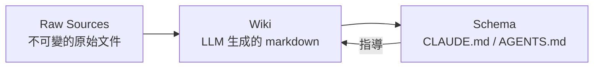

## TL;DR

- Karpathy 提出一種新的知識管理模式：讓 LLM **持續維護一個結構化的 wiki**，而非每次查詢時重新從原始文件檢索（RAG）
- 核心差異：知識被 **編譯一次、持續更新**，而非每次查詢時重新推導
- 三層架構：Raw Sources → Wiki → Schema
- 人類負責策展來源與提問；LLM 負責所有繁瑣的整理、交叉引用、維護工作
- 靈感來自 Vannevar Bush 的 Memex（1945）—— 一個帶有關聯路徑的私人知識庫

## 核心概念：Persistent Wiki vs RAG

### RAG 的問題

- 每次查詢都從零開始：LLM 必須重新找到相關片段、重新拼湊答案
- **沒有累積效應** —— 問一個需要綜合五份文件的問題，每次都要重新推導
- NotebookLM、ChatGPT file uploads、大多數 RAG 系統都是這樣運作

### LLM Wiki 的不同

- LLM **漸進式建構並維護一個持久性 wiki** —— 結構化、互相連結的 markdown 檔案
- 新來源加入時，LLM 不只是索引它，而是：
  - 閱讀並提取關鍵資訊
  - 整合到現有 wiki 中
  - 更新實體頁面、修訂主題摘要
  - 標記新舊資料的矛盾之處
- **Wiki 是一個持續複利的產出物** —— 交叉引用已經建好、矛盾已經標記、綜合分析已反映所有已讀內容

> Obsidian is the IDE; the LLM is the programmer; the wiki is the codebase.

## 三層架構



### Layer 1: Raw Sources（原始來源）

- 文章、論文、圖片、資料檔案
- **不可變** —— LLM 只讀取，絕不修改
- 這是唯一的 source of truth

### Layer 2: Wiki（知識庫）

- LLM 生成的 markdown 檔案目錄
- 包含：摘要、實體頁面、概念頁面、比較、總覽、綜合分析
- **LLM 完全擁有此層** —— 建立頁面、更新、維護交叉引用、保持一致性
- 你只負責閱讀；LLM 負責寫入

### Layer 3: Schema（結構定義）

- 一份設定文件（例如 `CLAUDE.md` 或 `AGENTS.md`）
- 告訴 LLM：
  - wiki 的結構是什麼
  - 慣例是什麼
  - 在 ingest / query / lint 時要遵循什麼流程
- 你和 LLM **共同演化**這份文件

## 三大操作流程

### Ingest（攝取）

- 將新來源丟入 raw collection，告訴 LLM 處理它
- 流程：閱讀來源 → 討論重點 → 寫摘要頁 → 更新索引 → 更新相關實體和概念頁 → 追加 log
- 一個來源可能觸及 **10-15 個 wiki 頁面**
- 可以逐一攝取（參與式）或批次攝取（低監督）

### Query（查詢）

- 針對 wiki 提問，LLM 搜尋相關頁面、閱讀、綜合答案並附引用
- 輸出格式可變：markdown 頁面、比較表、投影片（Marp）、圖表
- **關鍵洞察：好的答案可以回存到 wiki 成為新頁面** —— 讓探索也能複利

### Lint（健檢）

- 定期請 LLM 檢查 wiki 健康度：
  - 頁面間的矛盾
  - 被新來源取代的過時聲明
  - 沒有入連結的孤立頁面
  - 被提及但缺乏獨立頁面的重要概念
  - 缺失的交叉引用
  - 可透過網路搜尋填補的資料缺口

## 索引與日誌

| 檔案 | 用途 | 特性 |
|------|------|------|
| `index.md` | 內容導向的目錄 | 每頁一行摘要，按分類組織，LLM 查詢時先讀此檔 |
| `log.md` | 時間導向的紀錄 | append-only，記錄 ingest / query / lint 事件，可用 unix 工具解析 |

- 在約 100 個來源、數百頁 wiki 的規模下，`index.md` 運作良好，不需要 embedding-based RAG 基礎設施
- 超過此規模可引入搜尋工具（如 [qmd](https://github.com/tobi/qmd)）

## 與 RAG / NotebookLM 的比較

| 面向 | RAG / NotebookLM | LLM Wiki |
|------|-------------------|----------|
| 知識持久性 | 無 —— 每次查詢重新推導 | 有 —— 編譯一次，持續更新 |
| 交叉引用 | 查詢時才建立 | 已預先建好 |
| 矛盾偵測 | 不主動偵測 | ingest 時即標記 |
| 綜合分析 | 每次重新合成 | 累積式，反映所有已讀內容 |
| 維護成本 | 低（無狀態） | LLM 承擔（對人類近乎零成本） |
| 擴展性 | 依賴 embedding infra | 中小規模用 index.md 即可 |
| 查詢品質 | 受限於 retrieval 品質 | 受限於 wiki 維護品質 |

## MVP 實作方案

1. **建立三層目錄結構**
   ```
   my-wiki/
   ├── raw/          # 原始來源（不可變）
   ├── wiki/         # LLM 維護的 markdown
   │   ├── index.md  # 內容目錄
   │   └── log.md    # 操作日誌
   └── CLAUDE.md     # Schema / 結構定義
   ```

2. **撰寫 Schema（CLAUDE.md）**
   - 定義頁面類型（summary / entity / concept / comparison）
   - 定義 ingest / query / lint 流程
   - 定義命名慣例與 frontmatter 格式

3. **Ingest 流程**
   - 使用 Obsidian Web Clipper 將文章轉為 markdown 存入 `raw/`
   - 告訴 LLM agent 處理新來源
   - 檢視 LLM 的更新，引導強調重點

4. **工具選擇**
   - 編輯器：Obsidian（graph view 用於視覺化連結）
   - LLM Agent：Claude Code / OpenAI Codex / 任何支援檔案操作的 agent
   - 搜尋（規模成長後）：qmd 或自建簡易搜尋腳本

## 對 ai-study-note 的適用性評估

### 現狀

- ai-study-note 已經是一個 Quartz-powered digital garden
- 已有 `content/` 目錄結構、frontmatter 慣例、CLAUDE.md schema
- 已使用 Claude Code 作為 LLM agent

### 可採用的部分

- **Ingest 流程規範化**：定義標準的來源攝取流程，讓每次新增筆記時自動更新相關頁面的交叉引用
- **index.md 強化**：目前的 index 可以擴展為 Karpathy 模式的內容目錄，加入一行摘要
- **Lint 操作**：定期用 LLM 檢查孤立頁面、缺失連結、過時內容
- **log.md 引入**：追蹤內容變更歷史，方便跨 session 理解進度

### 需要注意的差異

- ai-study-note 是**公開發布**的 digital garden，不是私人 wiki —— 需要人類審核品質
- Quartz 已提供 graph view、backlinks 等功能，部分交叉引用需求已被覆蓋
- 目前規模不大，不需要額外搜尋基礎設施

## Quick Reference

- **原始 Gist**：[karpathy/442a6bf](https://gist.github.com/karpathy/442a6bf555914893e9891c11519de94f)
- **核心公式**：人類策展 + LLM 維護 = 持續複利的知識庫
- **三層架構**：Raw Sources（不可變）→ Wiki（LLM 擁有）→ Schema（共同演化）
- **三大操作**：Ingest（攝取）/ Query（查詢）/ Lint（健檢）
- **關鍵洞察**：人類放棄 wiki 是因為維護成本成長快於價值；LLM 讓維護成本趨近於零
