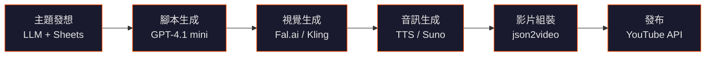

## TL;DR

- 透過 n8n 串接 6+ 個 AI 服務，可實現從主題發想到 YouTube 發布的**全自動影片生產線**
- 估計每支影片成本 **$1–7 美元**，月產 30 支約 $30–200
- 最貴的環節是**影片生成**（Kling、Veo3），最便宜的是 LLM 腳本
- 主要風險：內容品質、版權、YouTube 政策、API 連鎖故障

## 完整 Workflow

## 工具分類表

| 層級 | 工具 | 角色 | 成本 |
|------|------|------|------|
| **Orchestration** | n8n | 串接所有 API 的工作流引擎 | 自建免費；cloud 20 美元/月起 |
| **Orchestration** | Google Sheets / Airtable | 內容日曆、狀態追蹤 | 免費 |
| **LLM / Script** | GPT-4.1 mini | 主題生成、腳本撰寫 | 0.01–0.05 美元/次 |
| **LLM / Script** | Gemini | 替代 LLM 選項 | 免費額度慷慨 |
| **Visual** | Fal.ai | 圖片生成（每場景） | 0.01–0.05 美元/張 |
| **Visual** | Kling 3.0 | AI 影片片段生成 | 0.50–5.00 美元/段（最貴） |
| **Visual** | Veo3 | Google 影片生成模型 | 類似 Kling |
| **Visual** | Pollinations AI | 開源圖片生成 | 免費 |
| **Audio** | OpenAI TTS | 文字轉語音 | 約 0.015 美元/1K chars |
| **Audio** | Eleven Labs | 高品質語音合成 | 0.30 美元/min 起 |
| **Audio** | Suno AI | AI 音樂生成 | 免費額度有限 |
| **Rendering** | json2video / Creatomate | 雲端影片組裝 API | 0.10–0.50 美元/支 |
| **Rendering** | FFmpeg | 本地影片處理 | 免費 |
| **Publishing** | YouTube Data API v3 | 影片上傳 | 免費（有配額） |
| **Publishing** | Blotato | 社群媒體排程 | 付費 |

## 各環節拆解

### 1. 主題發想

LLM 根據 niche、趨勢資料、或預填的 Google Sheets 內容日曆，產出影片主題和大綱。

### 2. 腳本生成

GPT-4.1 mini 或 Gemini 根據主題寫出分場次的旁白腳本，每個場景包含：
- 旁白文字
- 視覺描述提示（用於下一步的圖片/影片生成）

### 3. 視覺素材生成

根據腳本中的視覺描述，呼叫圖片或影片生成 API：
- **靜態場景：** Fal.ai、Pollinations AI（便宜）
- **動態場景：** Kling 3.0、Veo3（貴但品質高）
- 典型一支影片需要 5–10 個場景

### 4. 音訊生成

- **旁白：** OpenAI TTS（便宜）或 Eleven Labs（品質好）
- **背景音樂：** Suno AI 生成（可選）
- 5 分鐘旁白成本：0.15–1.00 美元

### 5. 影片組裝

將場景圖片/影片 + 旁白音訊 + 背景音樂合成最終影片：
- **雲端方案：** json2video、Creatomate（API 驅動、no-code）
- **本地方案：** FFmpeg（免費但需要自寫腳本）

### 6. 發布與追蹤

- YouTube Data API v3 上傳
- Blotato 做跨平台排程
- Discord Webhook / Telegram Bot 通知結果
- Google Sheets 回寫狀態

## 成本估算（每支影片）

| 環節 | 低估 | 高估 |
|------|------|------|
| LLM（腳本） | 0.01 | 0.05 |
| TTS（5 min） | 0.15 | 1.00 |
| 圖片（5–10 張） | 0.05 | 0.50 |
| 影片片段 | 0.50 | 5.00 |
| 組裝 | 0.10 | 0.50 |
| **合計（美元）** | **0.81** | **7.05** |

月產 30 支：約 **25–210 美元/月**

## 風險評估

| 風險 | 嚴重度 | 說明 |
|------|--------|------|
| 內容品質 | 高 | 全自動產出容易流於空泛、重複；無人審核時事實錯誤難以避免 |
| 版權問題 | 中 | AI 生成的音樂和圖片可能無意中複製版權素材；各工具授權條款仍在演變 |
| YouTube 政策 | 高 | YouTube 要求揭露 AI 生成內容；批量低品質上傳可能觸發垃圾內容政策、降權或停權 |
| 平台偵測 | 中 | YouTube 演算法越來越會辨識機器人式的上傳模式，低互動頻道會被降權 |
| API 連鎖故障 | 中 | 串接 6+ 個外部 API，任何一個掛掉或改版都會中斷整條流水線 |

## 可落地的 PoC 方案（最小版本）

1. **n8n 自建**（Docker）+ Google Sheets 做內容日曆
2. **Gemini** 做腳本生成（免費額度足夠 PoC）
3. **Pollinations AI** 做圖片（免費）
4. **OpenAI TTS** 做旁白（最便宜的付費方案）
5. **FFmpeg** 本地組裝（免費）
6. 手動上傳 YouTube（先驗證內容品質再自動化發布）

**預估 PoC 成本：0–5 美元/月**（主要是 TTS 費用）

## 延伸思考

- 這套流程更適合做**研究型內容自動化**（資料整理 → 視覺化 → 分享），而非純量產短影音
- 加入人工審核環節（腳本審核 + 最終影片審核）可大幅提升品質
- 中文內容適用，但 TTS 品質需額外測試
