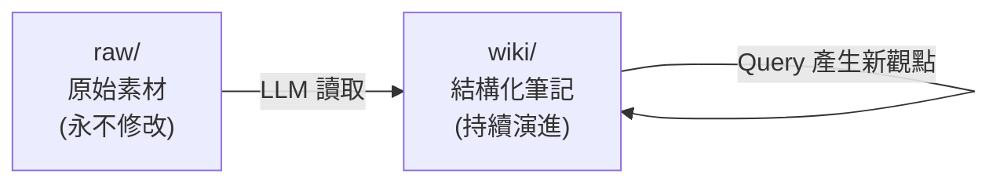

## TL;DR

- 把個人知識庫切成兩層：`raw/`（原始素材，不可修改）與 `wiki/`（AI 整理後的結構化筆記）
- LLM 只寫 `wiki/`；人類只決定「放什麼進 raw / 問什麼問題」
- Query 過程中產生的新觀點 **回寫** wiki，讓每次查詢都變成知識庫成長的契機
- 工具堆疊刻意低門檻：IDE + Obsidian + Markdown + Git，不需要 embedding / vector DB
- 相較於原始 Karpathy 模式，本版本省略 `schema` 層與 `log.md`，以降低起步成本

> [!info] 延伸閱讀
> 完整理論與三層架構：[[karpathy-llm-wiki-pattern|Karpathy 的 LLM-Maintained Wiki 模式研究]]。本筆記為個人化、精簡化後的實作版本。

## 設計核心：兩層而非三層



| 層 | 角色 | 寫入者 | 可變性 |
|----|------|--------|--------|
| `raw/` | Source of truth：文章、逐字稿、截圖 OCR、會議筆記 | 人類 | 不可變 |
| `wiki/` | 整理後的實體頁、主題摘要、交叉引用 | LLM | 持續演進 |

### 為什麼省略 Schema 層

- Karpathy 原版的 `CLAUDE.md` / `AGENTS.md` 定義頁面類型、ingest 流程、命名慣例
- 個人起步階段，schema 過早會變成維護負擔
- 替代方案：在每次 ingest 時用一句話 system prompt 指定慣例，累積到 20+ 頁再抽成文件

## 三大操作流程（精簡版）

### 1. Ingest — 素材整合

```
觸發：有新文章 / 新筆記要進庫
輸入：raw/ 新檔案
動作：
  - LLM 閱讀新檔案
  - 找出涉及的既有 wiki 頁
  - 更新（不是覆寫）相關頁面的摘要與交叉引用
  - 如遇矛盾，保留雙方並標註 `> [!warning]`
輸出：wiki/ 中 3–10 個頁面被 touched
```

### 2. Query — 知識查詢

```
觸發：需要答案或想做決策
輸入：一個問題
動作：
  - LLM 讀取 wiki/index.md，鎖定相關頁
  - 綜合多頁內容，產出答案並附頁面引用
  - 如果答案值得保留，直接寫成新的 wiki 頁
輸出：答案 + 可選的新 wiki 頁
```

### 3. Writeback — 查詢回寫

- 這是整個工作流最關鍵的複利機制
- 查詢不只是「讀取」：每次有價值的綜合分析都成為知識庫的新頁
- 例如：問「A 和 B 在 X 情境下哪個好？」→ 答案寫入 `wiki/comparisons/a-vs-b-in-x.md`
- 下次類似問題可直接命中，不需重新推導

## 目錄結構範例

```
my-knowledge/
├── raw/
│   ├── 2026-04-08-article-cursor-vs-claude.md
│   ├── 2026-04-10-meeting-notes.txt
│   └── images/
├── wiki/
│   ├── index.md              # 目錄 + 每頁一行摘要
│   ├── entities/             # 工具、人名、組織
│   ├── concepts/             # 技術概念、模式
│   ├── comparisons/          # 對照分析
│   └── summaries/            # 主題總覽
└── .git/
```

## 工具選擇與理由

| 工具 | 角色 | 為什麼選它 |
|------|------|-----------|
| IDE (Cursor / VS Code) | LLM agent 執行環境 | 檔案操作原生、diff 可視化 |
| Obsidian | 閱讀與 graph view | 免費、本地檔案、Wikilink 原生 |
| Markdown | 儲存格式 | LLM 輸出友善、純文字、可版本控制 |
| Git | 版本控管 | 每次 ingest = 一個 commit，可回滾 |

- **刻意避免**：embedding infra、vector DB、RAG middleware —— 起步階段過度工程
- **超過 100 頁後再考慮**：簡單搜尋腳本或 [qmd](https://github.com/tobi/qmd)

## Vibe Coding 可視化切入點

- 整個工作流本身是一個 AI agent loop —— 可以用 vibe coding 把三大流程做成小型可視化 demo
- 最小化展示：一個 web UI，左邊是 raw 檔案拖放區，右邊即時顯示 wiki 如何被更新
- 用途：對非技術觀眾解釋「AI 整理你的資料」是什麼感覺
- 參考 [[karpathy-llm-wiki-pattern#三大操作流程|Karpathy 的三流程設計]]

## 與 RAG / NotebookLM 的取捨

| 面向 | RAG / NotebookLM | 本工作流 |
|------|-------------------|---------|
| 上手成本 | 低（丟檔案即可） | 中（需建目錄與慣例） |
| 知識複利 | 無 | 有（wiki 持續長大） |
| 跨來源綜合 | 每次重新推導 | ingest 時已預先整合 |
| 資料擁有權 | 平台託管 | 本地檔案 + Git |
| 適合對象 | 一次性問答 | 長期主題深耕 |

## 常見踩雷

- **LLM 覆寫 raw/**：在 system prompt 明確寫「raw/ 目錄唯讀，任何修改寫到 wiki/」
- **wiki 變成另一個 raw dump**：每次 ingest 要求 LLM 更新 **既有頁** 而不是新增重複頁
- **矛盾未標註**：當新來源與既有 wiki 衝突，強制要求 LLM 用 `> [!warning]` 標註
- **index.md 失去同步**：把「更新 index.md 一行摘要」設為 ingest 的必要步驟

## Quick Reference

- **核心公式**：人類策展 raw + LLM 維護 wiki + 查詢回寫 = 持續複利的個人知識庫
- **兩層架構**：`raw/`（不可變）→ `wiki/`（LLM 擁有）
- **三流程**：Ingest / Query / Writeback
- **MVP 工具堆疊**：IDE + Obsidian + Markdown + Git
- **靈感來源**：[[karpathy-llm-wiki-pattern|Karpathy 原始 Gist]] + 林穎俊老師教學
