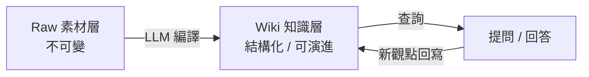

## TL;DR

- 個人知識系統只需兩層：**raw（永不修改的素材）** + **wiki（LLM 整理的結構化筆記）**
- LLM 負責把 raw 編譯成 wiki、建立交叉連結、生成摘要；人類只負責投餵素材與提問
- 查詢 wiki 時產生的新觀點 **回寫 wiki**，讓知識庫隨使用時間複利累積
- 工具組合：**IDE + Obsidian + Markdown + Git**，零額外 SaaS 成本
- 與 Karpathy 三層模型（raw / wiki / schema）相比，本版本把 schema 降為隱式（`CLAUDE.md` / `AGENTS.md`），更適合個人入門

## 雙層設計：Raw vs Wiki

### Raw 層

- 原文、PDF、影片逐字稿、截圖、聊天紀錄、會議錄音摘要
- **寫入即凍結**：LLM 只讀取，永不改寫；保留原始脈絡與時間戳
- 檔名格式建議：`raw/<yyyy-mm-dd>-<source>-<slug>.md`
- 為什麼要凍結：確保後續所有 wiki 推論都可回溯到來源；避免 LLM 幻覺污染素材

### Wiki 層

- LLM 從 raw 編譯出的結構化 markdown：摘要、實體頁、主題頁、交叉索引
- **完全由 LLM 維護**：新增條目、更新、合併重複、標記矛盾
- 檔名沿用既有慣例：`content/<topic>/<kebab-case>.md`
- 人類只讀不寫；若需修正，修改 raw 或 `CLAUDE.md` 規則，重新編譯

## 編譯流程

1. **投餵 raw**：丟入文章、筆記、連結，僅加最小 frontmatter（`title`、`source`、`captured_at`）
2. **LLM 編譯**：`@writer` / `@content-ops` 類代理讀 raw → 抽取實體、概念、關係 → 寫入 wiki
3. **交叉連結**：wiki 間用 Obsidian wikilink（`[[entity]]`）互連；LLM 在更新時自動回掃相關頁
4. **摘要與分類**：每個 wiki 條目自帶 3–5 行 TL;DR 與 tags，便於後續檢索
5. **矛盾標記**：LLM 遇到 raw 之間衝突時，在 wiki 用 `> [!warning]` 標註，不強行合併

## 查詢與回寫循環

- 查詢 wiki（而非 raw）才能得到**已綜合過的答案**，避免每次重新 RAG
- 提問產生的新觀點 / 類比 / 反例 → LLM 判斷是否值得回寫：
  - 是原 wiki 條目的延伸 → 追加到該頁
  - 是跨條目的新關聯 → 建立新主題頁並雙向連結
  - 是來源不明的推論 → 標為 `speculation` tag，不進主幹
- **複利效應**：用得越久，wiki 越密、查詢品質越高；這是與 RAG 最大差異

## 低門檻工具組合

| 角色 | 工具 | 為什麼 |
|------|------|--------|
| 編輯器 | IDE（Cursor / VS Code）+ Obsidian | IDE 提供 AI 編寫，Obsidian 提供雙向連結與圖譜視覺化 |
| 格式 | Markdown | 純文字、可版控、跨工具相容 |
| 版控 | Git | raw 凍結、wiki 演進歷史、可回滾 |
| LLM | 任一長上下文模型（Claude / GPT / Gemini）| 長上下文 + 好的指令遵循即可，不需 fine-tune |
| 規則 | `CLAUDE.md` / `AGENTS.md` | 把 schema 寫成 agent 規則，省掉獨立 schema 層 |

## 與相關做法的差異

:::col
### Karpathy 三層模型
- Raw → Wiki → Schema
- Schema 用 `CLAUDE.md` 顯式管理
- 偏重系統設計視角
- 見 [[prompt-notes/karpathy-llm-wiki-pattern|Karpathy LLM Wiki Pattern]]
:::

:::col
### 本文的個人版本
- Raw → Wiki（Schema 隱式）
- 強調 **查詢回寫循環** 作為主要增值路徑
- 偏重個人工作流上手
- 以現有 Obsidian + Git 庫即可啟動
:::

## 為何適合個人知識管理

- **無鎖定**：全部 markdown + Git，任何時刻可離開任一工具
- **漸進啟動**：第一天只要有一個 raw 檔案就能跑；不需預先設計 schema
- **成本可控**：LLM 呼叫只在編譯與查詢時發生，不需要常駐向量資料庫
- **審閱友善**：wiki 是人類可讀的 markdown，而非向量索引或不透明資料庫
- **可分享**：wiki 層可直接作為公開筆記站素材（如 Quartz / Obsidian Publish）

## 啟動步驟（最小可行）

1. `mkdir raw wiki`（或 `content/`）並 `git init`
2. 放入第一份 raw（例如一篇文章全文 + 來源連結）
3. 在專案根新增 `CLAUDE.md`，寫明：raw 禁止修改、wiki 命名慣例、frontmatter 欄位
4. 用 LLM 跑第一次編譯：`讀 raw/<file>，產出 wiki/<entity>.md 與 wiki/<topic>.md，雙向 wikilink`
5. 開始提問；每次回答結束後評估是否回寫 wiki
6. 累積到 20–30 份 wiki 條目後，重跑一次全庫交叉索引整理

## 風險與限制

> [!warning] LLM 幻覺污染
> 若未嚴格執行「raw 不可變」，LLM 生成的錯誤內容會被下次編譯再次引用。處置：wiki 每個陳述必須能回指到 raw 段落。

> [!warning] 規模上限
> 單一資料夾 wiki 超過數百條目後，Obsidian 圖譜會難以導航；此時需切分主題子庫或引入自動 tagging。

- 不適合：需要多人協作精準版控的團隊知識庫（合併衝突成本高）
- 不適合：需要即時更新的動態資料（如股價、API 狀態）—— 這類應用 RAG/工具呼叫更合適
- 未解：大量圖片 / 多模態素材如何高效納入 wiki 編譯（現階段需人工摘要）

## 延伸閱讀

- [[prompt-notes/karpathy-llm-wiki-pattern|Karpathy LLM Wiki Pattern]] — 三層架構的系統視角
- Vannevar Bush, "As We May Think" (1945) — Memex 原始構想
