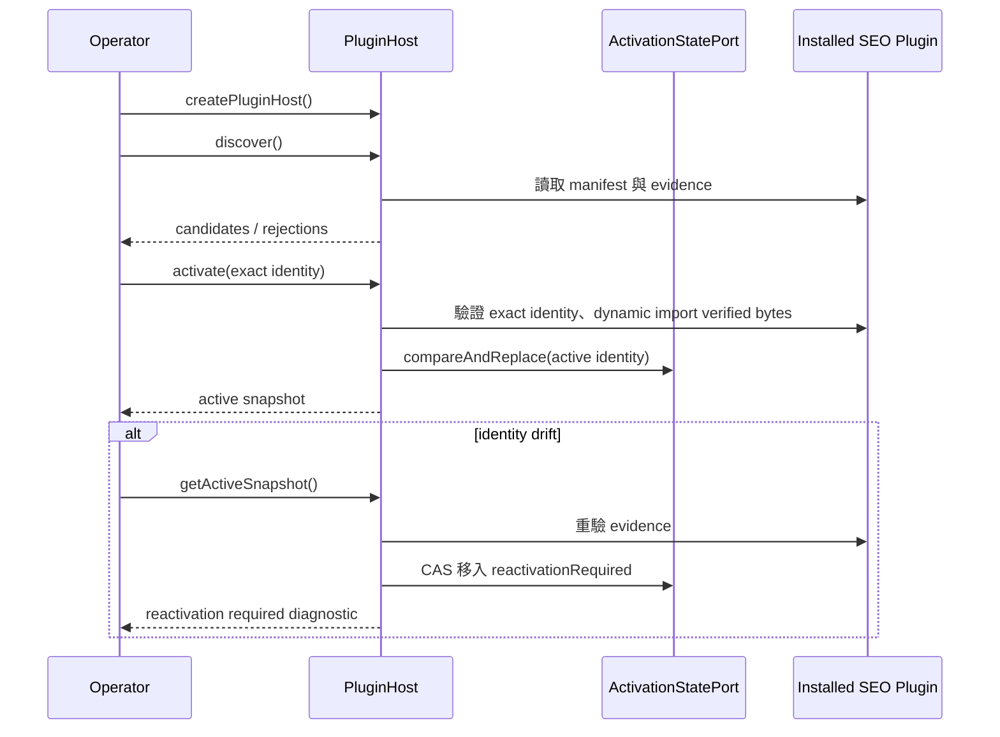
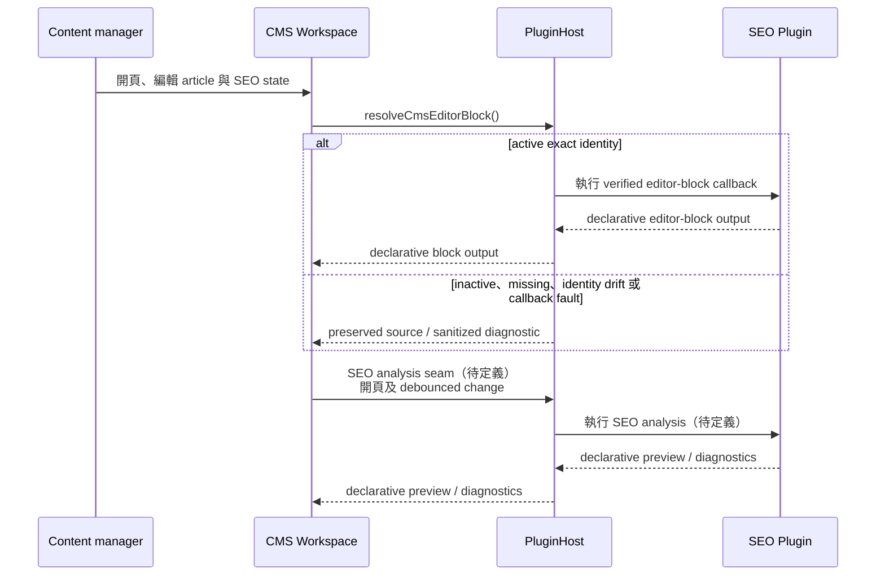
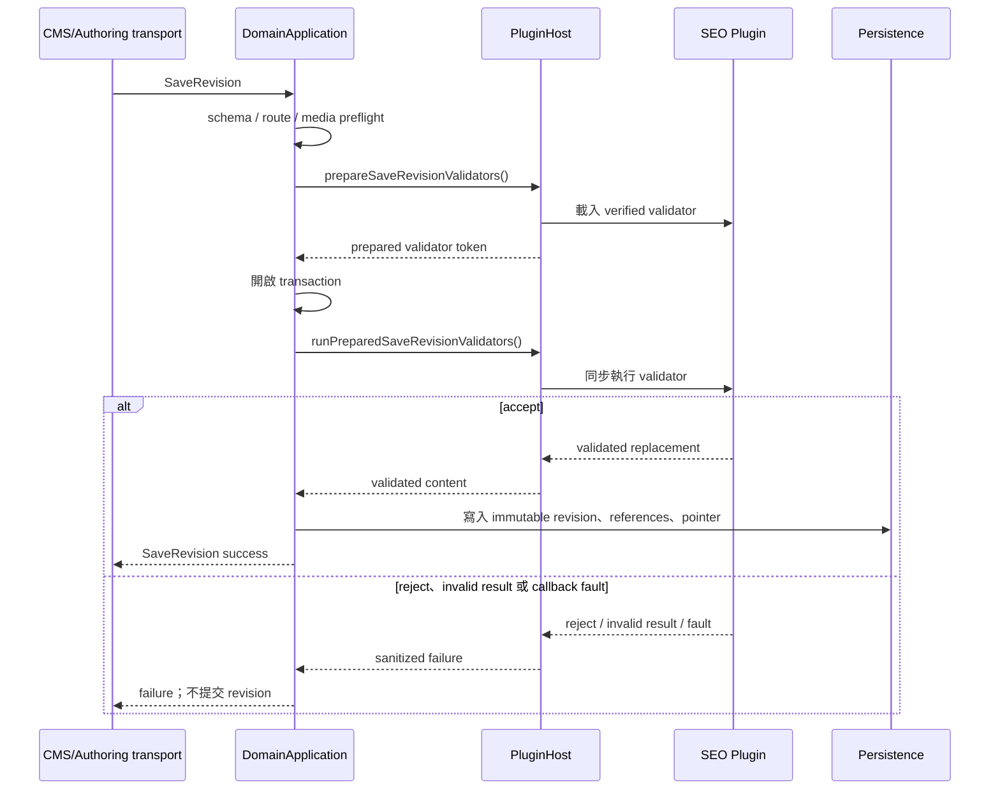
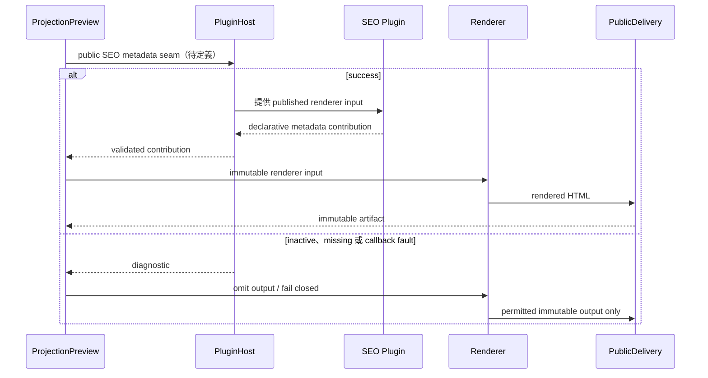
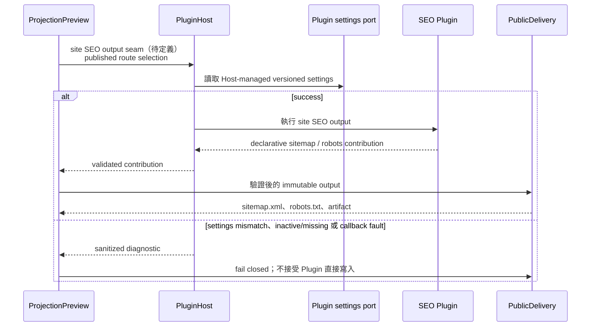

# SEO Plugin 模組互動說明

> **需求討論稿／非 contract／不代表目前 runtime。**
>
> 本文借用 Yoast SEO 類產品情境說明模組互動：誰在何時呼叫 `PluginHost`、Host 如何執行 SEO Plugin，以及結果由哪個 owner 接收。本文不實作 SEO Plugin，不定義新 API、資料表、畫面細節或 implementation order；標示「待定義」的 seam 不代表已存在。

## 核心互動規則

- 核心模組永不直接 import 或呼叫 installed Plugin。固定互動為 **caller owner → PluginHost → SEO Plugin → PluginHost → caller owner**。
- caller owner 組成 immutable input；`PluginHost` 負責 identity、capability、verified execution 與 sanitized diagnostic boundary。
- Plugin 回傳的結果仍由 caller owner 決定如何顯示、保存或交給下游。Plugin 不直接操作 CMS UI、Persistence、route graph、current pointer 或 artifact directory。

## 場景一：安裝、啟用與升級

**現況已實作。** Operator 以 `createPluginHost()` 建立 Host，並使用 `discover()`、`activate()`、`deactivate()` 與 `getActiveSnapshot()` 管理 lifecycle。`discover()` 讀取 manifest/evidence；`activate()` 驗證 exact identity 後才 dynamic import verified bytes，並以 activation-state CAS 保存狀態。若 Host 發現 identity drift，會將 Plugin 移入 `reactivationRequired`；只有 exact-identity re-enable 可恢復執行。Plugin 不直接操作 activation DB。

## 場景二：CMS 編輯期 SEO 分析

`resolveCmsEditorBlock()` 這個 Host method 已存在，但尚無 CMS production caller；目前也沒有通用的非阻斷 SEO analysis/diagnostics seam。CMS Workspace 擁有正在編輯的 article／SEO state，先以既有 `resolveCmsEditorBlock()` 取得 declarative editor-block output。若要提供 Yoast 類即時分析，CMS 應在開頁及 debounced content change 時呼叫 `SEO analysis seam（待定義）`；Host 執行 Plugin 後，將 declarative preview/diagnostics 經 Host 回傳 CMS。CMS 擁有 React rendering、a11y、表單 state 與使用者回饋。

## 場景三：SaveRevision 驗證

**現況已實作，且是唯一 production integration。** `DomainApplication.saveRevision()` 會呼叫 `prepareSaveRevisionValidators()`，並在 transaction 內呼叫 `runPreparedSaveRevisionValidators()`。既有 schema、route 與 media preflight 完成後，Application 向 Host prepare verified validator；Application 在 transaction 內執行它，只有 validated replacement 回到 Application 後才寫入 immutable revision、references 與 pointer。SEO 品質建議是編輯期 feedback；現有 validator 只適合結構完整性的 hard gate，不應把低 SEO 分數描述為既有儲存政策。

## 場景四：公開頁 metadata

Projection、Renderer、Delivery 與 public Plugin callback 尚未實作。`ProjectionPreview` 先從既有 owners 取得 published-only selection，再呼叫 `public SEO metadata seam（待定義）`。Host 只將 published renderer input 交給 Plugin；Plugin 經 Host 回傳 declarative title、description、canonical、Open Graph 與 JSON-LD contribution。Projection 驗證 output 後將其納入 immutable renderer input，Renderer 產生 HTML，`PublicDelivery` 產生 artifact。Plugin 不得直接讀 Content、Persistence、current pointer 或 artifact directory。

## 場景五：全站 sitemap 與 robots

site-wide Plugin settings、sitemap／robots Plugin seam 與其 runtime 均尚未定義。`ProjectionPreview` 以 published route selection 呼叫 `site SEO output seam（待定義）`；Host 讀取 Host-managed versioned settings 後執行 Plugin。Plugin 經 Host 回傳 declarative sitemap／robots contribution；Projection 驗證後交給 `PublicDelivery` 產生 `sitemap.xml`、`robots.txt` 與相關 artifact。settings mismatch、inactive/missing 或 callback fault 時，Plugin 不得直接修改 route graph 或 artifact directory，而由 owner fail closed。

## 模組互動總表

| Caller owner | 經過的介面 | Plugin 做什麼 | 結果回到誰 | 目前狀態 |
| --- | --- | --- | --- | --- |
| Operator lifecycle | `createPluginHost()` → `discover()`／`activate()`／`deactivate()`／`getActiveSnapshot()` | 由 Host 驗證 manifest/evidence，僅在 exact identity 下載入 verified bytes | Operator | 已實作 |
| CMS editing | `resolveCmsEditorBlock()`；`SEO analysis seam（待定義）` | 回傳 declarative editor-block output；未來可回傳 preview/diagnostics | CMS Workspace | editor-block Host method 已實作；production caller 與 analysis seam 未實作 |
| SaveRevision | `prepareSaveRevisionValidators()` → `runPreparedSaveRevisionValidators()` | 同步 accept、reject 或 replacement 的結構完整性驗證 | DomainApplication | 已實作；唯一 production integration |
| Projection page metadata | `public SEO metadata seam（待定義）` | 對 published renderer input 貢獻 title、description、canonical、Open Graph、JSON-LD | ProjectionPreview | 未定義／未實作 |
| Projection site output | `site SEO output seam（待定義）` | 對 published route selection 貢獻 sitemap／robots output | ProjectionPreview | 未定義／未實作 |

## 來源

- [Plugin host 與 CMS editor integration contract](../contracts/README.md#4-plugin-host)
- [Domain lifecycle contract](../contracts/README.md#1-domain-lifecycle)
- [Projection, preview, delivery contract](../contracts/README.md#3-projection-preview-delivery)
- [PluginHost current contract](../core/plugin-host/contracts.ts)
- [SaveRevision current integration](../core/application/application.ts)
