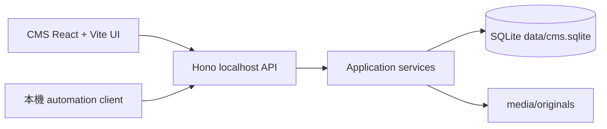

# SQL CMS 架構契約

## 範圍與權威

本目錄定義 V1 本機 authoring state 的 CMS、SQLite、媒體與 localhost automation API 契約。權威順序為 `MEMORY.md`、`logs/2026-08-25-1617-sql-cms-direction.md`、本目錄；`draft/` 與任何 `project-*` 僅是唯讀歷史參考，絕非規格或發布內容。

本次不建立應用程式、不安裝 dependency、不執行 migration。GitHub Pages deploy、static Theme、Navigation、Settings 與 release artifact 都不在範圍；未來只能消費已發布 projection 與媒體 reference。

## 四層責任

| 層 | 責任 | 禁止事項 |
|---|---|---|
| CMS UI | Dashboard、Post Types、Entries、Taxonomies、Media；CodeMirror source 編輯與 GFM preview | 直接 SQL、Git、build、deploy |
| localhost API | HTTP 邊界、Zod input/output、ETag/idempotency、loopback/origin 檢查 | public runtime API、第二套 domain 規則 |
| Application services | aggregate transaction、route migration、term batch publish、媒體恢復 | 讓 Drizzle row 或 HTTP payload 成為 domain contract |
| SQLite + media files | durable canonical state、不可變歷史、physical bytes | template/component code、任意 HTML |

UI 與 automation client 共用同一組 application services；UI 不直接查 SQL。HTTP payload 與 Drizzle row 都不是 domain contract。未來 frontend/Theme 僅可讀 published projection。

## 固定技術契約

- Node.js **22.22+**、npm workspaces、TypeScript。
- CMS：React + Vite；local API：Hono；shared contract：Zod。
- persistence：Drizzle + `better-sqlite3`；GFM：unified、remark、rehype；source editor：CodeMirror。
- 不引入 PHP、Python、Ruby、remote service、第二套 application runtime、remote/production database。
- V1 是 OS-trusted single owner：server 只 bind `127.0.0.1`；不建立 login、users、sessions、roles、permissions。

## 文件索引

| 文件 | 規定 |
|---|---|
| [cms.md](cms.md) | product model、schema/term/entry revision、route 與 lifecycle |
| [database.md](database.md) | SQLite ownership、migration、query、checkpoint/backup 邊界 |
| [media.md](media.md) | content-addressed media、durable upload/reconciliation、Git 邊界 |
| [api.md](api.md) | owner service、HTTP precondition、idempotency 與 error model |
| [openapi.json](openapi.json) | machine-readable OpenAPI 3.1 surface |
| [migrations/0001_initial.sql](migrations/0001_initial.sql) | 唯一 schema source of truth |
| [schema.sql](schema.sql) | 從 migrations generated 的唯讀 normalized snapshot |
| [contract-fixtures.sql](contract-fixtures.sql) | SQLite constraint fixtures |
| [verify-contract.mjs](verify-contract.mjs) | Node `node:sqlite` machine gate |
| [decision-sources.md](decision-sources.md) | 借鑑的一手來源與非繼承範圍 |

## 名詞表

| 名詞 | 定義 |
|---|---|
| Aggregate | Post Type、Taxonomy、Term、Entry 或 Media Asset 的可變 owner row。 |
| Revision/version | 不可 UPDATE/DELETE 的歷史 snapshot；aggregate pointer 選擇 current/published snapshot。 |
| current | working state；Preview 只讀它。 |
| published | 本機 canonical published state；不代表 build/deploy。 |
| claim | 全域 canonical route 的單一 owner/source row。 |
| projection | 將 published revision 解析為未來 frontend 可消費資料的服務結果。 |
| asset/object | asset 是邏輯 metadata；object 是 checksum 唯一的 physical bytes owner。 |

## capability → owner → tables

| 能力／method group | Owner service | 寫入／主要讀取 tables |
|---|---|---|
| `GET/POST /post-types`、schema save/publish/archive | PostTypeService | `post_types`、`post_type_schema_versions`、`field_definitions`、`field_definition_versions`、`route_claims` |
| taxonomy version lifecycle | TaxonomyService | `taxonomies`、`taxonomy_versions`、`taxonomy_version_post_types`、`route_claims` |
| term revision/publish | PublishTermRevisionService | `terms`、`term_revisions`、`revision_terms`、`entries`、`entry_revisions`、`route_claims` |
| entry revision/preview/publish lifecycle | EntryService + RouteMigrationService | `entries`、`entry_revisions`、`entry_field_values`、`revision_terms`、`route_claims` |
| media upload/metadata/archive | MediaUploadService + MediaReconciliationService | `media_objects`、`media_assets`、`idempotency_keys`、`operation_log` |
| all commands | IdempotencyService | `idempotency_keys`、`operation_log` 與目標 aggregate |

## 決策摘要

1. canonical authoring state 是 `data/cms.sqlite` 與 local media，不是 Markdown/YAML、Git 或 remote database。
2. schema、field、entry、term snapshot 都永久保留；V1 沒有 hard delete/purge。
3. Page、Post、custom single/archive、taxonomy/term archive 與 reserved path 共用一個 global route domain。
4. Save、Preview、Publish 只改本機 current/published pointers 與 claims；絕不 commit/push/build/deploy。
5. canonical DB/original media 只能在 repository private 後進 Git；否則 tooling 必須 fail closed。
