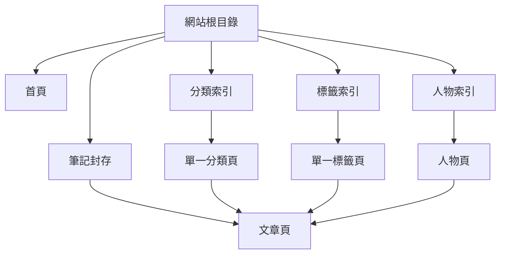
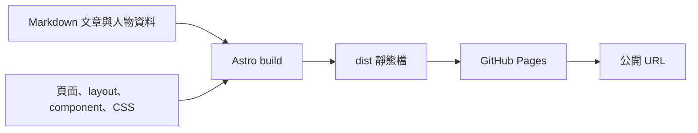

# GitHub Pages 型筆記網站：網頁架構草案

> 目的：重做一個與現有網站相近的靜態筆記站。這份草案只定義**頁面、內容層級、共用版型與靜態輸出結構**；不定義登入、後端、搜尋、留言等功能。

## 1. 架構原則

- **靜態優先**：每個公開 URL 都在建置時產生 HTML，可直接由 GitHub Pages 提供。
- **內容驅動**：文章 Markdown 與少量結構化資料是頁面來源；不要為每篇文章手寫頁面。
- **單一視覺骨架**：所有頁面共用導覽、頁尾、字體、色彩與內容寬度。
- **清楚的瀏覽層級**：首頁 → 全部筆記／主題分類／標籤／人物 → 單一文章。
- **專案子路徑安全**：若部署在 `https://<owner>.github.io/<repo>/`，所有內部連結與資源都必須帶入 repository base path。



## 2. URL 與頁面地圖

| 層級 | URL | 頁面角色 | 版面內容 |
|---|---|---|---|
| 根頁 | `/` | 首頁／入口 | Hero、網站定位、最新筆記、分類入口、熱門標籤 |
| 封存 | `/blog/` | 全部文章總覽 | 頁面標題、文章數、分類切換列、完整文章清單 |
| 文章 | `/blog/<slug>/` | 單一筆記 | 麵包屑、文章標頭、內文、標籤、相關人物、前後篇導覽 |
| 分類索引 | `/categories/` | 主題總覽 | 分類名稱與各分類文章數 |
| 分類 | `/categories/<category>/` | 同主題文章集合 | 分類標題、文章數、文章清單 |
| 標籤索引 | `/tags/` | 細粒度索引 | 所有標籤與使用次數 |
| 標籤 | `/tags/<tag>/` | 同標籤文章集合 | 標籤標題、文章數、文章清單 |
| 人物索引 | `/people/` | 被引用作者／創作者總覽 | 人物名稱、簡介、相關文章數 |
| 人物 | `/people/<slug>/` | 人物脈絡頁 | 名稱、簡介、外部連結、相關文章清單 |
| 輔助頁 | `/404/` | 找不到頁面 | 簡短說明與回首頁連結 |
| 訂閱輸出 | `/rss.xml` | RSS 靜態檔 | 最新公開文章摘要 |

文章、分類、標籤與人物頁均由建置程序依內容資料產生；不需要在 GitHub Pages 執行伺服器程式。

## 3. 全站共用頁面骨架

```text
BaseLayout
├── <head>
│   ├── 頁面 title / description / canonical URL
│   ├── Open Graph 與 Twitter 分享資料
│   ├── JSON-LD 結構化資料
│   ├── favicon 與 RSS 連結
│   └── 字體與全域樣式
├── Header
│   ├── 網站名稱／首頁連結
│   ├── 主導覽：首頁、筆記、名人
│   └── 次導覽：分類捷徑
├── <main>
│   └── 各路由頁面內容
└── Footer
    └── 版權、來源或外部連結
```

### Header

- 固定在視窗頂端；捲動後以半透明背景與分隔線維持辨識度。
- 第一列放品牌名稱與三個主要入口：`首頁`、`筆記`、`名人`。
- 第二列放分類捷徑，讓讀者在任一頁面都能跳入主題。
- 目前頁面以文字色或 accent 色呈現 active state。

### Footer

- 保持極簡，作為全站收尾而非第二個導覽列。
- 建議只放：站名、GitHub／RSS 等公開連結、版權或最後更新資訊。

### 全域視覺框架

- 單欄、可閱讀的內容寬度：首頁與列表用同一個窄欄容器；文章內文再由 `prose` 排版控制。
- 標題使用高辨識度 display 字體；內文使用易讀 sans-serif；分類、日期、計數與 metadata 使用等寬字體。
- 背景、主文字、次文字、分隔線與 accent 色都定義成全域 token，避免每頁自行選色。
- 手機版維持同一資訊順序，只縮小左右留白、垂直間距與大標字級；不另做第二套頁面。

## 4. 各頁的內容層級

### 首頁

```text
Hero
├── 小型站名標記
├── 一句主標
├── 一段站點描述
└── 「閱讀所有筆記」入口

最新筆記
├── 區塊標記 Recent
├── 區塊標題
├── 最新 6 篇文章卡／列
└── 全部筆記入口

依分類瀏覽
├── 分類名稱
└── 該分類文章數

熱門標籤
├── 標籤名稱
└── 使用次數
```

首頁是「從站點認識內容」的導覽頁，不應重複放完整文章內文或過多固定文案。

### 全部筆記、分類頁與標籤頁

三者共用一種**文章清單模板**，只換頁首語意與資料來源：

```text
頁首
├── 英文小型區塊標記（Archive / Category / Tag）
├── 大型頁面標題
└── 文章數或摘要

文章清單
└── PostList
    └── Post row（重複）
        ├── 分類／日期等 metadata
        ├── 文章標題
        ├── description 摘要
        └── tags
```

- `/blog/` 額外放一排分類按鈕，作為視覺上的封存篩選控制列。
- `/categories/` 與 `/tags/` 是索引頁，採名稱＋篇數的緊湊清單；點擊才進入對應文章集合頁。
- 文章卡不需要封面圖才能成立。若未來導入圖片，應把它當成可選欄位，而非每篇必填的版型依賴。

### 文章頁

文章頁採用 `PostLayout`，讓內容區與網站骨架分離：

```text
文章導覽
├── 首頁
├── 分類
└── 目前文章

文章標頭
├── 分類、發佈日期、更新日期
├── H1 標題
├── description
├── tags
└── 相關人物連結（有資料時）

文章正文（Markdown 渲染）

文章頁尾
├── 前一篇／下一篇
└── 回到分類或文章封存
```

- 文章標頭與 Markdown 正文分開，能讓所有筆記保有一致 metadata 與可讀性。
- 正文內的標題、段落、清單、程式碼、引用、圖片、表格由一套 typography 規則處理。
- `Article` 與 `BreadcrumbList` JSON-LD 放在文章頁，不把文章專屬 SEO 資料散落到 Markdown。

### 人物頁

人物是「內容關聯」的獨立瀏覽維度，版面比文章頁短：

```text
人物標頭
├── 名稱
├── 簡介
└── 外部連結

相關筆記清單
```

人物資料置於一份結構化檔案；文章只保存人物 slug。這樣人物簡介與外部連結不會在多篇文章中重複。

## 5. 內容與元件對應

```text
src/
├── content/
│   └── blog/
│       └── <slug>.md              # 文章與 frontmatter
├── data/
│   └── people.ts                  # 人物資料
├── layouts/
│   ├── BaseLayout.astro           # 全站 head / header / main / footer
│   └── PostLayout.astro           # 文章專用框架
├── components/
│   ├── Header.astro
│   ├── Footer.astro
│   ├── PostList.astro             # 唯一的文章清單呈現元件
│   └── TagChip.astro
├── pages/
│   ├── index.astro
│   ├── 404.astro
│   ├── blog/
│   ├── categories/
│   ├── tags/
│   ├── people/
│   └── rss.xml.js
└── styles/
    └── global.css                 # token、基礎樣式、Markdown typography
```

重做時應保留 `PostList` 作為所有文章集合頁的單一來源；首頁、封存、分類、標籤、人物頁都不自行複製一份文章卡 HTML。

## 6. GitHub Pages 靜態輸出架構



### 建置與部署邊界

| 階段 | 產物／責任 |
|---|---|
| Repository | 原始 Markdown、Astro 頁面、元件、樣式、公開資產、部署 workflow |
| Build | 將動態路由展開成分類、標籤、人物、文章的實體 HTML；輸出 `dist/` |
| GitHub Actions | 在 `main` 更新時執行 Astro build，將產物交給 Pages deployment action |
| GitHub Pages | 只提供靜態 HTML、CSS、JS、圖片、RSS、sitemap；不承載伺服器端渲染或資料庫 |

### URL 約束

- 網站位於 repository project page 時，設定 `base: "/<repo-name>"`。
- 以 `trailingSlash: "always"` 與 directory-format build 輸出 `/blog/<slug>/index.html`，避免 GitHub Pages 對副檔名與目錄 URL 的差異。
- 元件內部連結與靜態資產以 `import.meta.env.BASE_URL` 組成；Markdown 交叉連結使用 `/<repo-name>/blog/<slug>/`。
- canonical URL、RSS、sitemap、Open Graph 圖片皆以正式 GitHub Pages 網域與 base path 為基準。

## 7. 重做時的最小頁面交付順序

1. 建立 `BaseLayout`、全域樣式、Header、Footer。
2. 建立首頁與共用 `PostList`。
3. 建立文章 `PostLayout` 與 `/blog/<slug>/` 靜態路由。
4. 建立 `/blog/`、分類、標籤等文章集合頁。
5. 建立人物索引與人物頁；若新站不需要此維度，可整組省略，不留下空白入口。
6. 建立 404、RSS、sitemap 與 GitHub Pages workflow。

## 8. 不納入本草案的範圍

- 使用者帳號、登入、會員內容。
- 資料庫、API、後端管理台。
- 站內全文搜尋、留言、按讚、閱讀記錄。
- 即時更新、個人化推薦、分析追蹤。

這些需求若未來出現，應先確認是否仍能維持靜態輸出；不要讓單一互動需求改變整個 GitHub Pages 網站的頁面架構。
