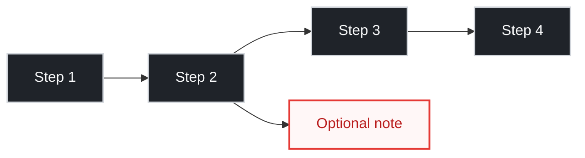

# Simple Draw Skill

Use this skill when the user needs a Mermaid diagram that is easy to scan and does not dominate the page.

## 1. Default Rules

- Prefer `flowchart LR`.
- Keep 4 to 6 core nodes.
- Keep one primary path (`A --> B --> C --> D`).
- Add side notes only if they directly help action.
- Keep each node to 1 to 2 short lines.
- Avoid `TD` unless the user explicitly asks for top-down.

## 2. Readability Rules

- Use high-contrast colors on dark themes.
- Do not use tiny HTML text like `<small>`.
- Use short labels and action verbs.
- Avoid crossing lines and dense branching.
- If the chart is still hard to read, remove nodes before adding style.

## 3. Quartz-Safe Mermaid Template

## 4. Decision Policy

- Use Mermaid only when it improves comprehension.
- If the logic is linear and obvious, use a bullet list instead.
- If the user says the chart is too big or hard to read, simplify first, then restyle.

## 5. Final Check

- Verify node labels are readable in one pass.
- Verify the chart fits horizontally without visual clutter.
- Run `npm run quartz -- build` after edits.
